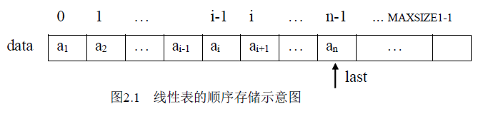
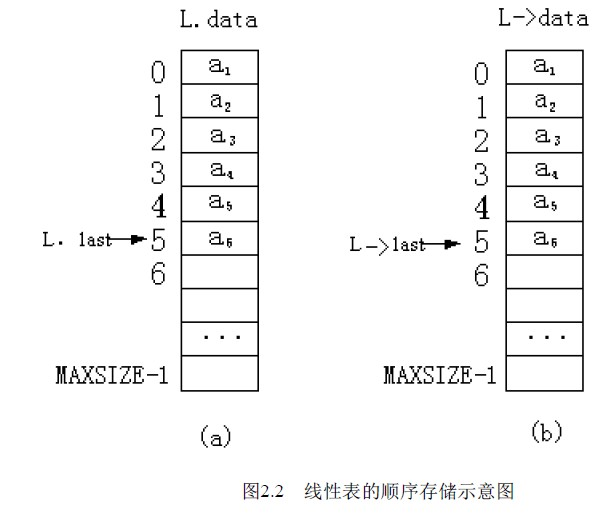

# 2.2 线性表的顺序存储及运算—顺序表

线性表的顺序存储是指在内存中用地址连续的一块存储空间顺序存放线性表的各元素，用这种存储形式存储的线性表称其为顺序表。因为内存中的地址空间是线性的，因此，用物理上的相邻实现数据元素之间的逻辑相邻关系是既简单，又自然的。如图 2.1 所示。

设 a１的存储地址为 Loc(a１)，每个数据元素占 d 个存储地址，则第 i 个数据元素的地址为：

Loc(ai)=Loc(a１)+(i-1)*d 1<=i<=n

这就是说只要知道顺序表首地址和每个数据元素所占地址单元的个数就可求出第 i 个数据元素的地址来，这也是顺序表具有按数据元素的序号随机存取的特点。

在程序设计语言中，一维数组在内存中占用的存储空间就是一组连续的存储区域，因此，用一维数组来表示顺序表的数据存储区域是再合适不过的。考虑到线性表的运算有插入、删除等运算，即表长是可变的，因此，数组的容量需设计的足够大，设用：data[MAXSIZE]来表示，其中 MAXSIZE 是一个根据实际问题定义的足够大的整数，线性表中的数据从 data[0] 开始依次顺序存放，但当前线性表中的实际元素个数可能未达到 MAXSIZE 多个，因此需用一个变量 last 记录当前线性表中最后一个元素在数组中的位置，即 last 起一个指针的作用，始终指向线性表中最后一个元素，因此，表空时 last=-1。这种存储思想的具体描述可以是多样的。如可以是：

datatype data[MAXSIZE];

int last;

这样表示的顺序表如图 2.1 所示。表长为 last+1，数据元素分别存放在 data[0]到 data[last]中。这样使用简单方便，但有时不便管理。

从结构性上考虑，通常将 data 和 last 封装成一个结构作为顺序表的类型：

typedef struct

{ datatype data[MAXSIZE];

int last;

} SeqList;

定义一个顺序表：SeqList L ;

这样表示的线性表如图 2.2（a） 所示。表长＝L.last+1，线性表中的数据元素 a1 至 an 分别存放在 L.data[0]至 L.data[L.last]中。由于我们后面的算法用 C 语言描述，根据 C 语言中的一些规则，有时定义一个指向 SeqList 类型的指针更为方便：

SeqList *L ；L 是一个指针变量，线性表的存储空间通过 L=malloc(sizeof(SeqList)) 操作来获得。L 中存放的是顺序表的地址，这样表示的线性表如图 2.2(b)所示。表长表示为（*L）.last 或 L－＞last+1，线性表的存储区域为 L->data ，线性表中数据元素的存储空间为：L－＞data[0] ~ L－＞data[L－＞last]。

在以后的算法中多用这种方法表示，读者在读算法时注意相关数据结构的类型说明。

