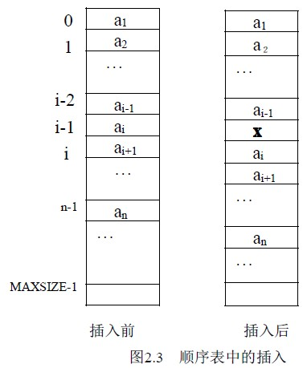
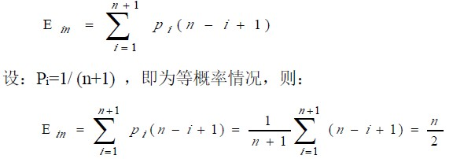
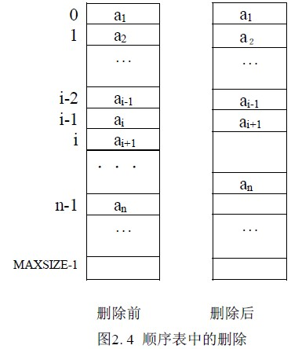
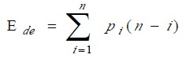
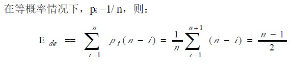

# 2.2 线性表的顺序存储及运算—顺序表上的基本运算

### 1.顺序表的初始化

顺序表的初始化即构造一个空表，这对表是一个加工型的运算，因此，将 L 设为指针参数，首先动态分配存储空间，然后，将表中 last 指针置为－1，表示表中没有数据元素。算法如下：

SeqList *init_SeqList( )

{ SeqList *L;

L=malloc(sizeof(SeqList));

L->last=-1; return L;

}

算法 2.1

设调用函数为主函数，主函数对初始化函数的调用如下：

main()

{SeqList *L;

L=Init_SeqList();

．．．

}

### 2\. 插入运算

线性表的插入是指在表的第 i 个位置上插入一个值为 x 的新元素，插入后使原表长为 n 的表:

(a1，a2，... ，ai-1，ai，ai+1，... ，an)成为表长为 n+1 表:(a1，a2，...，ai-1，x，ai，ai+1，...，an ) 。i 的取值范围为 1<=i<=n+1 。

顺序表上完成这一运算则通过以下步骤进行：

(1) 将 ai～an 顺序向下移动，为新元素让出位置；

(2) 将 x 置入空出的第 i 个位置；

(3) 修改 last 指针(相当于修改表长)，使之仍指向最后一个元素。

算法如下：

int Insert_SeqList(SeqList *L，int i，datatype x)

{ int j;

if (L->last==MAXSIZE－1)

{ printf(＂表满＂); return(-1); } /*表空间已满，不能插入*/

if (i<1 || i>L->last+2) /*检查插入位置的正确性*/

{ printf(＂位置错＂);return(0); }

for(j=L->last;j>=i-1;j--)

L->data[j+1]=L->data[j]; /* 结点移动*/

L->data[i-1]=x; /*新元素插入*/

L->last++; /*last 仍指向最后元素*/

return (1); /*插入成功，返回*/

}

算法 2.2

本算法中注意以下问题：

(1) 顺序表中数据区域有 MAXSIZE 个存储单元，所以在向顺序表中做插入时先检查表空间是否满了，在表满的情况下不能再做插入，否则产生溢出错误。

(2) 要检验插入位置的有效性，这里 i 的有效范围是：1<=i<=n+1，其中 n 为原表长。

(3) 注意数据的移动方向。

插入算法的时间性能分析：顺序表上的插入运算，时间主要消耗在了数据的移动上，在第 i 个位置上插入 x ，从 ai 到 an 都要向下移动一个位置，共需要移动 n－i＋1 个元素，而 i 的取值范围为：1<= i<= n+1，即有 n＋1 个位置可以插入。设在第 i 个位置上作插入的概率为 Pi，则平均移动数据元素的次数：

这说明：在顺序表上做插入操作需移动表中一半的数据元素。显然时间复杂度为Ｏ(n)。

### 3\. 删除运算 DeleteList(L,i)

线性表的删除运算是指将表中第 i 个元素从线性表中去掉，删除后使原表长为 n 的线性表：

(a1，a2，... ，ai-1，ai，ai+1，...，an)成为表长为 n－1 的线性表：(a1，a2，... ，ai-1， ai+1，... ，an)。i 的取值范围为：1<=i<=n 。

顺序表上完成这一运算的步骤如下：

(1) 将 ai+1～an 顺序向上移动。

(2) 修改 last 指针(相当于修改表长)使之仍指向最后一个元素。

算法如下：

int Delete_SeqList(SeqList *L;int i)

{ int j;

if(i<1 || i>L->last+1) /*检查空表及删除位置的合法性*/

{ printf (＂不存在第 i 个元素＂); return(0); }

for(j=i;j<=L->last;j++)

L->data[j-1]=L->data[j]; /*向上移动*/

L->last--;

return(1); /*删除成功*/

}

算法 2.3

本算法注意以下问题：

（1）删除第 i 个元素，i 的取值为 1<=i<=n ,否则第 i 个元素不存在，因此，要检查删除位置的有效性。

（2）当表空时不能做删除，因表空时 L->last 的值为-1，条件（i<1 || i>L->last+1）也包括了对表空的检查。

（3）删除 ai 之后，该数据已不存在，如果需要，先取出 ai ，再做删除。

删除算法的时间性能分析：与插入运算相同，其时间主要消耗在了移动表中元素上，删除第 i 个元素时，其后面的元素 ai+1～an 都要向上移动一个位置，共移动了 n-i 个元素，所以平均移动数据元素的次数：

这说明顺序表上作删除运算时大约需要移动表中一半的元素，显然该算法的时间复杂度为Ｏ(n)。

### 4\. 按值查找

线性表中的按值查找是指在线性表中查找与给定值 x 相等的数据元素。在顺序表中完成该运算最简单的方法是：从第一个元素 a1 起依次和 x 比较，直到找到一个与 x 相等的数据元素，则返回它在顺序表中的存储下标或序号（二者差一）；或者查遍整个表都没有找到与 x 相等的元素，返回-1。

算法如下：

int Location_SeqList(SeqList *L, datatype x)

{ int i=0;

while(i<=L.last && L->data[i]!= x)

i++;

if (i>L->last) return -1;

else return i; /*返回的是存储位置*/

}

算法 2.4

本算法的主要运算是比较。显然比较的次数与 x 在表中的位置有关，也与表长有关。当 a1=x 时，比较一次成功。当 an=x 时比较 n 次成功。平均比较次数为（n+1）/2，时间性能为 O(n)。