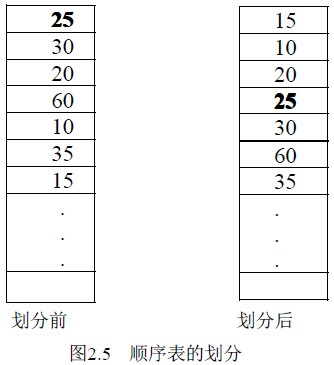
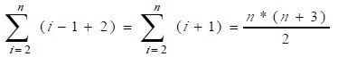

# 2.2 线性表的顺序存储及运算—顺序表应用举例

例 2．1 将顺序表(a1，a2，... ，an) 重新排列为以 a1 为界的两部分：a1 前面的值均比 a1 小，a1 后面的值都比 a1 大(这里假设数据元素的类型具有可比性, 不妨设为整型)，操作前后如图 2.5 所示。这一操作称为划分。a1 也称为基准。

划分的方法有多种，下面介绍的划分算法其思路简单，性能较差。基本思路：

从第二个元素开始到最后一个元素，逐一向后扫描：

（1）当前数据元素 aI 比 a1 大时，表明它已经在 a1 的后面，不必改变它与 a1 之间的位置，继续比较下一个。

（2）当前结点若比 a1 小，说明它应该在 a1 的前面，此时将它上面的元素都依次向下移动一个位置，然后将它置入最上方。

算法如下：

void part(SeqList *L)

{ int i,j;

datatype x,y;

x=L->data[0]; /* 将基准置入 x 中*/

for(i=1;i<=L->last;i++)

if(L->data[i]<x) /*当前元素小于基准*/

{ y = L->data[i];

for(j=i-1;j>=0;j--) /*移动*/

L－>data[j+1]=L->data[j];

L->data[0]=y;

}

}

算法 2.5

本算法中，有两重循环，外循环执行 n－1 次，内循环中移动元素的次数与当前数据的大小有关，当第ｉ个元素小于 a1 时，要移动它上面的 i-1 个元素，再加上当前结点的保存及置入，所以移动 i-1+2 次，在最坏情况下，a1 后面的结点都小于 a1 ，故总的移动次数为：

即最坏情况下移动数据时间性能为Ｏ(ｎ２)。

这个算法简单但效率低，在第九章的快速排序中时我们将介绍另一种划分算法，它的性能为Ｏ(n)。

例 2．2 有顺序表 A 和 B，其元素均按从小到大的升序排列，编写一个算法将它们合并成一个顺序表 C，要求 C 的元素也是从小到大的升序排列。

算法思路：依次扫描通过 A 和 B 的元素，比较当前的元素的值，将较小值的元素赋给 C，如此直到一个线性表扫描完毕，然后将未完的那个顺序表中余下部分赋给 C 即可。C 的容量要能够容纳 A、B 两个线性表相加的长度。

算法如下：

void merge(SeqList A, SeqList B, SeqList *C)

{ int i,j,k;

i=0;j=0;k=0;

while ( i<=A.last && j<=B.last )

if (A.date[i]<B.date[j])

C->data[k++]=A.data[i++];

else C->data[k++]=B.data[j++];

while (i<=A.last )

C->data[k++]= A.data[i++];

while (j<=B.last )

C->data[k++]=B.data[j++];

C->last=k-1;

}

算法 2.6

算法的时间性能是 O(m+n)，其中 m 是 A 的表长，n 是 B 的表长。

例 2.3 比较两个线性表的大小。两个线性表的比较依据下列方法：设 A、B 是两个线性表，均用向量表示，表长分别为 m 和 n。A′和 B′分别为 A 和 B 中除去最大共同前缀后的子表。

例如 A=(x,y,y,z,x,z)， B=(x,y,y,z,y,x,x,z)，两表最大共同前缀为(x,y,y,z) 。则 A′=（x,z）， B′=（y,x,x,z），若 A′=B′= 空表，则 A=B；若 A′=空表且 B′≠空表，或两者均不空且 A′首元素小于 B′首元素，则 A<B；否则，A>B。

算法思路：首先找出 A、B 的最大共同前缀；然后求出 A′和 B′，之后在按比较规则进行比较，A>B 函数返回 1；A=B 返回 0；A<B 返回-1。算法如下：

int compare( A,B,m,n)

int A[],B[];

int m,n;

{ int i=0,j,AS[],BS[],ms=0,ns=0; /*AS,BS 作为 A′,B′*/

while (A[i]==B[i]) i++; /*找最大共同前缀*/

for (j=i;j<m;j++)

{ AS[j-i]=A[j];ms++; } /*求 A′,ms 为 A′的长度*/

for (j=i;j<n;j++)

{ BS[j-i]=B[j];ns++; } /*求 B′,ms 为 B′的长度*/

if (ms==ns&&ms==0) return 0;

else if (ms==0&&ns>0 || ms>0 && ns>0 && AS[0]<BS[0]) return –1;

else return 1;

}

算法 2.7

算法的时间性能是 O( m+n )。