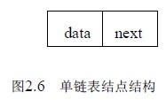
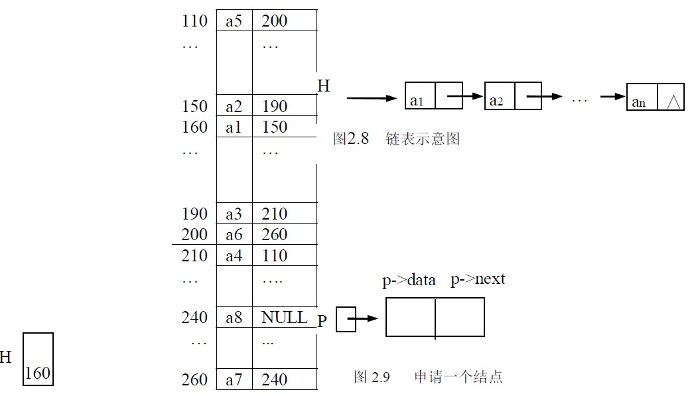

# 2.3 线性表的链式存储和运算—单链表

由于顺序表的存贮特点是用物理上的相邻实现了逻辑上的相邻，它要求用连续的存储单元顺序存储线性表中各元素，因此，对顺序表插入、删除时需要通过移动数据元素来实现，影响了运行效率。本节介绍线性表链式存储结构，它不需要用地址连续的存储单元来实现，因为它不要求逻辑上相邻的两个数据元素物理上也相邻，它是通过“链”建立起数据元素之间的逻辑关系来，因此对线性表的插入、删除不需要移动数据元素。

## 2.3.1 单链表

链表是通过一组任意的存储单元来存储线性表中的数据元素的，那么怎样表示出数据元素之间的线性关系呢？为建立起数据元素之间的线性关系，对每个数据元素 ai，除了存放数据元素的自身的信息 ai 之外，还需要和 ai 一起存放其后继 ai+1 所在的存贮单元的地址，这两部分信息组成一个“结点”，结点的结构如图 2.6 所示，每个元素都如此。存放数据元素信息的称为数据域，存放其后继地址的称为指针域。因此 n 个元素的线性表通过每个结点的指针域拉成了一个“链子”，称之为链表。因为每个结点中只有一个指向后继的指针，所以称其为单链表。

链表是由一个个结点构成的，结点定义如下：

typedef struct node

{ datatype data;

struct node *next;

} LNode，*LinkList；

定义头指针变量：

LinkList H；

如图 2.7 是线性表(a1,a2,a3,a4,a5,a6,a7,a8) 对应的链式存储结构示意图。

当然必须将第一个结点的地址 160 放到一个指针变量如 H 中，最后一个结点没有后继, 其指针域必需置空，表明此表到此结束，这样就可以从第一个结点的地址开始“顺藤摸瓜”，找到每个结点。

作为线性表的一种存储结构，我们关心的是结点间的逻辑结构，而对每个结点的实际地址并不关心，所以通常的单链表用图 2.8 的形式而不用图 2.7 的形式表示。

通常我们用“头指针”来标识一个单链表，如单链表 L、单链表 H 等，是指某链表的第一个结点的地址放在了指针变量 L、H 中， 头指针为“NULL”则表示一个空表。

图 2.7 链式存储结构

需要进一步指出的是：上面定义的 LNode 是结点的类型，LinkList 是指向 Lnode 类型结点的指针类型。为了增强程序的可读性，通常将标识一个链表的头指针说明为 LinkList 类型的变量，如 LinkList L ; 当 L 有定义时，值要么为 NULL，则表示一个空表；要么为第一个结点的地址，即链表的头指针；将操作中用到指向某结点的指针变量说明为 LNode *类型，如 LNode *p； 则语句：

p=malloc(sizeof(LNode))；则完成了申请一块 Lnode 类型的存储单元的操作，并将其地址赋值给变量 p。如图 2.9 所示。P 所指的结点为*p，*p 的类型为 LNode 型，所以该结点的数据域为(*p).data 或 p->data，指针域为(*p).next 或 p->next。free(p)则表示释放 p 所指的结点。