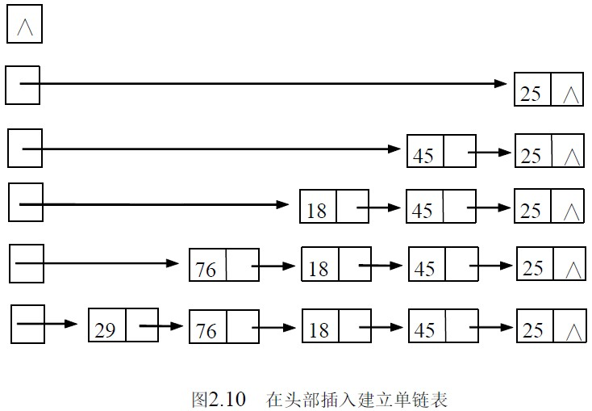
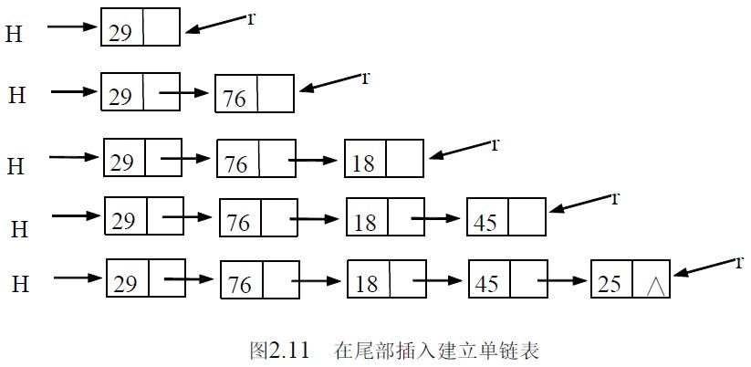
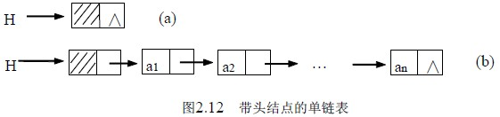
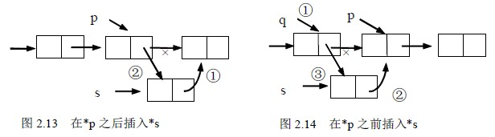
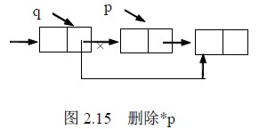

# 2.3 线性表的链式存储和运算—单链表基本运算

## 1\. 建立单链表

**(1)在链表的头部插入结点建立单链表**

链表与顺序表不同，它是一种动态管理的存储结构，链表中的每个结点占用的存储空间不是预先分配，而是运行时系统根据需求而生成的，因此建立单链表从空表开始，每读入一个数据元素则申请一个结点，然后插在链表的头部，如图 2.10 展现了线性表：（25,45,18,76,29）之链表的建立过程，因为是在链表的头部插入，读入数据的顺序和线性表中的逻辑顺序是相反的。

算法如下：

LinkList Creat_LinkList1( )

{ LinkList L=NULL；/*空表*/

Lnode *s;

int x; /*设数据元素的类型为 int*/

scanf(＂%d＂,&x);

while (x!=flag)

{ s=malloc(sizeof(LNode));

s->data=x;

s->next=L; L=s;

Scanf (＂%d＂,&x);

}

return L;

}

算法 2.8

**(2)在单链表的尾部插入结点建立单链表**

头插入建立单链表简单，但读入的数据元素的顺序与生成的链表中元素的顺序是相反的，若希望次序一致，则用尾插入的方法。因为每次是将新结点插入到链表的尾部，所以需加入一个指针 r 用来始终指向链表中的尾结点，以便能够将新结点插入到链表的尾部，如图 2.11 展现了在链表的尾部插入结点建立链表的过程。

算法思路：

初始状态：头指针 H=NULL，尾指针 r=NULL; 按线性表中元素的顺序依次读入数据元素，不是结束标志时，申请结点，将新结点插入到 r 所指结点的后面，然后 r 指向新结点（但第一个结点有所不同，读者注意下面算法中的有关部分）。

H=NULL r=NULL /*初始状态*/

算法如下：

LinkList Creat_LinkList2( )

{ LinkList L=NULL;

Lnode *s,*r=NULL;

int x; /*设数据元素的类型为 int*/

scanf(＂%d＂,&x);

while (x!=flag)

{ s=malloc(sizeof(LNode)); s->data=x;

if (L==NULL) L=s; /*第一个结点的处理*/

else r->next=s; /*其它结点的处理*/

r=s; /*r 指向新的尾结点*/

scanf(＂%d＂,&x);

}

if ( r!=NULL) r->next=NULL; /*对于非空表，最后结点的指针域放空指针*/

return L;

}

算法 2.9

在上面的算法中，第一个结点的处理和其它结点是不同的，原因是第一个结点加入时链表为空，它没有直接前驱结点，它的地址就是整个链表的指针， 需要放在链表的头指针变量中；而其它结点有直接前驱结点，其地址放入直接前驱结点的指针域。“第一个结点”的问题在很多操作中都会遇到，如在链表中插入结点时，将结点插在第一个位置和其它位置是不同的，在链表中删除结点时，删除第一个结点和其它结点的处理也是不同的，等等，为了方便操作，有时在链表的头部加入一个“头结点”，头结点的类型与数据结点一致，标识链表的头指针变量 L 中存放该结点的地址，这样即使是空表，头指针变量 L 也不为空了。

头结点的加入使得“第一个结点”的问题不再存在，也使得“空表”和“非空表”的处理成为一致。

头结点的加入完全是为了运算的方便，它的数据域无定义，指针域中存放的是第一个数据结点的地址，空表时为空。图 2.12(a)、（b）分别是带头结点的单链表空表和非空表的示意图。

## 2\. 求表长

算法思路：设一个移动指针ｐ和计数器ｊ，初始化后，ｐ所指结点后面若还有结点，ｐ向后移动，计数器加 1。

**(1)设 L 是带头结点的单链表(线性表的长度不包括头结点)。**

算法如下：

int Length_LinkList1 (LinkList L)

{ Lnode * p=L; /* p 指向头结点*/

int j=0;

while (p->next)

{ p=p->next; j++ } /* p 所指的是第 j 个结点*/

return j;

}

算法 2.10(a)

**(2)设 L 是不带头结点的单链表。**

算法如下：

int Length_LinkList2 (LinkList L)

{ Lnode * p=L;

int j;

if (p==NULL) return 0; /*空表的情况*/

j=1; /*在非空表的情况下，p 所指的是第一个结点*/;

while (p->next )

{ p=p->next; j++ }

return j;

}

算法 2.10(b)

从上面两个算法中看到，不带头结点的单链表空表情况要单独处理，而带上头结点之后则不用了。在以后的算法中不加说明则认为单链表是带头结点的。算法 2.10(a)、(b)的时间复杂度均为 O(n)。

## 3\. 查找操作

**(1) 按序号查找 Get_Linklist(L,i)**

算法思路：从链表的第一个元素结点起，判断当前结点是否是第 i 个，若是，则返回该结点的指针，否则继续后一个，表结束为止。没有第ｉ个结点时返回空。算法如下：

Lnode * Get_LinkList(LinkList L, Int i);

/*在单链表 L 中查找第 i 个元素结点，找到返回其指针，否则返回空*/

{ Lnode * p=L;

int j=0;

while (p->next !=NULL && j<i )

{ p=p->next; j++; }

if (j==i) return p;

else return NULL;

}

算法 2.11(a)

**(2) 按值查找即定位 Locate_LinkList(L,x)**

算法思路：从链表的第一个元素结点起，判断当前结点其值是否等于 x，若是，返回该结点的指针，否则继续后一个，表结束为止。找不到时返回空。算法如下：

Lnode * Locate_LinkList( LinkList L, datatype x)

/*在单链表 L 中查找值为 x 的结点，找到后返回其指针，否则返回空*/

{ Lnode * p=L->next;

while ( p!=NULL && p->data != x)

p=p->next;

return p;

}

算法 2.11(b)

算法 2.11(a)、(b)的时间复杂度均为 O(n)。

## 4.插入

**(1)后插结点：**

设 p 指向单链表中某结点，s 指向待插入的值为 x 的新结点，将*s 插入到*p 的后面，插入示意图如图 2.13。操作如下：

①s->next=p->next;

②p->next=s;

注意：两个指针的操作顺序不能交换。

**(2)前插结点：**

设ｐ指向链表中某结点，ｓ指向待插入的值为 x 的新结点，将*s 插入到*p 的前面，插入示意图如图 2.14，与后插不同的是：首先要找到*p 的前驱*q，然后再完成在*q 之后插入*s，设单链表头指针为 L，操作如下：

q=L;

while (q->next!=p)

q=q->next; /*找*p 的直接前驱*/

s->next=q->next;

q->next=s;

后插操作的时间复杂性为 O(1)，前插操作因为要找*p 的前驱，时间性能为 O(n)；其实我们关心的更是数据元素之间的逻辑关系，所以仍然可以将*s 插入到*p 的后面，然后将ｐ->data 与 s->data 交换即可，这样即满足了逻辑关系，也能使得时间复杂性为 O(1)。

**(3)插入运算 Insert_LinkList(L,i,x)**

算法思路：

1.找到第 i-1 个结点；若存在继续 2，否则结束

2.申请、填装新结点；

3.将新结点插入。结束。

算法如下：

int Insert_LinkList( LinkList L, int i, datatype x)

/*在单链表 L 的第 i 个位置上插入值为 x 的元素*/

{ Lnode * p,*s;

p=Get_LinkList(L,i-1); /*查找第 i-1 个结点*/

if (p==NULL)

{ printf(＂参数 i 错＂);return 0; } /*第 i-1 个不存在不能插入*/

else {

s=malloc(sizeof(LNode)); /*申请、填装结点*/

s->data=x;

s->next=p->next; /*新结点插入在第 i-1 个结点的后面*/

p->next=s

return 1;

}

算法 2.12。算法 2.12 的时间复杂度为 O(n)。

## 5\. 删除

**(1)删除结点：**

设 p 指向单链表中某结点，删除*p。操作示意图如图 2.15 所示。

通过示意图可见，要实现对结点*p 的删除，首先要找到*p 的前驱结点*q，然后完成指针的操作即可。指针的操作由下列语句实现：

q->next=p->next;

free(p);

显然找*p 前驱的时间复杂性为 O(n)。若要删除*p 的后继结点(假设存在)，则可以直接完成：

s=p->next;

p->next=s->next;

free(s);

该操作的时间复杂性为 O(1) 。

**(2)删除运算：Del_LinkList(L,i)**

算法思路：

1.找到第 i-1 个结点；若存在继续 2，否则结束；

2.若存在第 i 个结点则继续 3，否则结束；

3.删除第 i 个结点，结束。

算法如下：

int Del_LinkList(LinkList L，int i)

/*删除单链表 L 上的第 i 个数据结点*/

{ LinkList p,s;

p=Get_LinkList(L,i-1); /*查找第 i-1 个结点*/

if (p==NULL)

{ printf(＂第 i-1 个结点不存在＂);return -1; }

else { if (p->next==NULL)

{ printf(＂第 i 个结点不存在＂);return 0; }

else

{ s=p->next; /*s 指向第 i 个结点*/

p->next=s->next; /*从链表中删除*/

free(s); /*释放*s */

return 1;

}

算法 2.13。算法 2.13 的时间复杂度为 O(n)。

通过上面的基本操作我们得知：

(1) 在单链表上插入、删除一个结点，必须知道其前驱结点。

(2) 单链表不具有按序号随机访问的特点，只能从头指针开始一个个顺序进行。