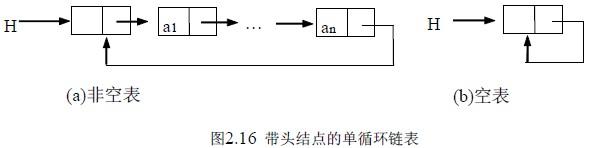
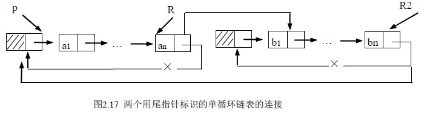

# 2.3 线性表的链式存储和运算—循环链表

对于单链表而言，最后一个结点的指针域是空指针，如果将该链表头指针置入该指针域，则使得链表头尾结点相连，就构成了单循环链表。如图 2.16 所示。

在单循环链表上的操作基本上与非循环链表相同，只是将原来判断指针是否为 NULL 变为是否是头指针而已，没有其它较大的变化。

对于单链表只能从头结点开始遍历整个链表，而对于单循环链表则可以从表中任意结点开始遍历整个链表，不仅如此，有时对链表常做的操作是在表尾、表头进行，此时可以改变一下链表的标识方法，不用头指针而用一个指向尾结点的指针 R 来标识，可以使得操作效率得以提高。

例如对两个单循环链表 H1 、H2 的连接操作，是将 H2 的第一个数据结点接到 H1 的尾结点，如用头指针标识，则需要找到第一个链表的尾结点，其时间复杂性为 O(n)，而链表若用尾指针 R1 、R2 来标识，则时间性能为 O(1)。操作如下：

p= R1 –>next; /*保存 R1 的头结点指针*/

R1->next=R2->next->next; /*头尾连接*/

free(R2->next); /*释放第二个表的头结点*/

R2->next=p; /*组成循环链表*/

这一过程可见图 2.17。

