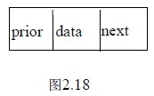

# 2.3 线性表的链式存储和运算—双向链表

以上讨论的单链表的结点中只有一个指向其后继结点的指针域 next，因此若已知某结点的指针为 p，其后继结点的指针则为 p->next ，而找其前驱则只能从该链表的头指针开始，顺着各结点的 next 域进行，也就是说找后继的时间性能是 O(1)，找前驱的时间性能是 O(n)，如果也希望找前驱的时间性能达到 O(1)，则只能付出空间的代价：每个结点再加一个指向前驱的指针域，结点的结构为如图 2.18 所示，用这种结点组成的链表称为双向链表。双向链表结点的定义如下：

typedef struct dlnode

{ datatype data;

struct dlnode *prior,*next;

}DLNode,*DLinkList;

和单链表类似，双向链表通常也是用头指针标识，也可以带头结点和做成循环结构，图 2.19 是带头结点的双向循环链表示意图。显然通过某结点的指针 p 即可以直接得到它的后继结点的指针 p->next，也可以直接得到它的前驱结点的的指针 p->prior。这样在有些操作中需要找前驱时，则勿需再用循环。从下面的插入删除运算中可以看到这一点。

设 p 指向双向循环链表中的某一结点，即 p 中是该结点的指针，则 p->prior->next 表示的是*p 结点之前驱结点的后继结点的指针，即与 p 相等；类似，p->next->prior 表示的是*p 结点之后继结点的前驱结点的指针，也与 p 相等，所以有以下等式：

p->prior->next = p = p->next->prior

双向链表中结点的插入：设 p 指向双向链表中某结点，s 指向待插入的值为 x 的新结点，将*s 插入到*p 的前面，插入示意图如图 2.20 所示。操作如下：

1 s->prior=p->prior;

2 p->prior->next=s;

3 s->next=p;

4 p->prior=s;

指针操作的顺序不是唯一的，但也不是任意的，操作①必须要放到操作④的前面完成，否则*p 的前驱结点的指针就丢掉了。读者把每条指针操作的涵义搞清楚，就不难理解了。

双向链表中结点的删除：

设 p 指向双向链表中某结点，删除*p。

操作示意图如图 2.21 所示。操作如下：

①p->prior->next=p->next;

②p->next->prior=p->prior;

free(p);

