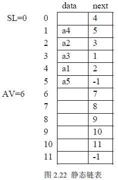

# 2.3 线性表的链式存储和运算—静态链表

下面先请看图 2.22 ，在图 2.22 中，规模较大的结构数组 sd[MAXSIZE] 中有两个链表：

其中链表 SL 是一个带头结点的单链表，表示了线性表(a1, a2, a3, a4, a5)，而另一个单链表 AV 是将当前 sd 中的空结点组成的链表。

数组 sd 的定义如下：

#define MAXSIZE … /*足够大的数*/

typedef struct

{datatype data;

int next;

}SNode; /*结点类型*/

SNode sd[MAXSIZE];

int SL,AV; /*两个头指针变量*/

这种链表的结点中也有数据域 data 和指针域 next，与前面所讲的链表中的指针不同的是，这里的指针是结点的相对地址(数组的下标)，称之为静态指针，这种链表称之为静态链表，空指针用-1 表示，因为上面定义的数组中没有下标为-1 的单元。

在图 2.21 中，SL 是用户的线性表，AV 模拟的是系统存储池中空闲结点组成的链表，当用户需要结点时，例如向线性表中插入一个元素，需自己向 AV 申请，而不能用系统函数 malloc 来申请，相关的语句为：

if(AV!=-1)

{ t=AV;

AV=sd[AV].next;

}

所得到的结点地址(下标)存入了 t 中；不难看出当 AV 表非空时，摘下了第一个结点给用户。当用户不再需要某个结点时，需通过该结点的相对地址 t 将它还给 AV，相关语句为： sd[t].next=AV;AV=t;而不能调用系统的 free 函数。交给 AV 表的结点链在了 AV 的头部。

下面通过线性表插入这个例子看静态链表操作。

例 2．4 在带头结点的静态链表 SL 的第 i 个结点之前插入一个值为 x 的新结点。设静态链表的存储区域 sd 为全局变量。

int Insert_SList( int SL, datatype x, int i)

{ int p,s;

p=SL; j=0;

while(sd[p].next!=-1 && j<i-1)

{p=sd[p].next;j++;} /*找第 i-1 个结点*/

if(j==i-1)

{ if(AV!=-1) /*若 AV 表还有结点可用*/

{t=AV;

AV=sd[AV].next; /*申请、填装新结点*/

sd[t].data=x;

sd[t].next=sd[p].next; /*插入*/

sd[p].next=t;

return 1; /*正常插入成功返回*/

}

else{printf(＂存储池无结点＂);return 0;}

/*未申请到结点，插入失败*/

else{printf(＂插入的位置错误＂);return -1;}

/*插入位置不正确，插入失败*/

}

算法 2.14

读者可将该算法和算法 2.12 相比较，除了一些描述方法有些区别外，算法思路是相同的。有关基于静态链表上的其它线性表的操作基本与动态链表相同，这里不再赘述。