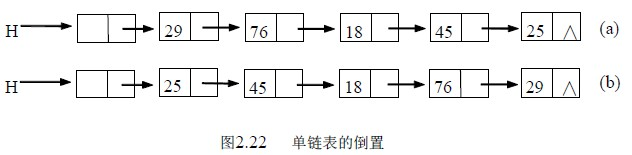
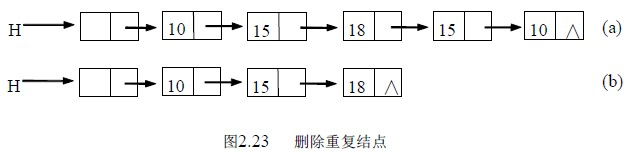

# 2.3 线性表的链式存储和运算—单链表应用举例

例 2.5 已知单链表 H，写一算法将其倒置。即实现如图 2.22 的操作。(a)为倒置前，(b)为倒置后。

算法思路：依次取原链表中的每个结点，将其作为第一个结点插入到新链表中去，指针 p 用来指向当前结点，p 为空时结束。算法如下：

void reverse (Linklist H)

{ LNode *p;

p=H->next; /*p 指向第一个数据结点*/

H->next=NULL; /*将原链表置为空表 H*/

while (p)

{ q=p; p=p->next;

q->next=H->next; /*将当前结点插到头结点的后面*/

H->next=q;

}

}

算法 2.15。该算法只是对链表中顺序扫描一边即完成了倒置，所以时间性能为 O(n)。

例 2.6 已知单链表 L，写一算法，删除其重复结点，即实现如图 2.23 的操作。(a)为删除前，(b)为删除后。

算法思路：用指针 p 指向第一个数据结点，从它的后继结点开始到表的结束，找与其值相同的结点并删除之；p 指向下一个；依此类推，p 指向最后结点时算法结束。

算法如下：

void pur_LinkList(LinkList H)

{ LNode *p,*q,*r;

p=H->next; /*p 指向第一个结点*/

if(p==NULL) return;

while (p->next)

{ q=p;

while (q->next) /* 从*p 的后继开始找重复结点*/

{ if (q->next->data==p->data)

{ r=q->next; /*找到重复结点，用 r 指向，删除*r */

q->next=r->next;

free(r);

} /*if*/

else q=q->next;

} /*while(q->next)*/

p=p->next; /*p 指向下一个，继续*/

} /*while(p->next)*/

}

算法 2.16。该算法的时间性能为 O(n2)。

例 2.7 设有两个单链表 A、B，其中元素递增有序，编写算法将 A、B 归并成一个按元素值递减（允许有相同值）有序的链表 C，要求用 A、B 中的原结点形成，不能重新申请结点。

算法思路：利用 A、B 两表有序的特点，依次进行比较，将当前值较小者摘下，插入到 C 表的头部，得到的 C 表则为递减有序的。算法如下：

LinkList merge(LinkList A,LinkList B)

/*设 A、B 均为带头结点的单链表*/

{ LinkList C; LNode *p,*q;

p=A->next;q=B->next;

C=A; /*C 表的头结点*/

C->next=NULL;

free(B);

while (p&&q)

{ if (p->data<q->data)

{ s=p;p=p->next; }

else

{s=q;q=q->next;} /*从原 AB 表上摘下较小者*/

s->next=C->next; /*插入到 C 表的头部*/

C->next=s;

} /*while */

if (p==NULL) p=q;

while (p) /* 将剩余的结点一个个摘下，插入到 C 表的头部*/

{ s=p;p=p->next;

s->next=C->next;

C->next=s;

}

}

算法 2.17。该算法的时间性能为 O(m+n)。