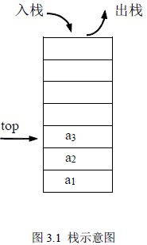

# 3.1 栈—栈的定义及基本运算

栈和队列是在软件设计中常用的两种数据结构，它们的逻辑结构和线性表相同。其特点在于运算受到了限制：栈按“后进先出”的规则进行操作，队按“先进先出”的规则进行操作，故称运算受限制的线性表。

**栈是限制在表的一端进行插入和删除的线性表。**允许插入、删除的这一端称为栈顶，另一个固定端称为栈底。当表中没有元素时称为空栈。如图 3.1.1 所示栈中有三个元素，进栈的顺序是 a1、a2、a3，当需要出栈时其顺序为 a3、a2、a1，所以栈又称为后进先出的线性表（Last In First Out），简称 LIFO 表。

在日常生活中，有很多后进先出的例子，读者可以列举。在程序设计中，常常需要栈这样的数据结构，使得与保存数据时相反顺序来使用这些数据，这时就需要用一个栈来实现。对于栈，常做的基本运算有：

**⑴ 栈初始化：Init_Stack(s)**

初始条件：栈 s 不存在

操作结果：构造了一个空栈。

**⑵ 判栈空：Empty_Stack(s)**

初始条件：栈 s 已存在

操作结果：若 s 为空栈返回为 1，否则返回为 0。

**⑶ 入栈： Push_Stack(s，x)**

初始条件：栈 s 已存在

操作结果：在栈 s 的顶部插入一个新元素 x， x 成为新的栈顶元素。栈发生变化。

**⑷ 出栈：Pop_Stack(s)**

初始条件：栈 s 存在且非空

操作结果：栈 s 的顶部元素从栈中删除，栈中少了一个元素。栈发生变化。

**⑸ 读栈顶元素：Top_Stack(s)**

初始条件：栈 s 存在且非空

操作结果：栈顶元素作为结果返回，栈不变化。