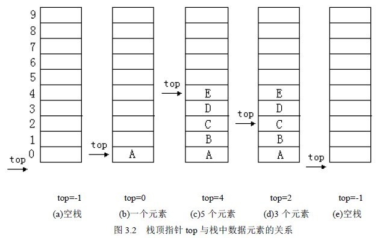

# 3.1 栈—栈的存储实现和运算实现

由于栈是运算受限的线性表，因此线性表的存储结构对栈也是适用的，只是操作不同而已。

## 1． 顺序栈

利用顺序存储方式实现的栈称为顺序栈。类似于顺序表的定义，栈中的数据元素用一个预设的足够长度的一维数组来实现：datatype data[MAXSIZE]，栈底位置可以设置在数组的任一个端点，而栈顶是随着插入和删除而变化的，用一个 int top 来作为栈顶的指针，指明当前栈顶的位置，同样将 data 和 top 封装在一个结构中，顺序栈的类型描述如下：

#define MAXSIZE 1024

typedef struct

{datatype data[MAXSIZE];

int top;

}SeqStack

定义一个指向顺序栈的指针：

SeqStack *s;通常 0 下标端设为栈底，这样空栈时栈顶指针 top=-1; 入栈时，栈顶指针加１，即 s->top++; 出栈时，栈顶指针减１，即 s->top--。栈操作的示意图如图 3.2 所示。

图(a)是空栈，图(c)是 A、B、C、D、E 5 个元素依次入栈之后，图(d)是在图(c)之后 E、D 相继出栈，此时栈中还有 3 个元素，或许最近出栈的元素 D、E 仍然在原先的单元存储着，但 top 指针已经指向了新的栈顶，则元素 D、E 已不在栈中了，通过这个示意图要深刻理解栈顶指针的作用。

在上述存储结构上基本操作的实现如下：

**⑴ 置空栈：首先建立栈空间，然后初始化栈顶指针。**

SeqStack *Init_SeqStack()

{ SeqStack *s;

s=malloc(sizeof(SeqStack));

s->top= -1; return s;

}

**⑵ 判空栈**

int Empty_SeqStack(SeqStack *s)

{ if (s->top= = -1) return 1;

else return 0;

}

**⑶ 入栈**

int Push_SeqStack (SeqStack *s, datatype x)

{if (s->top= =MAXSIZE-1) return 0; /*栈满不能入栈*/

else { s->top++;

s->data[s->top]=x;

return 1;

}

}

**⑷ 出栈**

int Pop_SeqStack(SeqStack *s, datatype *x)

{ if (Empty_SeqStack ( s ) ) return 0; /*栈空不能出栈*/

else { *x=s->data[s->top];

s->top--; return 1; } /*栈顶元素存入*x，返回*/

}

**⑸ 取栈顶元素**

datatype Top_SeqStack(SeqStack *s)

{ if ( Empty_SeqStack ( s ) ) return 0; /*栈空*/

else return (s->data[s->top] );

}

以下几点说明：

1\. 对于顺序栈，入栈时，首先判栈是否满了，栈满的条件为：s->top= =MAXSIZE-1，栈满时，不能入栈; 否则出现空间溢出，引起错误，这种现象称为上溢。

2\. 出栈和读栈顶元素操作，先判栈是否为空，为空时不能操作，否则产生错误。通常栈空时常作为一种控制转移的条件。

## 2\. 链栈

用链式存储结构实现的栈称为链栈。通常链栈用单链表表示，因此其结点结构与单链表的结构相同，在此用 LinkStack 表示，即有：

typedef struct node

{ datatype data;

struct node *next;

}StackNode，* LinkStack;

说明 top 为栈顶指针： LinkStack top ;因为栈中的主要运算是在栈顶插入、删除，显然在链表的头部做栈顶是最方便的，而且没有必要象单链表那样为了运算方便附加一个头结点。通常将链栈表示成图 3.3 的形式。

链栈基本操作的实现如下：

**⑴ 置空栈**

LinkStack Init_LinkStack（）

{ return NULL;

}

**⑵ 判栈空**

int Empty_LinkStack（LinkStack top ）

{ if（top==-1） return 1;

else return 0;

}

**⑶ 入栈**

LinkStack Push_LinkStack（LinkStack top, datatype x）

{ StackNode *s;

s=malloc（sizeof（StackNode））;

s->data=x;

s->next=top;

top=s;

return top;

}

**⑷ 出栈**

LinkStack Pop_LinkStack (LinkStack top, datatype *x)

{ StackNode *p;

if （top= =NULL） return NULL;

else { *x = top->data;

p = top;

top = top->next;

free (p);

return top;

}

}