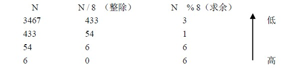
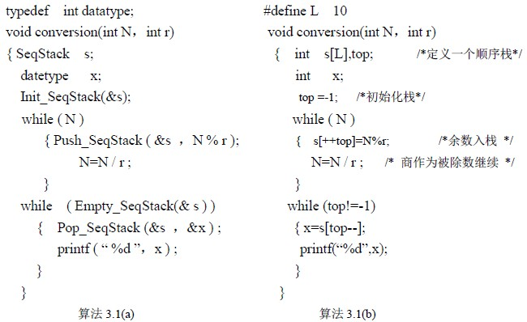
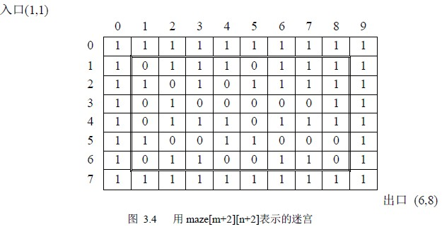
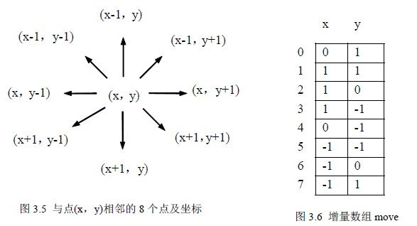
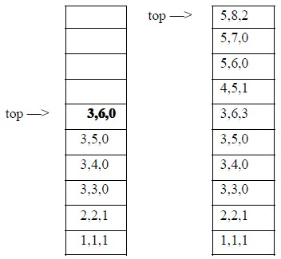

# 3.2 栈的应用举例

由于栈的“先进先出”特点，在很多实际问题中都利用栈做一个辅助的数据结构来进行求解，下面通过几个例子进行说明。

**例 3.1 简单应用：数制转换问题**

将十进制数 N 转换为 r 进制的数，其转换方法利用辗转相除法：以 N=3456，r=8 为例，转换方法如下：

所以：（3456）10 =（6563）8

我们看到所转换的 8 进制数按底位到高位的顺序产生的，而通常的输出是从高位到低位的，恰好与计算过程相反，因此转换过程中每得到一位 8 进制数则进栈保存，转换完毕后依次出栈则正好是转换结果。

算法思想如下：当 N>0 时重复 1，2

1． 若 N≠0，则将 N % r 压入栈 s 中，执行 2;若 N=0，将栈 s 的内容依次出栈，算法结束。

2． 用 N / r 代替 N

算法 3.1(a)是将对栈的操作抽象为模块调用，使问题的层次更加清楚。而算法 3.1(b)中的直接用 int 向量 S 和 int 变量 top 作为一个栈来使用，往往初学者将栈视为一个很复杂的东西，不知道如何使用，通过这个例子可以消除栈的“神秘”，当应用程序中需要一个与数据保存时相反顺序使用数据时，就要想到栈。通常用顺序栈较多，因为很便利。

在后面的例子中，为了在算法中表现出问题的层次，有关栈的操作调用了的相关函数，如象算法 3.1(a)那样，对余数的入栈操作：Push_SeqStack ( &s ，N % r ); 因为是用 c 语言描述，第一个参数是栈的地址才能对栈进行加工。在后面的例子中，为了算法的清楚易读，在不至于混淆的情况下，不再加地址运算符，请读者注意。

**例 3.2 利用栈实现迷宫的求解。**

问题： 这是实验心理学中的一个经典问题，心理学家把一只老鼠从一个无顶盖的大盒子的入口处赶进迷宫。迷宫中设置很多隔壁，对前进方向形成了多处障碍，心理学家在迷宫的唯一出口处放置了一块奶酪，吸引老鼠在迷宫中寻找通路以到达出口。

求解思想：回溯法是一种不断试探且及时纠正错误的搜索方法。下面的求解过程采用回溯法。从入口出发，按某一方向向前探索，若能走通（未走过的），即某处可以到达，则到达新点，否则试探下一方向; 若所有的方向均没有通路，则沿原路返回前一点，换下一个方向再继续试探，直到所有可能的通路都探索到，或找到一条通路，或无路可走又返回到入口点。

在求解过程中，为了保证在到达某一点后不能向前继续行走（无路）时，能正确返回前一点以便继续从下一个方向向前试探，则需要用一个栈保存所能够到达的每一点的下标及从该点前进的方向。

需要解决的四个问题：

1．表示迷宫的数据结构：设迷宫为 m 行 n 列，利用 maze[m][n]来表示一个迷宫，maze[i][j]=0 或 1; 其中：0 表示通路，1 表示不通，当从某点向下试探时，中间点有 8 个方向可以试探，（见图 3.4）而四个角点有 3 个方向，其它边缘点有 5 个方向，为使问题简单化我们用 maze[m+2][n+2]来表示迷宫，而迷宫的四周的值全部为 1。这样做使问题简单了，每个点的试探方向全部为 8，不用再判断当前点的试探方向有几个，同时与迷宫周围是墙壁这一实际问题相一致。

如图 3.4 表示的迷宫是一个 6×8 的迷宫。入口坐标为（1，1），出口坐标为（m，n）

迷宫的定义如下：

#define m 6 /* 迷宫的实际行*/

#define n 8 /* 迷宫的实际列*/

int maze [m+2][n+2] ;

2．试探方向：在上述表示迷宫的情况下，每个点有 8 个方向去试探，如当前点的坐标(x,y)，与其相邻的 8 个点的坐标都可根据与该点的相邻方位而得到，如图 3.5 所示。因为出口在（m，n），

因此试探顺序规定为：从当前位置向前试探的方向为从正东沿顺时针方向进行。为了简化问题，方便的求出新点的坐标，将从正东开始沿顺时针进行的这 8 个方向的坐标增量放在一个结构数组 move [ 8 ]中，在 move 数组中，每个元素有两个域组成，x：横坐标增量，y：纵坐标增量。move 数组如图 3.6 所示。Move 数组定义如下：

typedef struct

{ int x，y

} item ;

item move[8] ;

这样对 move 的设计会很方便地求出从某点(x，y) 按某一方向 v (0<=v<=7) 到达的新点（i，j）的坐标：i=x+move[v].x ; j=y+move[v].y ;

3．栈的设计：当到达了某点而无路可走时需返回前一点，再从前一点开始向下一个方向继续试探。因此，压入栈中的不仅是顺序到达的各点的坐标，而且还要有从前一点到达本点的方向。对于图 3.4 所示迷宫，依次入栈为：

栈中每一组数据是所到达的每点的坐标及从该点沿哪个方向向下走的，对于图 3.4 迷宫，走的路线为：(1,1)1􀃆(2,2)1􀃆(3,3)0􀃆(3,4)0􀃆(3,5)0􀃆(3,6)0（下脚标表示方向），当从点(3,6)沿方向 0 到达点(3,7)之后，无路可走，则应回溯，即退回到点(3,6)，对应的操作是出栈，沿下一个方向即方向 1 继续试探，方向１、２试探失败，在方向３上试探成功，因此将(3,6,3)压入栈中，即到达了（4,5）点。

栈中元素是一个由行、列、方向组成的三元组，栈元素的设计如下：

typedef struct

{int x , y , d ;/* 横纵坐标及方向*/

}datatype ;

栈的定义仍然为： SeqStack s ;

4． 如何防止重复到达某点，以避免发生死循环：一种方法是另外设置一个标志数组 mark[m][n]，它的所有元素都初始化为 0，一旦到达了某一点( i , j )之后，使 mark[i][j] 置 1，下次再试探这个位置时就不能再走了。另一种方法是当到达某点（i , j）后使 maze[i][j] 置-1，以便区别未到达过的点，同样也能起到防止走重复点的目的，本书采用后者方法，算法结束前可恢复原迷宫。

迷宫求解算法思想如下：

1． 栈初始化;

2． 将入口点坐标及到达该点的方向（设为－１）入栈

3． while (栈不空)

{ 栈顶元素＝＞（x , y , d）

出栈;

求出下一个要试探的方向 d++ ;

while （还有剩余试探方向时）

{ if （d 方向可走）

则{ （x , y , d）入栈;

求新点坐标(i, j ) ;

将新点（i , j）切换为当前点（x , y） ;

if ( (x ,ｙ)= =(ｍ,n) ) 结束;

else 重置 d=0 ;

}

else d++ ;

}

}

算法如下：

int path(maze，move)

int maze[m][n] ;

item move[8] ;

{ SeqStack s ;

datetype temp ;

int x, y, d, i, j ;

temp.x=1 ; temp.y=1 ; temp.d=-1 ;

Push-_SeqStack (s，temp) ;

while (! Empty_SeqStack (s ) )

{ Pop_SeqStack (s,＆temp) ;

x=temp.x ; y=temp.y ; d=temp.d+1 ;

while (d<8)

{ i=x+move[d].x ; j=y+move[d].y ;

if ( maze[i][j]= =0 )

{ temp={x, y, d} ;

Push_SeqStack ( s, temp ) ;

x=i ; y=j ; maze[x][y]= -1 ;

if (x==m&&y= =n) return 1 ; /*迷宫有路*/

else d=0 ;

}

else d++ ;

} /*while (d<8)*/

} /*while */

return 0 ;/*迷宫无路*/

}

算法 3.2。栈中保存的就是一条迷宫的通路。

**例 3.3 表达式求值**

表达式求值是程序设计语言编译中一个最基本的问题。它的实现也是需要栈的加入。下面的算法是由算符优先法对表达式求值。

表达式是由运算对象、运算符、括号组成的有意义的式子。运算符从运算对象的个数上分，有单目运算符和双目运算符；从运算类型上分，有算术运算、关系运算、逻辑运算。在此仅限于讨论只含二目运算符的算术表达式。

1． 中缀表达式求值：中缀表达式：每个二目运算符在两个运算量的中间，假设所讨论的算术运算符包括：+ 、- 、*、/、%、^（乘方）和括号（）。

设运算规则为：

．运算符的优先级为：（）——> ^ ——>＊、/、%——> +、- ；

．有括号出现时先算括号内的，后算括号外的，多层括号，由内向外进行；

．乘方连续出现时先算最右面的；

表达式作为一个满足表达式语法规则的串存储，如表达式“3*2^（4+2*2-１*3）-5”,它的的求值过程为：自左向右扫描表达式，当扫描到 3*2 时不能马上计算，因为后面可能还有更高的运算，正确的处理过程是：需要两个栈：对象栈 s1 和算符栈 s2。当自左至右扫描表达式的每一个字符时，若当前字符是运算对象，入对象栈，是运算符时，若这个运算符比栈顶运算符高则入栈，继续向后处理，若这个运算符比栈顶运算符低则从对象栈出栈两个运算量，从算符栈出栈一个运算符进行运算，并将其运算结果入对象栈，继续处理当前字符，直到遇到结束符。

根据运算规则，左括号“（”在栈外时它的级别最高，而进栈后它的级别则最低了; 乘方运算的结合性是自右向左，所以，它的栈外级别高于栈内; 就是说有的运算符栈内栈外的级别是不同的。当遇到右括号“）”时，一直需要对运算符栈出栈，并且做相应的运算，直到遇到栈顶为左括号“(”时，将其出栈，因此右括号“）”级别最低但它是不入栈的。

对象栈初始化为空，为了使表达式中的第一个运算符入栈，算符栈中预设一个最低级的运算符“（”。根据以上分析，每个运算符栈内、栈外的级别如下：