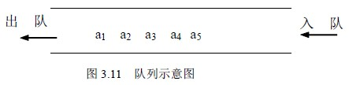

# 3.3 队列—队列的定义及基本运算

前面所讲的栈是一种后进先出的数据结构，而在实际问题中还经常使用一种“先进先出” (FIFO---First In First Out)的数据结构：即插入在表一端进行，而删除在表的另一端进行，我们将这种数据结构称为队或队列，把允许插入的一端叫队尾(rear) ，把允许删除的一端叫队头(front)。如图 3.11 所示是一个有 5 个元素的队列。入队的顺序依次为 a1、a2 、a3 、a4 、a5 ，出队时的顺序将依然是 a1、a2 、a3 、a4 、a5 。

**显然，队列也是一种运算受限制的线性表，所以又叫先进先出表。**

在日常生活中队列的例子很多，如排队买东西，排头的买完后走掉，新来的排在队尾。在队列上进行的基本操作有：

⑴ 队列初始化：Init_Queue(q)

初始条件： 队 q 不存在。

操作结果： 构造了一个空队。

⑵ 入队操作： In_Queue(q,x),

初始条件： 队 q 存在。

操作结果： 对已存在的队列 q，插入一个元素 x 到队尾，队发生变化。

⑶ 出队操作： Out_Queue(q,x)

初始条件: 队 q 存在且非空

操作结果： 删除队首元素，并返回其值，队发生变化。

⑷ 读队头元素：Front_Queue(q,x)

初始条件: 队 q 存在且非空

操作结果： 读队头元素，并返回其值，队不变；

⑸ 判队空操作：Empty_Queue(q)

初始条件： 队 q 存在

操作结果： 若 q 为空队则返回为 1，否则返回为 0。