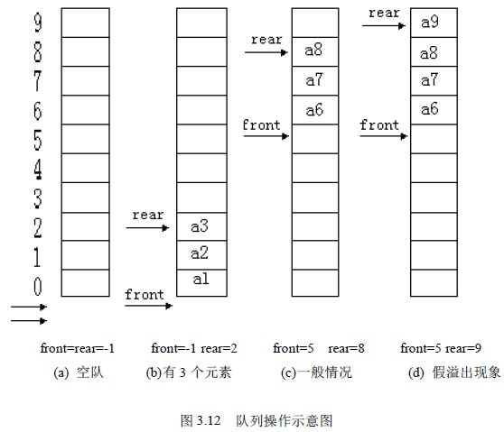
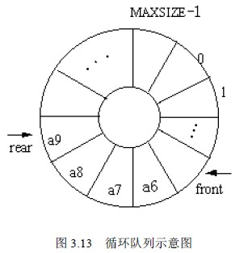
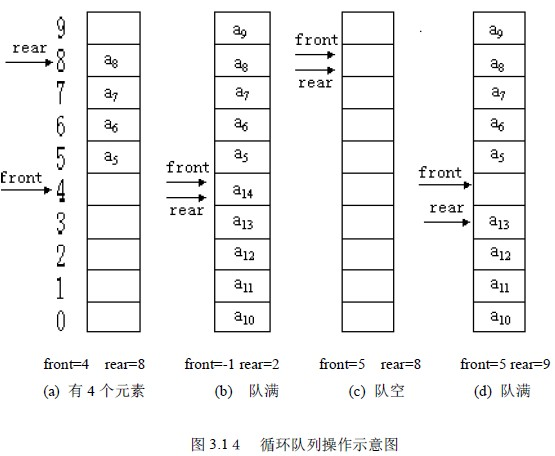
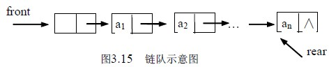
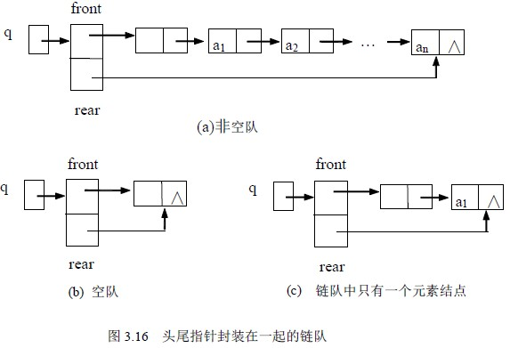

# 3.3 队列—队列的存储实现及运算实现

与线性表、栈类似，队列也有顺序存储和链式存储两种存储方法。

## 1、顺序队

顺序存储的队称为顺序队。因为队的队头和队尾都是活动的，因此，除了队列的数据区外还有队头、队尾两个指针。顺序队的类型定义如下：

define MAXSIZE 1024 /*队列的最大容量*/

typedef struct

{datatype data[MAXSIZE]; /*队员的存储空间*/

int rear,front; /*队头队尾指针*/

}SeQueue;

定义一个指向队的指针变量：

SeQueue *sq;申请一个顺序队的存储空间：sq=malloc(sizeof(SeQueue));队列的数据区为：sq->data[0]---sq->data[MAXSIZE -1]队头指针：sq->front

队尾指针：sq->rear

设队头指针指向队头元素前面一个位置，队尾指针指向队尾元素（这样的设置是为了某些运算的方便，并不是唯一的方法）。

置空队则为：sq->front=sq->rear=-1;

在不考虑溢出的情况下，入队操作队尾指针加 1，指向新位置后，元素入队。操作如下：

sq->rear++;

sq->data[sq->rear]=x; /*原队头元素送 x 中*/

在不考虑队空的情况下，出队操作队头指针加 1，表明队头元素出队。操作如下：

sq->front++;

x=sq->data[sq->front];

队中元素的个数：m=(sq->rear)-(q->front);

队满时：m= MAXSIZE； 队空时：m=0。

按照上述思想建立的空队及入队出队示意图如图 3.12 所示，设 MAXSIZE=10。从图中可以看到，随着入队出队的进行，会使整个队列整体向后移动，这样就出现了图 3.12(d)中的现象：队尾指针已经移到了最后,再有元素入队就会出现溢出，而事实上此时队中并未真的“满员”，这种现象为“假溢出”，这是由于“队尾入队头出”这种受限制

的操作所造成。解决假溢出的方法之一是将队列的数据区 data[0..MAXSIZE-1]看成头尾相接的循环结构，头尾指针的关系不变，将其称为“循环队”，“循环队”的示意图如图 3.13 所示。因为是头尾相接的循环结构，入队时的队尾指针加 1 操作修改为：sq->rear=(sq->rear+1) % MAXSIZE;出队时的队头指针加 1 操作修改为：sq->front=(sq->front+1) % MAXSIZE;设 MAXSIZE=10，图 3.14 是循环队列操作示意图。

从图 3.14 所示的循环队可以看出，(a)中具有 a5 、a6 、a7 、a8 四个元素，此时 front=4,rear=8；随着 a9~a14 相继入队，队中具有了 10 个元素---队满，此时 front=4,rear=4,如（b）所示，可见在队满情况下有：front==rear。若在（a）情况下，a5~a8 相继出队，此时队空， front=4，rear=4，如（c）所示，即在队空情况下也有：front==rear。就是说“队满”和“队空”的条件是相同的了。这显然是必须要解决的一个问题。

方法之一是附设一个存储队中元素个数的变量如 num，当 num==0 时队空，当 num==MAXSIZE 时为队满。

另一种方法是少用一个元素空间，把图（d）所示的情况就视为队满，此时的状态是队尾指针加 1 就会从后面赶上队头指针，这种情况下队满的条件是： (rear+1) %MAXSIZE==front，也能和空队区别开。

下面的循环队列及操作按第一种方法实现。循环队列的类型定义及基本运算如下：

typedef struct {

datatype data[MAXSIZE]; /*数据的存储区*/

int front,rear; /*队头队尾指针*/

int num; /*队中元素的个数*/

}c_SeQueue; /*循环队*/

**⑴ 置空队**

c_SeQueue* Init_SeQueue()

{ q=malloc(sizeof(c_SeQueue));

q->front=q->rear=MAXSIZE-1;

q->num=0;

return q;

}

**⑵ 入队**

int In_SeQueue ( c_SeQueue *q , datatype x)

{ if (num==MAXSIZE)

{ printf(＂队满＂);

return –1; /*队满不能入队*/

}

else

{ q->rear=(q->rear+1) % MAXSIZE;

q->data[q->rear]=x;

num++;

return 1; /*入队完成*/

}

}

**⑶ 出队**

int Out_SeQueue (c_SeQueue *q , datatype *x)

{ if (num==0)

{ printf(＂队空＂)；

return –1; /*队空不能出队*/

}

else

{ q->front=(q->front+1) % MAXSIZE;

*x=q->data[q->front]; /*读出队头元素*/

num--;

return 1; /*出队完成*/

}

}

**⑷ 判队空**

int Empty_SeQueue(c_SeQueue *q)

{ if (num==0) return 1;

else return 0;

}

## 2． 链队

链式存储的队称为链队。和链栈类似，用单链表来实现链队，根据队的 FIFO 原则，为了操作上的方便，我们分别需要一个头指针和尾指针，如图 3.15 所示。图 3.15 中头指针 front 和尾指针 rear 是两个独立的指针变量，从结构性上考虑，通常将二者封装在一个结构中。链队的描述如下：

typedef struct node

{ datatype data;

struct node *next;

} QNode; /*链队结点的类型*/

typedef struct

{ QNnode *front,*rear;

}LQueue; /*将头尾指针封装在一起的链队*/

定义一个指向链队的指针：

LQueue *q;按这种思想建立的带头结点的链队如图 3.16 所示。链队的基本运算如下：

**(1) 创建一个带头结点的空队：**

LQueue *Init_LQueue()

{ LQueue *q,*p;

q=malloc(sizeof(LQueue)); /*申请头尾指针结点*/

p=malloc(sizeof(QNode)); /*申请链队头结点*/

p->next=NULL; q->front=q->rear=p;

return q;

}

**(2) 入队**

void In_LQueue(LQueue *q , datatype x)

{ QNode *p;

p=malloc(sizeof(QNnode)); /*申请新结点*/

p->data=x; p->next=NULL;

q->rear->next=p;

q->rear=p;

}

**(3) 判队空**

int Empty_LQueue( LQueue *q)

{ if (q->front==q->rear) return 0;

else return 1;

}

**(4) 出队**

int Out_LQueue(LQueue *q , datatype *x)

{ QNnode *p;

if (Empty_LQueue(q) )

{ printf (＂队空＂)； return 0;

} /*队空，出队失败*/

else

{ p=q->front->neat;

q->front->next=p->next;

*x=p->data;/*队头元素放 x 中*/

free(p);

if (q->front->next==NULL)

q->rear=q->front;

/*只有一个元素时，出队后队空，此时还要要修改队尾指针参考图 3.16(c)*/

return 1;

}

}