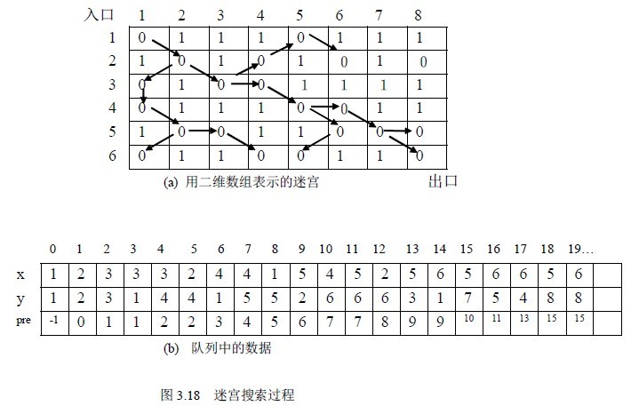

# 3.4 队列应用举例

例 3.5 求迷宫的最短路径：

现要求设计一个算法找一条从迷宫入口到出口的最短路径。本算法要求找一条迷宫的最短路径，算法的基本思想为：从迷宫入口点（1,1）出发，向四周搜索，记下所有一步能到达的坐标点；然后依次再从这些点出发，再记下所有一步能到达的坐标点，…，依此类推，直到到达迷宫的出口点(m,n)为止，然后从出口点沿搜索路径回溯直至入口。这样就找到了一条迷宫的最短路径，否则迷宫无路径。

有关迷宫的数据结构、试探方向、如何防止重复到达某点以避免发生死循环的问题与例 3.2 处理相同，不同的是：如何存储搜索路径。在搜索过程中必须记下每一个可到达的坐标点，以便从这些点出发继续向四周搜索。由于先到达的点先向下搜索，故引进一个“先进先出”数据结构------队列来保存已到达的坐标点。到达迷宫的出口点(m,n)后，为了能够从出口点沿搜索路径回溯直至入口，对于每一点，记下坐标点的同时，还要记下到达该点的前驱点，因此，用一个结构数组 sq[num]作为队列的存储空间，因为迷宫中每个点至多被访问一次，所以 num 至多等于 m*n。sq 的每一个结构有三个域：x,y 和 pre，其中 x,y 分别为所到达的点的坐标，pre 为前驱点在 sq 中的坐标，是一个静态链域。除 sq 外，还有队头、队尾指针：front 和 rear 用来指向队头和队尾元素。

队的定义如下：

typedef struct

{ int x,y;

int pre;

}sqtype;

sqtype sq[num];

int front,rear;

初始状态，队列中只有一个元素 sq[１]记录的是入口点的坐标（１,１），因为该点是出发点，因此没有前驱点，pre 域为－１，队头指针 front 和队尾指针 rear 均指向它，此后搜索时都是以 front 所指点为搜索的出发点，当搜索到一个可到达点时，即将该点的坐标及 front 所指点的位置入队，不但记下了到达点的坐标，还记下了它的前驱点。front 所指点的８个方向搜索完毕后，则出队，继续对下一点搜索。搜索过程中遇到出口点则成功，搜索结束，打印出迷宫最短路径，算法结束；或者当前队空即没有搜索点了，表明没有路径算法也结束。

算法如下：

void path(maze，move)

int maze[m][n]；/*迷宫数组*/

item move[8]；/*坐标增量数组*/

{ sqtype sq[NUM];

int front,rear；

int x,y,i,j,v;

front=rear=0;

sq[０].x=1; sq[０].y=1; sq[０].pre=-1; /*入口点入队*/

maze[1,1]=-1;

while (front<=rear) /*队列不空*/

{ x=sq[front].x ; y=sq[front ].y ;

for (v=0;v<8;v++)

{ i=x+move[v].x; j=x+move[v].y;

if (maze[i][j]==0)

{ rear++;

sq[rear].x=i; sq[rear].y=j; sq[rear].pre=front;

maze[i][j]=-1;

}

if (i==m&&j==n)

{ printpath(sq,rear); /*打印迷宫*/

restore(maze); /*恢复迷宫*/

return 1;

}

} /*for v*/

front++; /*当前点搜索完，取下一个点搜索*/

} /*while*/

return 0;

} /*path*/

void printpath(sqtype sq[],int rear) /*打印迷宫路径*/

{ int i;

i=rear;

do { printf(＂ (%d,%d)􀃅＂,sq[i].x , sq[i].y) ;

i=sq[i].pre; /*回溯*/

} while (i!=-1);

} /*printpath*/

算法 3.5

对于图 3.17（a）所示的迷宫搜索过程如图和队列中的数据如图 3.17(a)、(b)所示。

运行结果： (6,8)􀃅 (5,7)􀃅 (4,6)􀃅(4,5)􀃅 (3,4)􀃅 (3,3)􀃅 (2,2)􀃅(1,1)

在上面的例子中，不能采用循环队列，因为在本问题中，队列中保存了探索到的路径序列，如果用循环队列，则把先前得到的路径序列覆盖掉。而在有些问题中，如持续运行的实时监控系统中，监控系统源源不断的收到监控对象顺序发来的信息如报警，为了保持报警信息的顺序性，就要按顺序一一保存，而这些信息是无穷多个，不可能全部同时驻留内存，可根据实际问题，设计一个适当大的向量空间，用作循环队列，最初收到的报警信息一一入队，当队满之后，又有新的报警到来到时，新的报警则覆盖掉了旧的报警，内存中始终保持当前最新的若干条报警，以便满足快速查询。