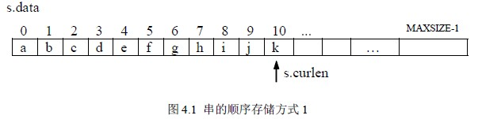
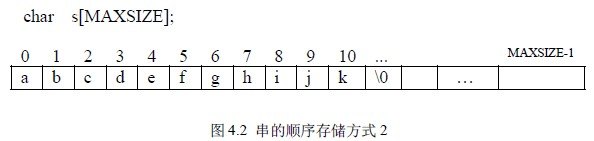
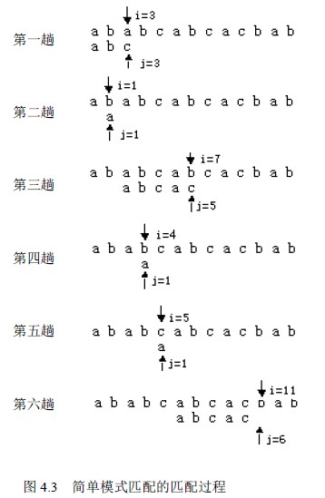
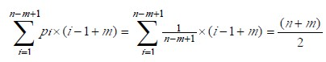
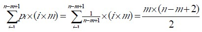
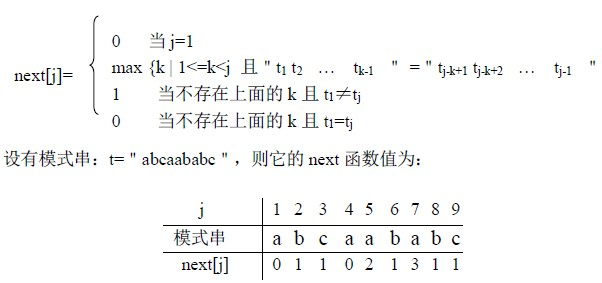
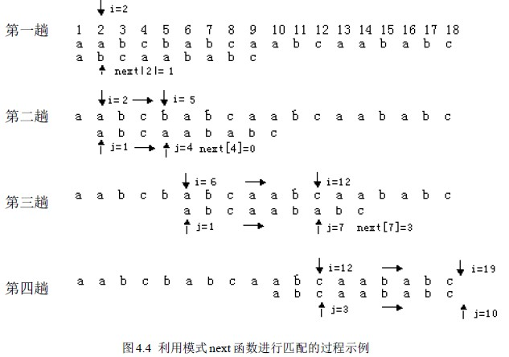

# 4.2 串的定长顺序存储及基本运算

因为串是数据元素类型为字符型的线性表，所以线性表的存储方式仍适用于串，也因为字符的特殊性和字符串经常作为一个整体来处理的特点，串在存储时还有一些与一般线性表不同之处。

## 4.2.1 串的定长顺序存储

类似于顺序表，用一组地址连续的存储单元存储串值中的字符序列，所谓定长是指按预定义的大小，为每一个串变量分配一个固定长度的存储区，如：

#define MAXSIZE 256

char s[MAXSIZE];

则串的最大长度不能超过 256。

如何标识实际长度？

**1\. 类似顺序表，用一个指针来指向最后一个字符**，这样表示的串描述如下：

typedef struct

{ char data[MAXSIZE];

int curlen;

} SeqString;

定义一个串变量：SeqString s。这种存储方式可以直接得到串的长度：s.curlen+1。如图 4.1 所示。

**2\. 在串尾存储一个不会在串中出现的特殊字符作为串的终结符，以此表示串的结尾。**比如 C 语言中处理定长串的方法就是这样的，它是用’\0’来表示串的结束。这种存储方法不能直接得到串的长度，是用判断当前字符是否是’\0’来确定串是否结束，从而求得串的长度。**3\. 设定长串存储空间**：char s[MAXSIZE+1]; 用 s[0]存放串的实际长度，串值存放在 s[1]~s[MAXSIZE]，字符的序号和存储位置一致，应用更为方便。

## 4.2.2 定长顺序串的基本运算

本小节主要讨论定长串联接、求子串、串比较算法，顺序串的插入和删除等运算基本与顺序表相同，在此不在赘述。串定位在下一小节讨论，设串结束用＇\0＇来标识。

**1．串联接**：把两个串 s1 和 s2 首尾连接成一个新串 s ，即：s<=s1+s2。

int StrConcat1(s1,s2,s)

char s1[],s2[],s[];

{ int i=0 , j, len1, len2;

len1= StrLength(s1); len2= StrLength(s2)

if (len1+ len2>MAXSIZE-1) return 0 ; /* s 长度不够*/

j=0;

while(s1[j]!=’\0’) { s[i]=s1[j];i++; j++; }

j=0;

while(s2[j]!=’\0’) { s[i]=s2[j];i++; j++; }

s[i]=’\0’; return 1;

}

算法 4.1

**２．求子串**

int StrSub (char *t, char *s, int i, int len)

/* 用 t 返回串 s 中第个 i 字符开始的长度为 len 的子串 1≤i≤串长*/

{ int slen;

slen=StrLength(s);

if ( i<1 || i>slen || len<0 || len>slen-i+1)

{ printf(＂参数不对＂); return 0; }

for (j=0; j<len; j++)

t[j]=s[i+j-1];

t[j]=’\0’;

return 1;

}

算法 4.2

**３．串比较**

int StrComp(char *s1, char *s2)

{ int i=0;

while (s1[i]==s2[i] && s1[i]!=’\0’) i++;

return (s1[i]-s2[i]);

}

算法 4.3

## 4.2.3 模式匹配

串的模式匹配即子串定位是一种重要的串运算。设 s 和 t 是给定的两个串，在主串 s 中找到等于子串 t 的过程称为模式匹配，如果在 s 中找到等于 t 的子串，则称匹配成功，函数返回 t 在 s 中的首次出现的存储位置(或序号)，否则匹配失败，返回-1。t 也称为模式。为了运算方便，设字符串的长度存放在 0 号单元，串值从 1 号单元存放，这样字符序号与存储位置一致。

**１．简单的模式匹配算法**

算法思想如下：首先将 s1 与 t1 进行比较，若不同，就将 s2 与 t1 进行比较，...，直到 s 的某一个字符 si 和 t1 相同，再将它们之后的字符进行比较，若也相同，则如此继续往下比较，当 s 的某一个字符 si 与 t 的字符 tj 不同时，则 s 返回到本趟开始字符的下一个字符，即 si-j+2，t 返回到 t1，继续开始下一趟的比较，重复上述过程。若 t 中的字符全部比完，则说明本趟匹配成功，本趟的起始位置是 i-j+1 或 i-t[0]，否则，匹配失败。设主串 s=＂ababcabcacbab＂，模式 t=＂abcac＂，匹配过程如图 4.3 所示。

依据这个思想，算法描述如下:

int StrIndex_BF (char *s,char *t)

/*从串 s 的第一个字符开始找首次与串 t 相等的子串*/

{ int i=1,j=1;

while (i<=s[0] && j<=t[0] ) /*都没遇到结束符*/

if (s[i]==t[j])

{ i++;j++; } /*继续*/

else

{i=i-j+2; j=1; } /*回溯*/

if (j>t[0]) return (i-t[0]); /*匹配成功，返回存储位置*/

else return –1;

}

算法 4.4

该算法简称为 BF 算法。下面分析它的时间复杂度，设串 s 长度为 n，串 t 长度为 m。匹配成功的情况下，考虑两种极端情况：在最好情况下，每趟不成功的匹配都发生在第一对字符比较时：

例如：s=＂aaaaaaaaaabc＂

t=＂bc＂

设匹配成功发生在 si 处，则字符比较次数在前面 i-1 趟匹配中共比较了 i-1 次，第 i 趟成功的匹配共比较了 m 次，所以总共比较了 i-1+m 次，所有匹配成功的可能共有 n-m+1 种，设从 si 开始与 t 串匹配成功的概率为 pi，在等概率情况下 pi=1/(n-m+1)，因此最好情况下平均比较的次数是：

即最好情况下的时间复杂度是 O(n+m)。在最坏情况下，每趟不成功的匹配都发生在 t 的最后一个字符：

例如：s=＂aaaaaaaaaaab＂

t=＂aaab＂

设匹配成功发生在 si 处，则在前面 i-1 趟匹配中共比较了(i-1)*m 次，第 i 趟成功的匹配共比较了 m 次，所以总共比较了 i*m 次，因此最坏好情况下平均比较的次数是：

即最坏情况下的时间复杂度是 O(n*m)。

上述算法中匹配是从 s 串的第一个字符开始的，有时算法要求从指定位置开始，这时算法的参数表中要加一个位置参数 pos：StrIndex(shar *s,int pos,char *t)，比较的初始位置定位在 pos 处。算法 4.4 是 pos=1 的情况。

**２．改进后的模式匹配算法**

BF 算法简单但效率较低，一种对 BF 算法做了很大改进的模式匹配算法是克努特(Knuth)，莫里斯(Morris)和普拉特(Pratt)同时设计的，简称 KMP 算法。

(1) KMP 算法的思想

分析算法 4.4 的执行过程, 造成 BF 算法速度慢的原因是回溯，即在某趟的匹配过程失败后，对于 s 串要回到本趟开始字符的下一个字符，t 串要回到第一个字符。而这些回溯并不是必要的。如图 4.3 所示的匹配过程，在第三趟匹配过程中，s3 ~ s6 和 t1~ t4 是匹配成功的，s7≠t5 匹配失败，因此有了第四趟，其实这一趟是不必要的：由图可看出，因为在第三趟中有 s4=t2，而 t 1≠t2，肯定有 t1≠s4 。同理第五趟也是没有必要的，所以从第三趟之后可以直接到第六趟，进一步分析第六趟中的第一对字符 s 6 和 t1 的比较也是多余的，因为第三趟中已经比过了 s6 和 t4，并且 s6=t4，而 t 1=t4，必有 s 6=t1，因此第六趟的比较可以从第二对字符 s7 和 t2 开始进行，这就是说，第三趟匹配失败后，指针 i 不动，而是将模式串 t 向右“滑动”，用 t2 “对准” s 7 继续进行，依此类推。这样的处理方法指针 i 是无回溯的。

综上所述，希望某趟在 si 和 tj 匹配失败后，指针 i 不回溯，模式 t 向右“滑动”至某个位置上，使得 tk 对准 s i 继续向右进行。显然，现在问题的关键是串 t“滑动”到哪个位置上？不妨设位置为 k，即 si 和 tj 匹配失败后，指针 i 不动，模式 t 向右“滑动”，使 tk 和 si 对准继续向右进行比较，要满足这一假设，就要有如下关系成立：

＂t1 t2 … tk-1 ＂ =＂si-k+1 si-k+2 … si-1 ＂ (4.1)(4.1)式左边是 tk 前面的 k-1 个字符，右边是 si 前面的 k-1 个字符。而本趟匹配失败是在 si 和 tj 之处，已经得到的部分匹配结果是：＂t1 t2 … tj-1 ＂ =＂si-j+1 si-j+2 … si-1 ＂ (4.2)因为 k<j，所以有：＂tj-k+1 tj-k+2 … tj-1 ＂ =＂si-k+1 si-k+2 … si-1 ＂ (4.3)(4.3)式左边是 tj 前面的 k-1 个字符，右边是 si 前面的 k-1 个字符，通过(4.1)和(4.3)得到关系：＂t1 t2 … tk-1 ＂ =＂tj-k+1 tj-k+2 … tj-1 ＂ (4.4)

结论：某趟在 si 和 tj 匹配失败后，如果模式串中有满足关系(4)的子串存在，即：模式中的前 k-1 个字符与模式中 tj 字符前面的 k-1 个字符相等时，模式 t 就可以向右“滑动”至使 tk 和 si 对准，继续向右进行比较即可。

（2）next 函数

模式中的每一个 tj 都对应一个 k 值，由(4.4)式可知，这个 k 值仅依赖与模式 t 本身字符序列的构成，而与主串 s 无关。我们用 next[j]表示 tj 对应的 k 值，根据以上分析，next 函数有如下性质：

① next[j]是一个整数，且 0≤next[j]<j

② 为了使 t 的右移不丢失任何匹配成功的可能，当存在多个满足(4.4)式的 k 值时，应取最大的，这样向右“滑动”的距离最短，“滑动”的字符为 j-next[j]个。

③ 如果在 tj 前不存在满足(4.4)式的子串，此时若 t1≠tj，则 k=1; 若 t1=tj，则 k=0; 这时“滑动”的最远，为 j-1 个字符即用 t1 和 sj+1 继续比较。

因此，next 函数定义如下：

(3) KMP 算法

在求得模式的 next 函数之后，匹配可如下进行：假设以指针 i 和 j 分别指示主串和模式中的比较字符，令 i 的初值为 pos，j 的初值为 1。若在匹配过程中 si≠tj，则 i 和 j 分别增１，若 si≠tj 匹配失败后，则 i 不变，j 退到 next[j]位置再比较，若相等，则指针各自增１，否则 j 再退到下一个 next 值的位置，依此类推。直至下列两种情况：一种是 j 退到某个 next 值时字符比较相等，则 i 和 j 分别增１继续进行匹配; 另一种是 j 退到值为零（即模式的第一个字符失配），则此时 i 和 j 也要分别增１，表明从主串的下一个字符起和模式重新开始匹配。

设主串 s=＂acabaabaabcacaabc＂，子串 t=＂abaabcac＂，图 4.4 是一个利用 next 函数进行匹配的过程示意图。在假设已有 next 函数情况下，KMP 算法如下：

int StrIndex_KMP(char *s,char *t,int pos)

/*从串 s 的第 pos 个字符开始找首次与串 t 相等的子串*/

{ int i=pos,j=1,slen,tlen;

while (i<=s[0] && j<=t[0] ) /*都没遇到结束符*/

if (j==0||s[i]==t[j]) { i++; j++; }

else j=next[j]; /*回溯*/

if (j>t[0]) return i-t[0]; /*匹配成功，返回存储位置*/

else return –1;

}

算法 4.5

(4)如何求 next 函数

由以上讨论知，next 函数值仅取决于模式本身而和主串无关。我们可以从分析 next 函数的定义出发用递推的方法求得 next 函数值。由定义知：

next[1]=0 (4.5)

设 next[j]=k，即有：

＂t1 t2 … tk-1 ＂ =＂tj-k+1 tj-k+2 … tj-1 ＂ (4.6)next[j+1]=? 可能有两种情况：

第一种情况：若 tk ＝tj 则表明在模式串中

＂t1 t2 … tk ＂ =＂tj-k+1 tj-k+2 … tj ＂ (4.7)这就是说 next[j+1]=k+1，即 next[j＋１]=next[j]+1 (4.8)第二种情况：若 tk ≠tj 则表明在模式串中＂t1 t2 … tk ＂≠＂tj-k+1 tj-k+2 … tj ＂ (4.9)此时可把求 next 函数值的问题看成是一个模式匹配问题，整个模式串既是主串又是模式，而当前在匹配的过程中，已有(4.6)式成立，则当 tk ≠tj 时应将模式向右滑动，使得第 next[k]个字符和“主串”中的第 j 个字符相比较。若 next[k]=k′，且 t k′＝tj，则说明在主串中第 j+1 个字符之前存在一个最大长度为 k′的子串，使得＂t1 t2 … t k′ ＂=＂tj-k′+1 tj- k′+2 … tj ＂ (4.10)

因此： next[j+1]=next[k]+1 (4.11)

同理若 t k′ ≠tj，则将模式继续向右滑动至使第 next[k′]个字符和 tj 对齐，依此类推，直至 tj 和模式中的某个字符匹配成功或者不存在任何 k′(1< k′<k <…<j)满足(4.10)，此时若 t1≠tj+1 ， 则有：next[j+1]=1 (4.12)

否则若 t1=tj+1 ，则有：next[j+1]=0 (4.13)

综上所述，求 next 函数值过程的算法如下：

void GetNext(char *t,int next[ ])

/*求模式 t 的 next 值并寸入 next 数组中*/

｛ int i=1,j=0;

next[1]=0;

while (i<t[0])

{ while (j>0&&t[i]!=t[j]) j=next[j];

i++; j++;

if (t[i]==t[j]) next[i]=next[j];

else next[i]=j;

}

}

算法 4.6

算法 4.6 的时间复杂度是 O(m)；所以算法 4.5 的时间复杂度是 O(n*m)，但在一般情况下，实际的执行时间是 O(n+m)。当然 KMP 算法和简单的模式匹配算法相比，增加了很大难度，我们主要学习该算法的设计技巧。