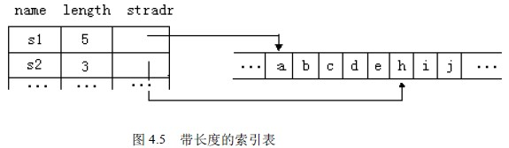
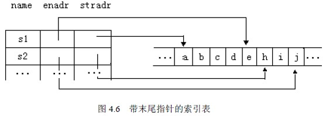
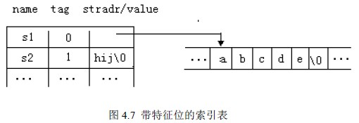

# 4.3 串的堆存储结构—串名的存储映象

串名的存储映象是串名－串值内存分配对照表，也称为索引表。表的形式有多种表示，如设 s1=＂abcdef＂，s2=＂hij＂，常见的串名－串值存储映象索引表有如下几种：

### 1\. 带串长度的索引表

如图 4.4 所示，索引项的结点类型为：

typedef struct

{ char name[MAXNAME]; /*串名*/

int length; /*串长*/

char *stradr; /*起始地址*/

} LNode;

### 2\. 末尾指针的索引表

如图 4.5 所示，索引项的结点类型为：

typedef struct

{ char name[MAXNAME]; /*串名*/

char *stradr,*enadr; /*起始地址，末尾地址*/

} ENode;

### 3\. 带特征位的索引表

当一个串的存储空间不超过一个指针的存储空间时，可以直接将该串存在索引项的指针域，这样即节约了存储空间，又提高查找速度，但这时要加一个特征位 tag 以指出指针域存放的是指针还是串。

如图 4.6 所示，索引项的结点类型为：

typedef struct

{ char name[MAXNAME];

int tag; /*特征位*/

union /*起始地址或串值*/

{char *stradr;

char value[4];

}uval;

} TNode;

