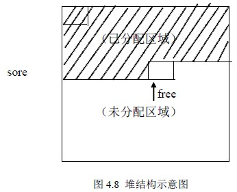

# 4.3 串的堆存储结构—堆存储结构

在应用程序中，参与运算的串变量之间的长度相差较大，并且操作中串值的长度变化也较大，因此为串变量预分配固定大小的空间不尽合理。堆存储结构的基本思想是：在内存中开辟能存储足够多的串、地址连续的存储空间作为应用程序中所有串的可利用存储空间，称为堆空间，如设 store[SMAX+1]; 根据每个串的长度，动态的为每个串在堆空间里申请相应大小的存储区域，这个串顺序存储在所申请的存储区域中，当操作过程中若原空间不够了，可以根据串的实际长度重新申请，拷贝原串值后再释放原空间。

如图 4.8 所示，是一个堆结构示意图。阴影部分是已经为存在的串分配过的，free 为未分配部分的起始地址，每当向 store 中存放一个串时，要填上该串的索引项。

