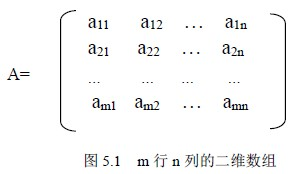
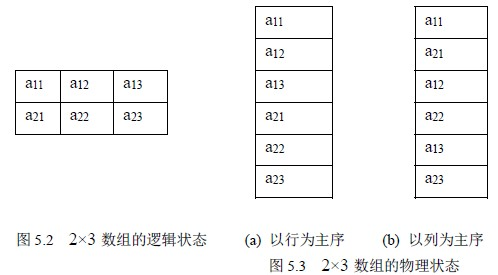
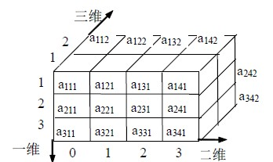
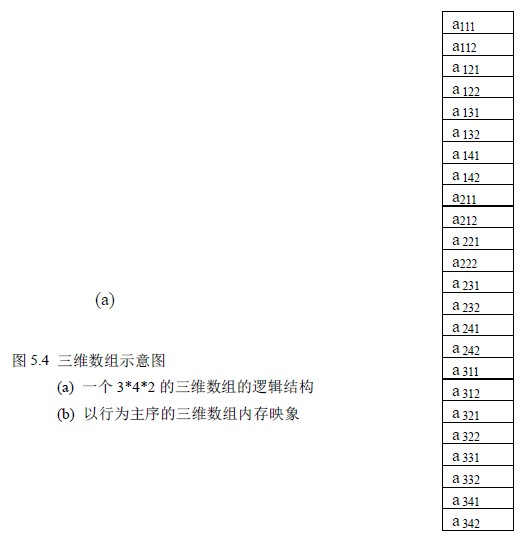

# 5.1 多维数组

本章介绍的数组与广义表可视为线性表的推广，其特点是数据元素仍然是一个表。本章讨论多维数组的逻辑结构和存储结构、特殊矩阵、矩阵的压缩存储、广义表的逻辑结构和存储结构等。

## 5.1.1 数组的逻辑结构

数组是我们很熟悉的一种数据结构，它可以看作线性表的推广。数组作为一种数据结构其特点是结构中的元素本身可以是具有某种结构的数据，但属于同一数据类型，比如：一维数组可以看作一个线性表，二维数组可以看作“数据元素是一维数组”的一维数组，三维数组可以看作“数据元素是二维数组”的一维数组，依此类推。图 5.1 是一个 m 行 n 列的二维数组。

数组是一个具有固定格式和数量的数据有序集，每一个数据元素有唯一的一组下标来标识，因此，在数组上不能做插入、删除数据元素的操作。通常在各种高级语言中数组一旦被定义，每一维的大小及上下界都不能改变。在数组中通常做下面两种操作：

(1) 取值操作：给定一组下标，读其对应的数据元素。

(2) 赋值操作：给定一组下标，存储或修改与其相对应的数据元素。

我们着重研究二维和三维数组，因为它们的应用是广泛的，尤其是二维数组。

## 5.1.2 数组的内存映象

现在来讨论数组在计算机中的存储表示。通常，数组在内存被映象为向量，即用向量作为数组的一种存储结构，这是因为内存的地址空间是一维的，数组的行列固定后，通过一个映象函数，则可根据数组元素的下标得到它的存储地址。

对于一维数组按下标顺序分配即可。

对多维数组分配时，要把它的元素映象存储在一维存储器中，一般有两种存储方式：

一是以行为主序（或先行后列）的顺序存放，如 BASIC、PASCAL、COBOL、C 等程序设计语言中用的是以行为主的顺序分配，即一行分配完了接着分配下一行。

另一种是以列为主序（先列后行）的顺序存放，如 FORTRAN 语言中，用的是以列为主序的分配顺序，即一列一列地分配。

以行为主序的分配规律是：最右边的下标先变化，即最右下标从小到大，循环一遍后，右边第二个下标再变，…，从右向左，最后是左下标。以列为主序分配的规律恰好相反：最左边的下标先变化，即最左下标从小到大，循环一遍后，左边第二个下标再变，…，从左向右，最后是右下标。例如一个 2×3 二维数组，逻辑结构可以用图 5.2 表示。以行为主序的内存映象如图 5.3

（a）所示。分配顺序为：a11 ，a12 ，a13 ，a21 ，a22 ，a23 ; 以列为主序的分配顺序为：a11 ，a21 ，a12 ，a22 ，a13 ，a23 ; 它的内存映象如图 5.3（b）所示。

设有 m×n 二维数组 Amn，下面我们看按元素的下标求其地址的计算：

以“以行为主序”的分配为例：设数组的基址为 LOC(a11)，每个数组元素占据 l 个地址单元，那么 aij 的物理地址可用一线性寻址函数计算：

LOC(aij) = LOC(a11) + ( (i-1)*n + j-1 ) * l 这是因为数组元素 aij 的前面有 i-1 行，每一行的元素个数为 n，在第 i 行中它的前面还有 j-1 个数组元素。

在 C 语言中，数组中每一维的下界定义为 0，则：

LOC(aij) = LOC(a00) + ( i*n + j ) * l 推广到一般的二维数组：A[c1..d1] [c2..d2]，则 aij 的物理地址计算函数为：LOC(aij)=LOC(a c1 c2)+( (i- c1) *( d2 - c2 + 1)+ (j- c2) )*l 同理对于三维数组 Amnp，即 m×n×p 数组，对于数组元素 aijk 其物理地址为：LOC(aijk)=LOC(a111)+( ( i-1) *n*p+ (j-1)*p +k-1)*l 推广到一般的三维数组：A[c1..d1] [c2..d2] [c3..d3]，则 aijk 的物理地址为：LOC(i,j)=LOC(a c1 c2 c3)+( (i- c1) *( d2 - c2 + 1)* (d3- c3 + 1)+ (j- c2) *( d3- c3 + 1)+(k- c3))*l 三维数组的逻辑结构和以行为主序的分配示意图如图 5.4 所示。

例 5．1 若矩阵 Am×n 中存在某个元素 aij 满足：aij 是第 i 行中最小值且是第 j 列中的最大值，则称该元素为矩阵 A 的一个鞍点。试编写一个算法，找出 A 中的所有鞍点。

基本思想：在矩阵 A 中求出每一行的最小值元素，然后判断该元素它是否是它所在列中的最大值，是则打印出，接着处理下一行。矩阵 A 用一个二维数组表示。算法如下：

void saddle (int A[ ][ ],int m, int n)

/*m,n 是矩阵 A 的行和列*/

{ int i,j,min;

for (i=0;i<m;i++) /*按行处理*/

{ min=A[i][0]

for (j=1; j<n; j++)

if (A[i][j]<min ) min=A[I][j]; /*找第 I 行最小值*/

for (j=0; j<n; j++) /*检测该行中的每一个最小值是否是鞍点*/

if (A[I][j]==min )

{ k=j; p=0;

while (p<m && A[p][j]<min)

p++;

if ( p>=m) printf (＂%d,%d,%d\n＂, i ,k,min);

} /* if */

} /*for i*/

}

算法的时间性能为 O(m*(n+m*n))。