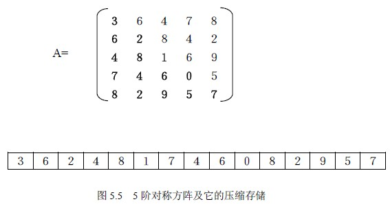
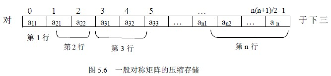

# 5.2 特殊矩阵的压缩存储—对称矩阵

对于一个矩阵结构显然用一个二维数组来表示是非常恰当的，但在有些情况下，比如常见的一些特殊矩阵，如三角矩阵、对称矩阵、带状矩阵、稀疏矩阵等，从节约存储空间的角度考虑，这种存储是不太合适的。下面从这一角度来考虑这些特殊矩阵的存储方法。

对称矩阵的特点是：在一个 n 阶方阵中，有 aij=aji ，其中 1≤i , j≤n，如图 5.5 所示是一个５阶对称矩阵。对称矩阵关于主对角线对称，因此只需存储上三角或下三角部分即可，比如，我们只存储下三角中的元素 aij，其特点是中 j≤i 且 1≤i≤n，对于上三角中的元素 aij ，它和对应的 aji 相等，因此当访问的元素在上三角时，直接去访问和它对应的下三角元素即可，这样，原来需要 n*n 个存储单元，现在只需要 n(n+1)/2 个存储单元了，节约了 n(n-1)/2 个存储单元，当 n 较大时，这是可观的一部分存储资源。

如何只存储下三角部分呢？对下三角部分以行为主序顺序存储到一个向量中去，在下三角中共有 n*(n+1)/2 个元素，因此，不失一般性，设存储到向量 SA[n(n+1)/2]中，存储顺序可用图 5.6 示意，这样，原矩阵下三角中的某一个元素 aij 则具体对应一个 sak，下面的问题是要找到 k 与 i、j 之间的关系。

角中的元素 aij，其特点是：i≥j 且 1≤i≤n，存储到 SA 中后，根据存储原则，它前面有 i-1 行，共有 1+2+…+i-1=i*(i-1)/2 个元素，而 aij 又是它所在的行中的第 j 个，所以在上面的排列顺序中，aij 是第 i*(i-1)/2+j 个元素，因此它在 SA 中的下标 k 与 i、j 的关系为：

k=i*(i-1)/2+j-1 (０≤k<n*(n+1)/2 )

若 i<j，则 aij 是上三角中的元素，因为 aij=aji ，这样，访问上三角中的元素 aij 时则去访问和它对应的下三角中的 aji 即可，因此将上式中的行列下标交换就是上三角中的元素在 SA 中的对应关系：

k=j*(j-1)/2+i-1 (０≤k<n*(n+1)/2 )

综上所述，对于对称矩阵中的任意元素 aij，若令 I=max(i,j)，J=min(i,j)，则将上面两个式子综合起来得到： k=I*(I-1)/2+J-1。