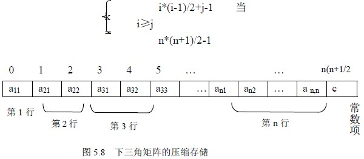

# 5.2 特殊矩阵的压缩存储—三角矩阵

形如图 5.7 的矩阵称为三角矩阵，其中 c 为某个常数。其中 5.7(a)为下三角矩阵：主队角线以上均为同一个常数；(b)为上三角矩阵，主队角线以下均为同一个常数；下面讨论它们的压缩存储方法。

## 1\. 下三角矩阵

与对称矩阵类似，不同之处在于存完下三角中的元素之后，紧接着存储对角线上方的常量，因为是同一个常数，所以存一个即可，这样一共存储了 n*(n+1)+1 个元素，设存入向量：SA[n*(n+1)+1]中，这种的存储方式可节约 n*(n-1)-1 个存储单元，sak 与 aji 的对应关系为：

## 2\. 上三角矩阵

对于上三角矩阵，存储思想与下三角类似，以行为主序顺序存储上三角部分，最后存储对角线下方的常量。对于第 1 行，存储 n 个元素，第 2 行存储 n-1 个元素，…，第 p 行存储(n-p+1)个元素，aij 的前面有 i-1 行，共存储：

个元素，而 aij 是它所在的行中要存储的第（j-i+1）个；所以，它是上三角存储顺序中的第(i-1)*(2n-i+2)/2+(j-i+1)个，因此它在 SA 中的下标为：k=(i-1)*(2n-i+2)/2+j-i。综上， sak 与 aji 的对应关系为：