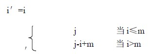
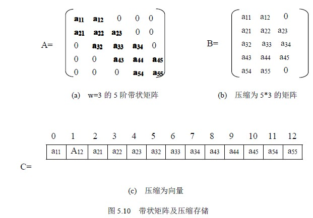

# 5.2 特殊矩阵的压缩存储—带状矩阵

n 阶矩阵 A 称为带状矩阵，如果存在最小正数 m ，满足当∣i-j∣≥m 时，aij =0，这时称 w=2n-1 为矩阵 A 的带宽。如图 5.10(a)是一个 w=3(m=2)的带状矩阵。带状矩阵也称为对角矩阵。由图 5.10(a)可看出，在这种矩阵中，所有非零元素都集中在以主对角线为中心的带状区域中，即除了主对角线和它的上下方若干条对角线的元素外，所有其他元素都为零(或同一个常数 c)。

带状矩阵 A 也可以采用压缩存储。

一种压缩方法是将 A 压缩到一个 n 行 w 列的二维数组 B 中，如图 5.10(b)所示，当某行非零元素的个数小于带宽 w 时，先存放非零元素后补零。那么 aij 映射为 b i′j′，映射关系为：

另一种压缩方法是将带状矩阵压缩到向量 C 中去，按以行为主序，顺序的存储其非零元素，如图 5.10(c)所示，按其压缩规律，找到相应的映象函数。如当 w=3 时，映象函数为：k=2*i+j-3