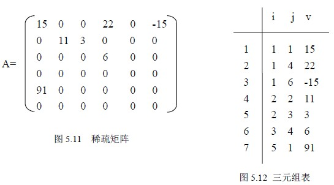
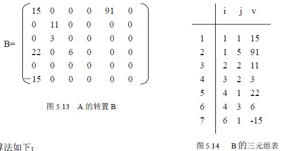
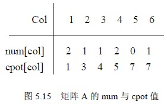
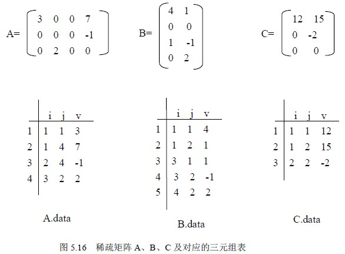
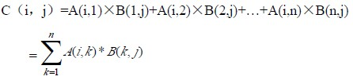
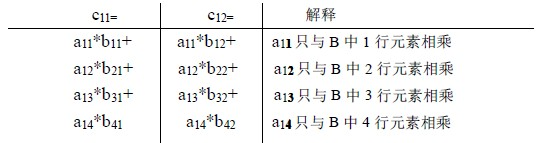
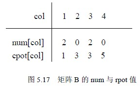

# 5.3 稀疏矩阵—稀疏矩阵的三元组表存储

设 m*n 矩阵中有 t 个非零元素且 t<<m*n，这样的矩阵称为稀疏矩阵。很多科学管理及工程计算中，常会遇到阶数很高的大型稀疏矩阵。如果按常规分配方法，顺序分配在计算机内，那将是相当浪费内存的。为此提出另外一种存储方法，仅仅存放非零元素。但对于这类矩阵，通常零元素分布没有规律，为了能找到相应的元素，所以仅存储非零元素的值是不够的，还要记下它所在的行和列。于是采取如下方法：将非零元素所在的行、列以及它的值构成一个三元组（i,j,v），然后再按某种规律存储这些三元组，这种方法可以节约存储空间。下面讨论稀疏矩阵的压缩存储方法。

将三元组按行优先的顺序，同一行中列号从小到大的规律排列成一个线性表，称为三元组表，采用顺序存储方法存储该表。如图 5.11 稀疏矩阵对应的三元组表为图 5.12。

显然，要唯一的表示一个稀疏矩阵，还需要存储三元组表的同时存储该矩阵的行、列，为了运算方便，矩阵的非零元素的个数也同时存储。这种存储的思想实现如下：

define SMAX 1024 /*一个足够大的数*/

typedef struct

{ int i,j; /*非零元素的行、列*/

datatype v; /*非零元素值*/

}SPNode; /*三元组类型*/

typedef struct

{ int mu,nu,tu; /*矩阵的行、列及非零元素的个数*/

SPNode data[SMAX]; /*三元组表*/

} SPMatrix; /*三元组表的存储类型*/

这样的存储方法确实节约了存储空间，但矩阵的运算从算法上可能变的复杂些。下面我们讨论这种存储方式下的稀疏矩阵的两种运算：转置和相乘。

### 1．稀疏矩阵的转置

设 SPMatrix A; 表示一 m*n 的稀疏矩阵，其转置 B 则是一个 n*m 的稀疏矩阵，因此也有 SPMatrix B; 由 A 求 B 需要：

A 的行、列转化成 B 的列、行；

将 A.data 中每一三元组的行列交换后转化到 B.data 中；

看上去以上两点完成之后，似乎完成了 B，没有。因为我们前面规定三元组的是按一行一行且每行中的元素是按列号从小到大的规律顺序存放的，因此 B 也必须按此规律实现，A 的转置 B 如图 5.13 所示，图 5.14 是它对应的三元组存储，就是说，在 A 的三元组存储基础上得到 B 的三元组表存储（为了运算方便，矩阵的行列都从 1 算起，三元组表 data 也从 1 单元用起）。

算法思路：

①A 的行、列转化成 B 的列、行；

②在 A.data 中依次找第一列的、第二列的、直到最后一列，并将找到的每个三元组的行、列交换后顺序存储到 B.data 中即可。

算法如下：

void TransM1 (SPMatrix *A)

{ SPMatrix *B;

int p,q,col;

B=malloc(sizeof(SPMatrix)); /*申请存储空间*/

B->mu=A->nu; B->nu=A->mu; B->tu=A->tu;

/*稀疏矩阵的行、列、元素个数*/

if (B->tu>0) /*有非零元素则转换*/

{ q=0;

for (col=1; col<=(A->nu); col++) /*按 A 的列序转换*/

for (p=1; p<= (A->tu); p++) /*扫描整个三元组表*/

if (A->data[p].j==col )

{ B->data[q].i= A->data[p].j ;

B->data[q].j= A->data[p].i ;

B->data[q].v= A->data[p].v;

q++; }/*if*/

} /*if(B->tu>0)*/

return B; /*返回的是转置矩阵的指针*/

} /*TransM1*/

算法 5.1 稀疏矩阵转置

分析该算法，其时间主要耗费在 col 和 p 的二重循环上，所以时间复杂性为 O(n*t)，(设 m、n 是原矩阵的行、列，t 是稀疏矩阵的非零元素个数)，显然当非零元素的个数 t 和 m*n 同数量级时，算法的时间复杂度为 O(m*n2)，和通常存储方式下矩阵转置算法相比，可能节约了一定量的存储空间，但算法的时间性能更差一些。

算法 5.1 的效率低的原因是算法要从 A 的三元组表中寻找第一列、第二列、…，要反复搜索 A 表，若能直接确定 A 中每一三元组在 B 中的位置，则对 A 的三元组表扫描一次即可。这是可以做到的，因为 A 中第一列的第一个非零元素一定存储在 B.data[1]，如果还知道第一列的非零元素的个数，那么第二列的第一个非零元素在 B.data 中的位置便等于第一列的第一个非零元素在 B.data 中的位置加上第一列的非零元素的个数，如此类推，因为 A 中三元组的存放顺序是先行后列，对同一行来说，必定先遇到列号小的元素，这样只需扫描一遍 A.data 即可。

根据这个想法，需引入两个向量来实现：num[n+1]和 cpot[n+1]，num[col]表示矩阵 A 中第 col 列的非零元素的个数（为了方便均从 1 单元用起），cpot［col］初始值表示矩阵 A 中的第 col 列的第一个非零元素在 B.data 中的位置。于是 cpot 的初始值为：

cpot[1]=1；

cpot[col]=cpot[col-1]+num[col-1]； 2≤col≤n

例如对于矩阵图 5.11 矩阵 A 的 num 和 cpot 的值如下：

依次扫描 A.data，当扫描到一个 col 列元素时，直接将其存放在 B.data 的 cpot[col]位置上，cpot[col]加１，cpot[col]中始终是下一个 col 列元素在 B.data 中的位置。下面按以上思路改进转置算法如下：

SPMatrix * TransM2 (SPMatrix *A)

{ SPMatrix *B;

int i,j,k;

int num[n+1],cpot[n+1];

B=malloc(sizeof(SPMatrix)); /*申请存储空间*/

B->mu=A->nu; B->nu=A->mu; B->tu=A->tu;

/*稀疏矩阵的行、列、元素个数*/

if (B->tu>0) /*有非零元素则转换*/

{ for (i=1;i<=A->nu;i++) num[i]=0;

for (i=1;i<=A->tu;i++) /*求矩阵 A 中每一列非零元素的个数*/

{ j= A->data[i].j;

num[j]++;

}

cpot[1]=1; /*求矩阵 A 中每一列第一个非零元素在 B.data 中的位置*/

for (i=2;i<=A->nu;i++)

cpot[i]= cpot[i-1]+num[i-1];

for (i=1; i<= (A->tu); i++) /*扫描三元组表*/

{ j=A->data[i].j; /*当前三元组的列号*/

k=cpot[j]; /*当前三元组在 B.data 中的位置*/

B->data[k].i= A->data[i].j ;

B->data[k].j= A->data[i].i ;

B->data[k].v= A->data[i].v;

cpot[j]++;

} /*for i */

} /*if (B->tu>0)*/

return B; /*返回的是转置矩阵的指针*/

} /*TransM2*/

算法 5.2 稀疏矩阵转置的改进算法

分析这个算法的时间复杂度：这个算法中有四个循环，分别执行 n，t，n-1，t 次，在每个循环中，每次迭代的时间是一常量，因此总的计算量是 O（n+t）。当然它所需要的存储空间比前一个算法多了两个向量。

### 2．稀疏矩阵的乘积

已知稀疏矩阵 A(m1× n1)和 B(m2× n2)，求乘积 C(m1× n2)。稀疏矩阵 A、B、C 及它们对应的三元组表 A.data、B.data、C.data 如图 5.16 所示。

由矩阵乘法规则知：

这就是说只有 A(i,k)与 B(k,p)（即 A 元素的列与 B 元素的行相等的两项）才有相乘的机会，且当两项都不为零时，乘积中的这一项才不为零。

矩阵用二维数组表示时，传统的矩阵乘法是：A 的第一行与 B 的第一列对应相乘累加后得到 c11，A 的第一行再与 B 的第二列对应相乘累加后得到 c12，…，因为现在按三元组表存储，三元组表是按行为主序存储的，在 B.data 中，同一行的非零元素其三元组是相邻存放的，同一列的非零元素其三元组并未相邻存放，因此在 B.data 中反复搜索某一列的元素是很费时的，因此改变一下求值的顺序，以求 c11 和 c12 为例，因为：

即 a11 只有可能和 B 中第 1 行的非零元素相乘，a12 只有可能和 B 中第 2 行的非零元素相乘，…，而同一行的非零元是相邻存放的，所以求 c11 和 c12 同时进行：求 a11*b11 累加到 c11，求 a11*b12 累加到 c12，再求 a12*b21 累加到 c11，再求 a12*b22 累加到 c22.，…，当然只有 aik 和 bkj(列号与行号相等)且均不为零（三元组存在）时才相乘，并且累加到 cij 当中去。

为了运算方便，设一个累加器：datatype temp[n+1]；用来存放当前行中 cij 的值，当前行中所有元素全部算出之后，再存放到 C.data 中去。

为了便于 B.data 中寻找 B 中的第 k 行第一个非零元素，与前面类似，在此需引入 num 和 rpot 两个向量。num[k]表示矩阵 B 中第 k 行的非零元素的个数；rpot[k]表示第 k 行的第一个非零元素在 B.data 中的位置。于是有

rpot[1]=1

rpot[k]=rpot[k-1]+num[k-1] 2≤k≤n

例如，对于矩阵 B 的 num 和 rpot 如图 5.17 所示。

根据以上分析，稀疏矩阵的乘法运算的粗略步骤如下：

⑴初始化。清理一些单元，准备按行顺序存放乘积矩阵;

⑵求 B 的 num，rpot;

⑶做矩阵乘法。将 A.data 中三元组的列值与 B.data 中三元组的行值相等的非零元素相乘，并将具有相同下标的乘积元素相加。

算法如下：

SPMatrix *MulSMatrix (SPMatrix *A, SPMatrix *B)

/*稀疏矩阵 A(m1× n1)和 B(m2× n2) 用三元组表存储，求 A×B */

{ SPMatrix *C; /* 乘积矩阵的指针*/

int p,q,i,j,k,r;

datatype temp[n+1];

int num[B->nu+1],rpot[B->nu+1];

if (A->nu!=B->mu) return NULL; /*A 的列与 B 的行不相等*/

C=malloc(sizeof(SPMatrix)); /*申请 C 矩阵的存储空间*/

C->mu=A->mu; C->nu=B->nu;

if (A->tu*B->tu==0) {C->tu=0; return C; }

for (i=1;i<= B->mu;i++) num[i]=0; /*求矩阵 B 中每一行非零元素的个数*/

for (k=1;k<=B->tu;k++)

{ i= B->data[k].i;

num[i]++;

}

rpot[1]=1; /*求矩阵 B 中每一行第一个非零元素在 B.data 中的位置*/

for (i=2;i<=B->mu;i++)

rpot[i]= rpot[i-1]+num[i-1];

r=0; /*当前 C 中非零元素的个数*/

p=1; /*指示 A.data 中当前非零元素的位置*/

for ( i= 1;i<=A->mu; i++)

{ for (j=1;j<=B->nu;j++) temp[j]=0; /*cij 的累加器初始化*/

while (A->data[p].i==i ) ./*求第 i 行的*/

{ k=A->data[p].j; /*A 中当前非零元的列号*/

if (k<B->mu) t=rpot[k+1];

else t=B->tu+1; /*确定 B 中第 k 行的非零元素在 B.data 中的下限位置*/

for (q=rpot[k]; q<t; q++;) /* B 中第 k 行的每一个非零元素*/

{ j=B->data[q].j;

temp[j]+=A->data[p].v * B->data[q].v

}

p++;

} /* while */

for (j=1;j<=B->nu;j++)

if (temp[j] )

{ r++;;

C->data[r]={i,j,temp[j] };

}

} /*for i*/

C->tu=r;

return C;

}/* MulSMatrix */

算法 5.3 稀疏矩阵的乘积

分析上述算法的时间性能如下：

（1）求 num 的时间复杂度为 O(B->nu+B->tu)；

（2）求 rpot 时间复杂度为 O(B->mu)；

（3）求 temp 时间复杂度为 O(A->mu*B->nu)；

（4）求 C 的所有非零元素的时间复杂度为 O(A->tu*B->tu/B->mu)；

（5）压缩存储时间复杂度为 O(A->mu*B->nu)；所以总的时间复杂度为 O(A->mu*B->nu+(A->tu*B->tu)/B->nu)。