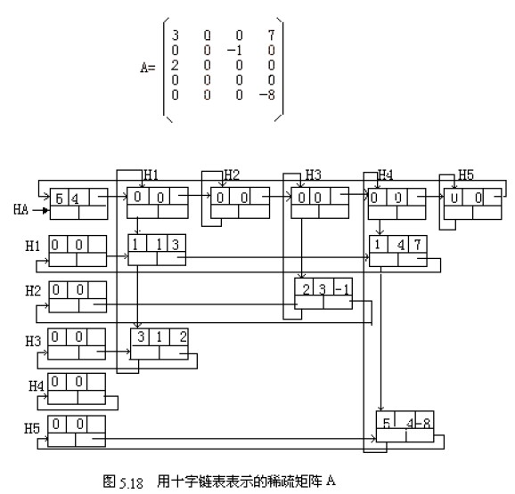
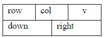
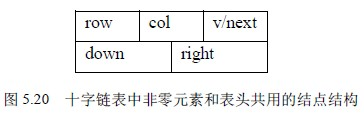

# 5.3 稀疏矩阵—稀疏矩阵的十字链表存储

三元组表可以看作稀疏矩阵顺序存储，但是在做一些操作（如加法、乘法）时，非零项数目及非零元素的位置会发生变化，这时这种表示就十分不便。在这节中，我们介绍稀疏矩阵的一种链式存储结构——十字链表，它同样具备链式存储的特点，因此，在某些情况下，采用十字链表表示稀疏矩阵是很方便的。

图 5.18 是一个稀疏矩阵的十字链表。

用十字链表表示稀疏矩阵的基本思想是：对每个非零元素存储为一个结点，结点由 5 个域组成，其结构如图 5.19 表示，其中：row 域存储非零元素的行号，col 域存储非零元素的列号，v 域存储本元素的值，right，down 是两个指针域。稀疏矩阵中每一行的非零元素结点按其列号从小到大顺序由 right 域链成一个带表头结点的循环行链表，同样每一列中的非零元素按其行号从小到大顺序由 down 域也链成一个带表头结点的循环列链表。即每个非零元素 aij 既是第 i 行循环链表中的一个结点，又是第 j 列循环链表中的一个结点。行链表、列链表的头结点的 row 域和 col 域置 0。每一列链表的表头结点的 down 域指向该列链表的第一个元素结点，每一行链表的表头结点的 right 域指向该行表的第一个元素结点。由于各行、列链表头结点的 row 域、col 域和 v 域均为零，行链表头结点只用 right 指针域，列链表头结点只用 right 指针域，故这两组表头结点可以合用，也就是说对于第 i 行的链表和第 i 列的链表可以共用同一个头结点。为了方便地找到每一行或每一列，将每行（列）的这些头结点们链接起来，因为头结点的值域空闲，所以用头结点的值域作为连接各头结点的链域，即第 i 行（列）的头结点的值域指向第 i+1 行（列）的头结点，… ，形成一个循环表。这个循环表又有一个头结点，这就是最后的总头结点，指针 HA 指向它。总头结点的 row 和 col 域存储原矩阵的行数和列数。

因为非零元素结点的值域是 datatype 类型，在表头结点中需要一个指针类型，为了使整个结构的结点一致，我们规定表头结点和其它结点有同样的结构，因此该域用一个联合来表示；改进后的结点结构如图 5.20 所示。

综上，结点的结构定义如下:

typedef struct node

{ int row, col;

struct node *down , *right;

union v_next

{ datatype v;

struct node *next;

}

} MNode，*MLink;

让我们看基于这种存储结构的稀疏矩阵的运算。这里将介绍两个算法，创建一个稀疏矩阵的十字链表和用十字链表表示的两个稀疏矩阵的相加。

### 1．建立稀疏矩阵 A 的十字链表

首先输入的信息是：m（A 的行数），n（A 的列数），r（非零项的数目），紧跟着输入的是 r 个形如（i,j,aij）的三元组。

算法的设计思想是：首先建立每行（每列）只有头结点的空链表，并建立起这些头结点拉成的循环链表；然后每输入一个三元组（i，j，aij），则将其结点按其列号的大小插入到第 i 个行链表中去，同时也按其行号的大小将该结点插入到第 j 个列链表中去。在算法中将利用一个辅助数组 MNode *hd[s+1]; 其中 s=max(m , n) , hd [i]指向第 i 行(第 i 列)链表的头结点。这样做可以在建立链表时随机的访问任何一行（列），为建表带来方便。

算法如下：

MLink CreatMLink( ) /* 返回十字链表的头指针*/

｛

MLink H;

Mnode *p,*q,*hd[s+1];

int i,j,m,n,t;

datatype v;

scanf(“%d,%,%d”,&m,&n,&t);

H=malloc(sizeof(MNode)); /*申请总头结点*/

H->row=m; H->col=n;

hd[0]=H;

for(i=1; i<S; i++)

{ p=malloc(sizeof(MNode)); /*申请第 i 个头结点*/

p->row=0; p->col=0;

p->right=p; p->down=p;

hd[i]=p;

hd[i-1]->v_next.next=p;

}

hd[S]->v_next.next=H; /*将头结点们形成循环链表*/

for (k=1;k<=t;k++)

{ scanf (“%d,%d,%d”,&i,&j,&v); /*输入一个三元组，设值为 int*/

p=malloc(sizeof(MNode));

p->row=i ; p->col=j; p->v_next.v=v

/*以下是将*p 插入到第 i 行链表中去，且按列号有序*/

q=hd[i];

while ( q->right!=hd[i] && (q->right->col)<j ) /*按列号找位置*/

q=q->right;

p->right=q->right; /*插入*/

q->right=p;

/*以下是将*p 插入到第 j 行链表中去，且按行号有序*/

q=hd[i];

while ( q->down!=hd[j] && (q->down->row)<i ) /*按行号找位置*/

q=q->down;

p-> down =q-> down; /*插入*/

q-> down =p;

} /*for k*/

return H;

} /* CreatMLink */

算法 5.4 建立稀疏矩阵的十字链表

上述算法中，建立头结点循环链表时间复杂度为 O(S)，插入每个结点到相应的行表和列表的时间复杂度是 O(t*S)，这是因为每个结点插入时都要在链表中寻找插入位置，所以总的时间复杂度为 O(t*S)。该算法对三元组的输入顺序没有要求。如果我们输入三元组时是按以行为主序（或列）输入的，则每次将新结点插入到链表的尾部的，改进算法后，时间复杂度为 O(S+t)。

### ２．两个十字链表表示的稀疏矩阵的加法

已知两个稀疏矩阵 A 和 B，分别采用十字链表存储，计算 C=A+B，C 也采用十字链表方式存储，并且在 A 的基础上形成 C。

由矩阵的加法规则知，只有 A 和 B 行列对应相等，二者才能相加。C 中的非零元素 cij 只可能有３种情况：或者是 aij+bij，或者是 aij (bij=0)，或者是 bij (aij=0)，因此当 B 加到 A 上时，对 A 十字链表的当前结点来说，对应下列四种情况：或者改变结点的值（aij+bij≠０），或者不变（bij＝０），或者插入一个新结点（aij＝０），还可能是删除一个结点（aij+bij＝０）。整个运算从矩阵的第一行起逐行进行。对每一行都从行表的头结点出发，分别找到 A 和 B 在该行中的第一个非零元素结点后开始比较，然后按４种不同情况分别处理。设 pa 和 pb 分别指向 A 和 B 的十字链表中行号相同的两个结点，４种情况如下：

(1) 若 pa->col=pb->col 且 pa->v+pb->v≠0，则只要用 aij+bij 的值改写 pa 所指结点的值域即可。

(2) 若 pa->col=pb->col 且 pa->v+pb->v=0，则需要在矩阵 A 的十字链表中删除 pa 所指结点，此时需改变该行链表中前趋结点的 right 域，以及该列链表中前趋结点的 down 域。

(3) 若 pa->col < pb->col 且 pa->col≠0（即不是表头结点），则只需要将 pa 指针向右推进一步，并继续进行比较。

(4) 若 pa->col > pb->col 或 pa->col＝0（即是表头结点），则需要在矩阵 A 的十字链表中插入一个 pb 所指结点。

由前面建立十字链表算法知，总表头结点的行列域存放的是矩阵的行和列，而各行（列）链表的头结点其行列域值为零，当然各非零元素结点的行列域其值不会为零，下面分析的 4 种情况利用了这些信息来判断是否为表头结点。

综上所述，算法如下：

MLink AddMat (Ha,Hb)

MLink Ha,Hb;

{ Mnode *p,*q,*pa,*pb,*ca,*cb,*qa;

if (Ha->row!=Hb->row || Ha->col!=Hb->col) return NULL;

ca=Ha->v_next.next; /*ca 初始指向 A 矩阵中第一行表头结点*/

cb=Hb->v_next.next; /*cb 初始指向 B 矩阵中第一行表头结点*/

do { pa=ca->right; /*pa 指向 A 矩阵当前行中第一个结点*/

qa=ca; /*qa 是 pa 的前驱*/

pb=cb->right; /*pb 指向 B 矩阵当前行中第一个结点*/

while (pb->col!=0) /*当前行没有处理完*/

{

if (pa->col < pb->col && pa->col !=0 ) /*第三种情况*/

{ qa=pa;

pa=pa->right;

}

else

if (pa->col > pb->col || pa->col ==0 ) /*第四种情况*/

{p=malloc(sizeof(MNode));

p->row=pb->row; p->col=pb->col; p->v=pb->v;

p->right=pa;qa->right=p; /* 新结点插入*pa 的前面*/

pa=p;

/*新结点还要插到列链表的合适位置，先找位置，再插入*/

q=Find_JH(Ha,p->col); /*从列链表的头结点找起*/

while(q->down->row!=0 && q->down->row<p->row)

q=q->down;

p->down=q->down; /*插在*q 的后面*/

q->down=p;

pb=pb->right;

} /* if */

else /*第一、二种情况*/

{x= pa->v_next.v+ pb->v_next.v;

if (x==0) /*第二种情况*/

{ qa->right=pa->right; ./*从行链中删除*/

/*还要从列链中删除，找*pa 的列前驱结点*/

q= Find_JH (Ha,pa->col); /*从列链表的头结点找起*/

while ( q->down->row < pa->row )

q=q->down;

q->down=pa->down;

free (pa);

pa=qa;

} /*if (x==0)*/

else /*第一种情况*/

{ pa->v_next.v=x;

qa=pa;

}

pa=pa->right;

pb=pb->right;

}

} /*while*/

ca=ca->v_next.next; /*ca 指向 A 中下一行的表头结点*/

cb=cb->v_next.next; /*cb 指向 B 中下一行的表头结点*/

} while (ca->row==0) /*当还有未处理完的行则继续*/

return Ha;

}

算法 5.5 十字链表表示的稀疏矩阵相加

为了保持算法的层次，在上面的算法，用到了一个函数 findjH。函数 Mlink Find_JH(MLink H, int j)的功能是：返回十字链表 H 中第 j 列链表的头结点指针，很简单，读者可自行写出。