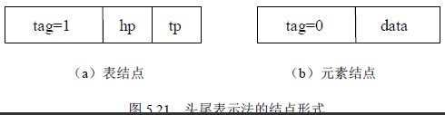
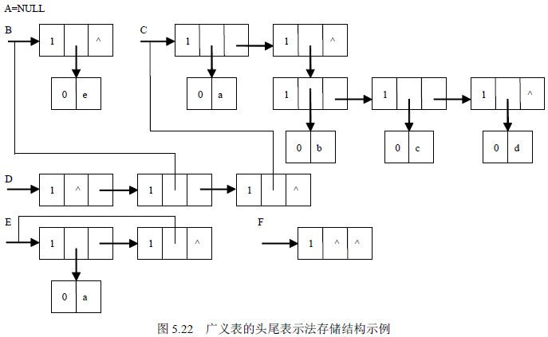
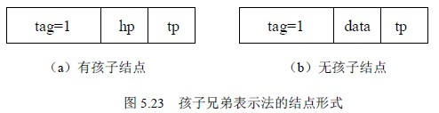
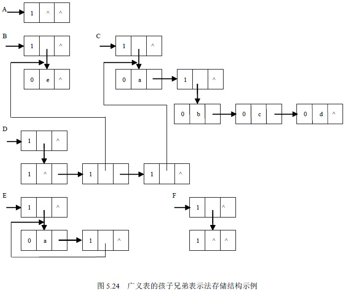

# 5.4 广义表—广义表的存储

由于广义表中的数据元素可以具有不同的结构，因此难以用顺序的存储结构来表示。而链式的存储结构分配较为灵活，易于解决广义表的共享与递归问题，所以通常都采用链式的存储结构来存储广义表。在这种表示方式下，每个数据元素可用一个结点表示。

按结点形式的不同，广义表的链式存储结构又可以分为不同的两种存储方式。一种称为头尾表示法，另一种称为孩子兄弟表示法。

## ⒈头尾表示法

若广义表不空，则可分解成表头和表尾；反之，一对确定的表头和表尾可惟一地确定一个广义表。头尾表示法就是根据这一性质设计而成的一种存储方法。

由于广义表中的数据元素既可能是列表也可能是单元素，相应地在头尾表示法中结点的结构形式有两种：一种是表结点，用以表示列表；另一种是元素结点，用以表示单元素。

在表结点中应该包括一个指向表头的指针和指向表尾的指针；而在元素结点中应该包括所表示单元素的元素值。为了区分这两类结点，在结点中还要设置一个标志域，如果标志为 1，则表示该结点为表结点；如果标志为 0，则表示该结点为元素结点。其形式定义说明如下：

typedef enum {ATOM, LIST} Elemtag; /*ATOM=0：单元素；LIST=1：子表*/

typedef struct GLNode {

Elemtag tag; /*标志域，用于区分元素结点和表结点*/

union { /*元素结点和表结点的联合部分*/

datatype data; /*data 是元素结点的值域*/

struct {

struct GLNode *hp, *tp

}ptr; /*ptr 是表结点的指针域，ptr.hp 和 ptr.tp 分别*/

/*指向表头和表尾*/

};

}*GList; /*广义表类型*/

头尾表示法的结点形式如图 5.21 所示。

对于 5.5.1 所列举的广义表 A、B、C、D、E、F，若采用头尾表示法的存储方式，其存储结构如图 5.22 所示。

从上述存储结构示例中可以看出，采用头尾表示法容易分清列表中单元素或子表所在的层次。例如，在广义表 D 中，单元素 a 和 e 在同一层次上，而单元素 b、c、d 在同一层次上且比 a 和 e 低一层，子表 B 和 C 在同一层次上。另外，最高层的表结点的个数即为广义表的长度。例如，在广义表 D 的最高层有三个表结点，其广义表的长度为 3。

## ⒉孩子兄弟表示法

广义表的另一种表示法称为孩子兄弟表示法。在孩子兄弟表示法中，也有两种结点形式：一种是有孩子结点，用以表示列表；另一种是无孩子结点，用以表示单元素。在有孩子结点中包括一个指向第一个孩子（长子）的指针和一个指向兄弟的指针；而在无孩子结点中包括一个指向兄弟的指针和该元素的元素值。为了能区分这两类结点，在结点中还要设置一个标志域。如果标志为 1，则表示该结点为有孩子结点；如果标志为 0，则表示该结点为无孩子结点。其形式定义说明如下：

typedef enum {ATOM, LIST} Elemtag; /*ATOM=0：单元素；LIST=1：子表*/

typedef struct GLENode {

Elemtag tag; /*标志域，用于区分元素结点和表结点*/

union { /*元素结点和表结点的联合部分*/

datatype data; /*元素结点的值域*/

struct GLENode *hp; /*表结点的表头指针*/

};

struct GLENode *tp; /*指向下一个结点*/

}*EGList; /*广义表类型*/

孩子兄弟表示法的结点形式如图 5.23 所示。

对于 5.5.1 节中所列举的广义表 A、B、C、D、E、F，若采用孩子兄弟表示法的存储方式，其存储结构如图 5.24 所示。

从图 5.24 的存储结构示例中可以看出，采用孩子兄弟表示法时，表达式中的左括号“（”对应存储表示中的 tag=1 的结点，且最高层结点的 tp 域必为 NULL。