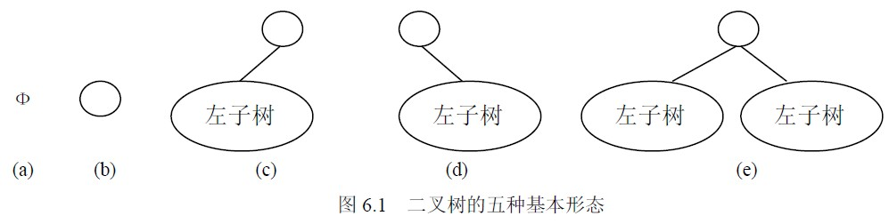
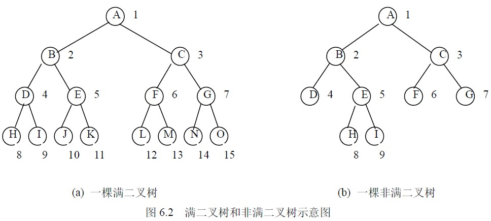
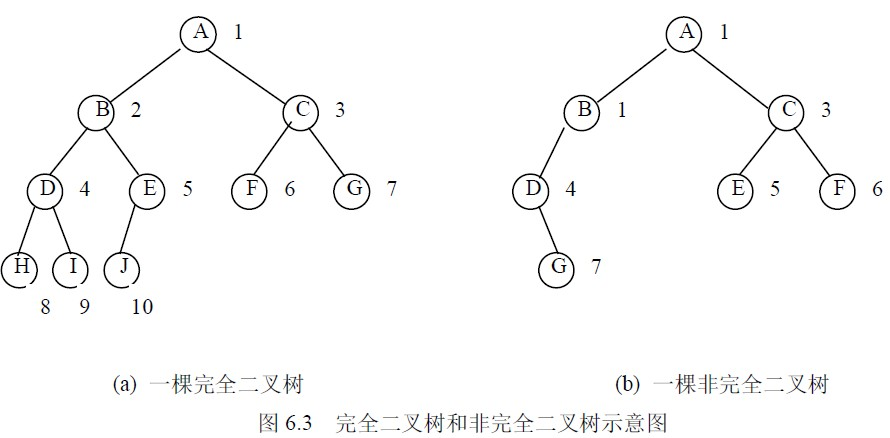
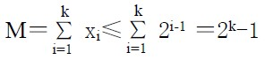
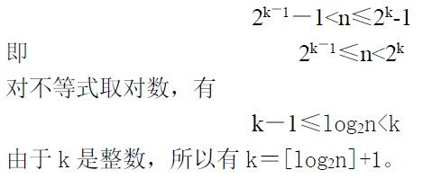

# 6.1 二叉树的定义与性质

## 6.1.1 二叉树的基本概念

**1．二叉树**

二叉树（Binary Tree）是个有限元素的集合，该集合或者为空、或者由一个称为根(root)的元素及两个不相交的、被分别称为左子树和右子树的二叉树组成。当集合为空时，称该二叉树为空二叉树。在二叉树中，一个元素也称作一个结点。

二叉树是有序的，即若将其左、右子树颠倒，就成为另一棵不同的二叉树。即使树中结点只有一棵子树，也要区分它是左子树还是右子树。因此二叉树具有五种基本形态，如图 6.1 所示。

**2．二叉树的相关概念**

（1）结点的度。结点所拥有的子树的个数称为该结点的度。

（2）叶结点。度为 0 的结点称为叶结点，或者称为终端结点。

（3）分枝结点。度不为 0 的结点称为分支结点，或者称为非终端结点。一棵树的结点除叶结点外，其余的都是分支结点。

（4）左孩子、右孩子、双亲。树中一个结点的子树的根结点称为这个结点的孩子。这个结点称为它孩子结点的双亲。具有同一个双亲的孩子结点互称为兄弟。

（5）路径、路径长度。如果一棵树的一串结点 n1,n2,…,nk 有如下关系：结点 ni 是 ni+1 的父结点（1≤i<k）,就把 n1,n2,…,nk 称为一条由 n1 至 nk 的路径。这条路径的长度是 k-1。

（6）祖先、子孙。在树中，如果有一条路径从结点 M 到结点 N，那么 M 就称为 N 的祖先，而 N 称为 M 的子孙。

（7）结点的层数。规定树的根结点的层数为 1，其余结点的层数等于它的双亲结点的层数加 1。

（8）树的深度。树中所有结点的最大层数称为树的深度。

（9）树的度。树中各结点度的最大值称为该树的度。

（10）满二叉树。

在一棵二叉树中，如果所有分支结点都存在左子树和右子树，并且所有叶子结点都在同一层上，这样的一棵二叉树称作满二叉树。如图 6.2 所示，（a）图就是一棵满二叉树，（b）图则不是满二叉树，因为，虽然其所有结点要么是含有左右子树的分支结点，要么是叶子结点，但由于其叶子未在同一层上，故不是满二叉树。

（11）完全二叉树。

一棵深度为 k 的有 n 个结点的二叉树，对树中的结点按从上至下、从左到右的顺序进行编号，如果编号为 i（1≤i≤n）的结点与满二叉树中编号为 i 的结点在二叉树中的位置相同，则这棵二叉树称为完全二叉树。完全二叉树的特点是：叶子结点只能出现在最下层和次下层，且最下层的叶子结点集中在树的左部。显然，一棵满二叉树必定是一棵完全二叉树，而完全二叉树未必是满二叉树。如图 6.3 所示（a）为一棵完全二叉树，（b）和图 6.2（b）都不是完全二叉树。

## 6.1.2 二叉树的主要性质

性质 1 一棵非空二叉树的第 i 层上最多有 2i-1 个结点（i≥1）。该性质可由数学归纳法证明。证明略。

性质 2 一棵深度为 k 的二叉树中，最多具有 2k－1 个结点。

证明设第 i 层的结点数为 xi（1≤i≤k），深度为 k 的二叉树的结点数为 M，xi 最多为 2i-1，则有：

性质 3 对于一棵非空的二叉树，如果叶子结点数为 n0，度数为 2 的结点数为 n2，则有:n0＝n2＋1。证明设 n 为二叉树的结点总数，n1 为二叉树中度为 1 的结点数，则有：n＝n0＋n1＋n2 （6-1）在二叉树中，除根结点外，其余结点都有唯一的一个进入分支。设 B 为二叉树中的分支数，那么有：B＝n－1 （6-2）这些分支是由度为 1 和度为 2 的结点发出的，一个度为 1 的结点发出一个分支，一个度为 2 的结点发出两个分支，所以有：B＝n1＋2n2 （6-3）综合（6-1）、（6-2）、（6-3）式可以得到：n0＝n2＋1 性质 4 具有 n 个结点的完全二叉树的深度 k 为[log2n]+1。

证明根据完全二叉树的定义和性质 2 可知，当一棵完全二叉树的深度为 k、结点个数为 n 时，有

性质 5 对于具有 n 个结点的完全二叉树，如果按照从上至下和从左到右的顺序对二叉树中的所有结点从 1 开始顺序编号，则对于任意的序号为 i 的结点，有：

（1）如果 i>1，则序号为 i 的结点的双亲结点的序号为 i/2(“/”表示整除)；如果 i＝1，则序号为 i 的结点是根结点，无双亲结点。

（2）如果 2i≤n，则序号为 i 的结点的左孩子结点的序号为 2i；如果 2i>n，则序号为 i 的结点无左孩子。

（3）如果 2i＋1≤n，则序号为 i 的结点的右孩子结点的序号为 2i＋1；如果 2i＋1>n，则序号为 i 的结点无右孩子。

此外，若对二叉树的根结点从 0 开始编号，则相应的 i 号结点的双亲结点的编号为（i－1）/2，左孩子的编号为 2i＋1，右孩子的编号为 2i＋2。此性质可采用数学归纳法证明。证明略。