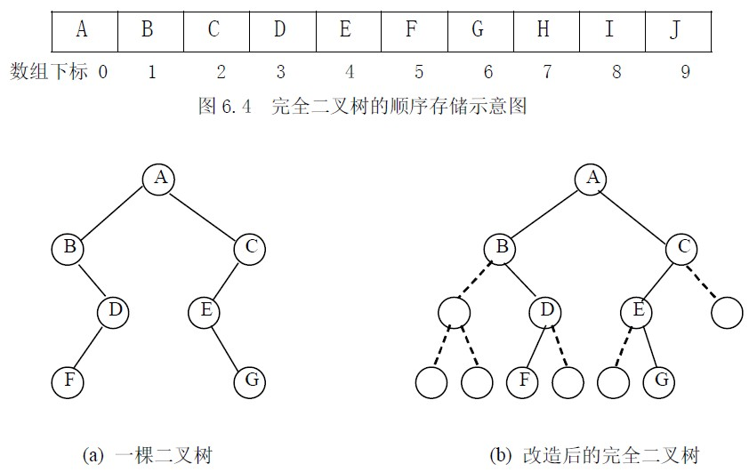
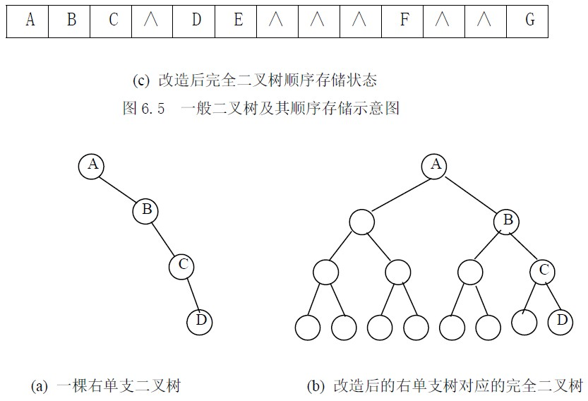
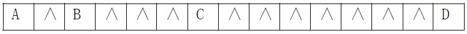
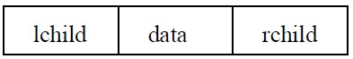
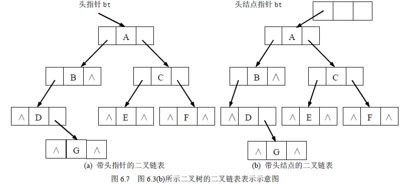
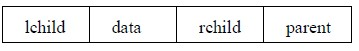
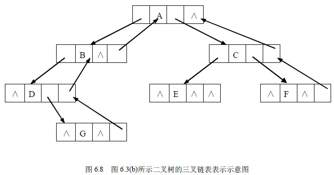

# 6.2 基本操作与存储—二叉树的存储

1．顺序存储结构

所谓二叉树的顺序存储，就是用一组连续的存储单元存放二叉树中的结点。一般是按照二叉树结点从上至下、从左到右的顺序存储。这样结点在存储位置上的前驱后继关系并不一定就是它们在逻辑上的邻接关系，然而只有通过一些方法确定某结点在逻辑上的前驱结点和后继结点，这种存储才有意义。因此，依据二叉树的性质，完全二叉树和满二叉树采用顺序存储比较合适，树中结点的序号可以唯一地反映出结点之间的逻辑关系，这样既能够最大可能地节省存储空间，又可以利用数组元素的下标值确定结点在二叉树中的位置，以及结点之间的关系。图 6.4 给出的图 6.3(a)所示的完全二叉树的顺序存储示意。

对于一般的二叉树，如果仍按从上至下和从左到右的顺序将树中的结点顺序存储在一维数组中，则数组元素下标之间的关系不能够反映二叉树中结点之间的逻辑关系，只有增添一些并不存在的空结点，使之成为一棵完全二叉树的形式，然后再用一维数组顺序存储。

如图 6.5 给出了一棵一般二叉树改造后的完全二叉树形态和其顺序存储状态示意图。显然，这种存储对于需增加许多空结点才能将一棵二叉树改造成为一棵完全二叉树的存储时，会造成空间的大量浪费，不宜用顺序存储结构。最坏的情况是右单支树，如图 6.6 所示，一棵深度为 k 的右单支树，只有 k 个结点，却需分配 2k－1 个存储单元。

(c) 单支树改造后完全二叉树的顺序存储状态图 6.6 右单支二叉树及其顺序存储示意图二叉树的顺序存储表示可描述为：

#define MAXNODE /*二叉树的最大结点数*/

typedef elemtype SqBiTree[MAXNODE] /*0 号单元存放根结点*/

SqBiTree bt;

即将 bt 定义为含有 MAXNODE 个 elemtype 类型元素的一维数组。

## 2．链式存储结构

所谓二叉树的链式存储结构是指，用链表来表示一棵二叉树，即用链来指示着元素的逻辑关系。通常有下面两种形式。

**（1）二叉链表存储**

链表中每个结点由三个域组成，除了数据域外，还有两个指针域，分别用来给出该结点左孩子和右孩子所在的链结点的存储地址。结点的存储的结构为：

其中，data 域存放某结点的数据信息；lchild 与 rchild 分别存放指向左孩子和右孩子的指针，当左孩子或右孩子不存在时，相应指针域值为空（用符号∧或 NULL 表示）。

图 6.7(a)给出了图 6.3(b)所示的一棵二叉树的二叉链表示。二叉链表也可以带头结点的方式存放，如图 6.7(b)所示。

**（2）三叉链表存储**

每个结点由四个域组成，具体结构为：

其中，data、lchild 以及 rchild 三个域的意义同二叉链表结构；parent 域为指向该结点双亲结点的指针。这种存储结构既便于查找孩子结点，又便于查找双亲结点；但是，相对于二叉链表存储结构而言，它增加了空间开销。图 6.8 给出了图 6.3(b)所示的一棵二叉树的三叉链表示。

尽管在二叉链表中无法由结点直接找到其双亲，但由于二叉链表结构灵活，操作方便，对于一般情况的二叉树，甚至比顺序存储结构还节省空间。因此，二叉链表是最常用的二叉树存储方式。本书后面所涉及到的二叉树的链式存储结构不加特别说明的都是指二叉链表结构。

二叉树的二叉链表存储表示可描述为：

typedef struct BiTNode{

elemtype data;

struct BiTNode *lchild;*rchild; /*左右孩子指针*/

}BiTNode,*BiTree;

即将 BiTree 定义为指向二叉链表结点结构的指针类型。