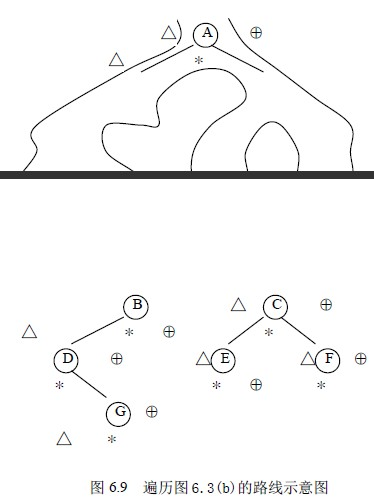
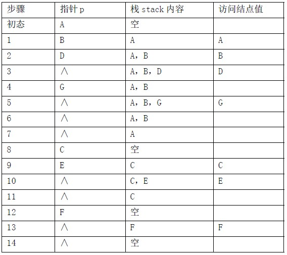
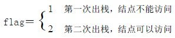

# 6.3 二叉树的遍历—二叉树遍历的非递归实现

前面给出的二叉树先序、中序和后序三种遍历算法都是递归算法。当给出二叉树的链式存储结构以后，用具有递归功能的程序设计语言很方便就能实现上述算法。然而，并非所有程序设计语言都允许递归；另一方面，递归程序虽然简洁，但可读性一般不好，执行效率也不高。因此，就存在如何把一个递归算法转化为非递归算法的问题。解决这个问题的方法可以通过对三种遍历方法的实质过程的分析得到。

如图 6.3(b)所示的二叉树，对其进行先序、中序和后序遍历都是从根结点 A 开始的，且在遍历过程中经过结点的路线是一样的，只是访问的时机不同而已。图 6.9 中所示的从根结点左外侧开始，由根结点右外侧结束的曲线，为遍历图 6.3(b)的路线。沿着该路线按△标记的结点读得的序列为先序序列，按*标记读得的序列为中序序列，按⊕标记读得的序列为后序序列。

然而，这一路线正是从根结点开始沿左子树深入下去，当深入到最左端，无法再深入下去时，则返回，再逐一进入刚才深入时遇到结点的右子树，再进行如此的深入和返回，直到最后从根结点的右子树返回到根结点为止。先序遍历是在深入时遇到结点就访问，中序遍历是在从左子树返回时遇到结点访问，后序遍历是在从右子树返回时遇到结点访问。

在这一过程中，返回结点的顺序与深入结点的顺序相反，即后深入先返回，正好符合栈结构后进先出的特点。因此，可以用栈来帮助实现这一遍历路线。其过程如下。在沿左子树深入时，深入一个结点入栈一个结点，若为先序遍历，则在入栈之前访问之；当沿左分支深入不下去时，则返回，即从堆栈中弹出前面压入的结点，若为中序遍历，则此时访问该结点，然后从该结点的右子树继续深入；若为后序遍历，则将此结点再次入栈，然后从该结点的右子树继续深入，与前面类同，仍为深入一个结点入栈一个结点，深入不下去再返回，直到第二次从栈里弹出该结点，才访问之。

**（1）先序遍历的非递归实现**

在下面算法中，二叉树以二叉链表存放，一维数组 stack[MAXNODE]用以实现栈，变量 top 用来表示当前栈顶的位置。

void NRPreOrder（BiTree bt）

{/*非递归先序遍历二叉树*/

BiTree stack[MAXNODE],p;

int top;

if (bt==NULL) return;

top=0;

p=bt;

while(!(p==NULL&&top==0))

{ while(p!=NULL)

{ Visite(p->data); /*访问结点的数据域*/

if (top<MAXNODE-1) /*将当前指针 p 压栈*/

{ stack[top]=p;

top++;

}

else { printf(“栈溢出”)；

return；

}

p=p->lchild； /*指针指向 p 的左孩子*/

}

if (top<=0) return; /*栈空时结束*/

else{ top--;

p=stack[top]; /*从栈中弹出栈顶元素*/

p=p->rchild; /*指针指向 p 的右孩子结点*/

}

}

}

算法 6.9

对于图 6.3(b)所示的二叉树，用该算法进行遍历过程中，栈 stack 和当前指针 p 的变化情况以及树中各结点的访问次序如表 6.1 所示。

表 6.1 二叉树先序非递归遍历过程

**（2）中序遍历的非递归实现**

中序遍历的非递归算法的实现，只需将先序遍历的非递归算法中的 Visite(p->data)移到 p=stack[top]和 p=p->rchild 之间即可。

**（3）后序遍历的非递归实现**

由前面的讨论可知，后序遍历与先序遍历和中序遍历不同，在后序遍历过程中，结点在第一次出栈后，还需再次入栈，也就是说，结点要入两次栈，出两次栈，而访问结点是在第二次出栈时访问。因此，为了区别同一个结点指针的两次出栈，设置一标志 flag，令：

当结点指针进、出栈时，其标志 flag 也同时进、出栈。因此，可将栈中元素的数据类型定义为指针和标志 flag 合并的结构体类型。定义如下：

typedef struct {

BiTree link;

int flag;

}stacktype;

后序遍历二叉树的非递归算法如下。在算法中，一维数组 stack[MAXNODE]用于实现栈的结构，指针变量 p 指向当前要处理的结点，整型变量 top 用来表示当前栈顶的位置，整型变量 sign 为结点 p 的标志量。

void NRPostOrder(BiTree bt)

/*非递归后序遍历二叉树 bt*/

{ stacktype stack[MAXNODE];

BiTree p;

int top,sign;

if (bt==NULL) return;

top=-1 /*栈顶位置初始化*/

p=bt;

while (!(p==NULL && top==-1))

{ if (p!=NULL) /*结点第一次进栈*/

{ top++;

stack[top].link=p;

stack[top].flag=1;

p=p->lchild; /*找该结点的左孩子*/

}

else { p=stack[top].link;

sign=stack[top].flag;

top--;

if (sign==1) /*结点第二次进栈*/

{top++;

stack[top].link=p;

stack[top].flag=2; /*标记第二次出栈*/

p=p->rchild;

}

else { Visite(p->data); /*访问该结点数据域值*/

}

}

}

}

算法 6.10