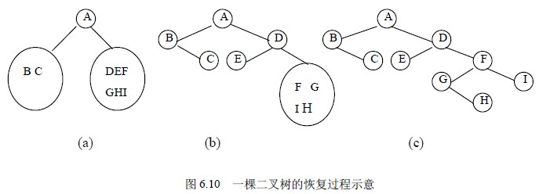

# 6.3 二叉树的遍历—由遍历序列恢复二叉树

从前面讨论的二叉树的遍历知道，任意一棵二叉树结点的先序序列和中序序列都是唯一的。反过来，若已知结点的先序序列和中序序列，能否确定这棵二叉树呢？这样确定的二叉树是否是唯一的呢？回答是肯定的。

根据定义，二叉树的先序遍历是先访问根结点，其次再按先序遍历方式遍历根结点的左子树，最后按先序遍历方式遍历根结点的右子树。这就是说，在先序序列中，第一个结点一定是二叉树的根结点。另一方面，中序遍历是先遍历左子树，然后访问根结点，最后再遍历右子树。这样，根结点在中序序列中必然将中序序列分割成两个子序列，前一个子序列是根结点的左子树的中序序列，而后一个子序列是根结点的右子树的中序序列。根据这两个子序列，在先序序列中找到对应的左子序列和右子序列。在先序序列中，左子序列的第一个结点是左子树的根结点，右子序列的第一个结点是右子树的根结点。这样，就确定了二叉树的三个结点。同时，左子树和右子树的根结点又可以分别把左子序列和右子序列划分成两个子序列，如此递归下去，当取尽先序序列中的结点时，便可以得到一棵二叉树。

同样的道理，由二叉树的后序序列和中序序列也可唯一地确定一棵二叉树。因为，依据后序遍历和中序遍历的定义，后序序列的最后一个结点，就如同先序序列的第一个结点一样，可将中序序列分成两个子序列，分别为这个结点的左子树的中序序列和右子树的中序序列，再拿出后序序列的倒数第二个结点，并继续分割中序序列，如此递归下去，当倒着取取尽后序序列中的结点时，便可以得到一棵二叉树。下面通过一个例子，来给出右二叉树的先序序列和中序序列构造唯一的一棵二叉树的实现算法。

已知一棵二叉树的先序序列与中序序列分别为：

A B C D E F G H I

B C A E D G H F I

试恢复该二叉树。

首先，由先序序列可知，结点 A 是二叉树的根结点。其次，根据中序序列，在 A 之前的所有结点都是根结点左子树的结点，在 A 之后的所有结点都是根结点右子树的结点，由此得到图 6.10 (a)所示的状态。然后，再对左子树进行分解，得知 B 是左子树的根结点，又从中序序列知道，B 的左子树为空，B 的右子树只有一个结点 C。接着对 A 的右子树进行分解，得知 A 的右子树的根结点为 D；而结点 D 把其余结点分成两部分，即左子树为 E，右子树为 F、G、H、I，如图 6.10 (b)所示。接下去的工作就是按上述原则对 D 的右子树继续分解下去，最后得到如图 6.10 (c)的整棵二叉树。

上述过程是一个递归过程，其递归算法的思想是：先根据先序序列的第一个元素建立根结点；然后在中序序列中找到该元素，确定根结点的左、右子树的中序序列；再在先序序列中确定左、右子树的先序序列；最后由左子树的先序序列与中序序列建立左子树，由右子树的先序序列与中序序列建立右子树。下面给出用 C 语言描述的该算法。假设二叉树的先序序列和中序序列分别存放在一维数组 preod[ ]与 inod[ ]中，并假设二叉树各结点的数据值均不相同。

void ReBiTree（char preod[ ],char inod[ ],int n,BiTree root）

/*n 为二叉树的结点个数，root 为二叉树根结点的存储地址*/

{ if (n≤0) root=NULL;

else PreInOd(preod,inod,1,n,1,n,&root);

}

算法 6.11

void PreInOd（char preod[ ],char inod[ ],int i,j,k,h,BiTree *t）

{* t=(BiTNode *)malloc(sizeof(BiTNode));

*t->data=preod[i];

m=k;

while (inod[m]!=preod[i]) m++;

if (m==k) *t->lchild=NULL

else PreInOd(preod,inod,i+1,i+m-k,k,m-1,&t->lchild);

if (m==h) *t->rchild=NULL

else PreInOd(preod,inod,i+m-k+1,j,m+1,h,&t->rchild);

}

算法 6.12

需要说明的是，数组 preod 和 inod 的元素类型可根据实际需要来设定，这里设为字符型。另外，如果只知道二叉树的先序序列和后序序列，则不能唯一地确定一棵二叉树。