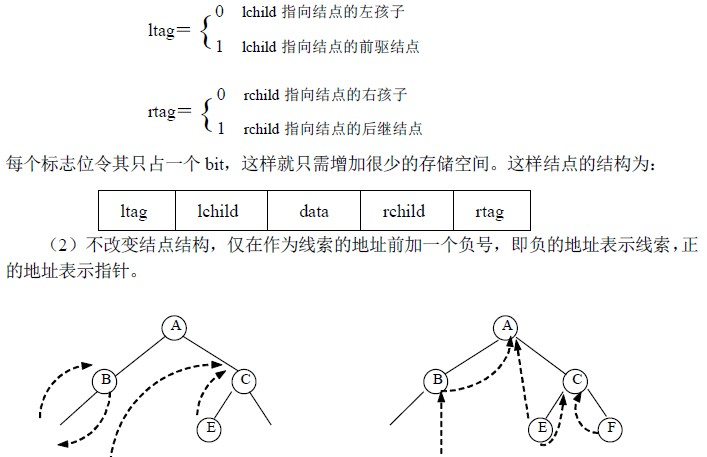
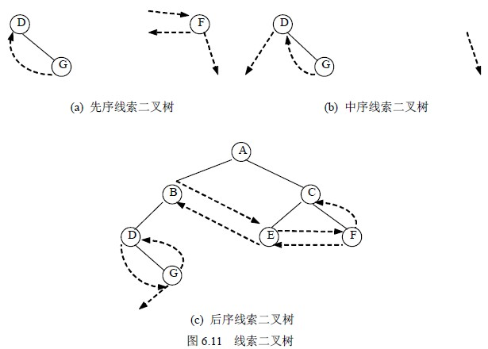

# 6.4 线索二叉树—线索二叉树的定义及结构

## 1．线索二叉树的定义

按照某种遍历方式对二叉树进行遍历，可以把二叉树中所有结点排列为一个线性序列。在该序列中，除第一个结点外，每个结点有且仅有一个直接前驱结点；除最后一个结点外，每个结点有且仅有一个直接后继结点。但是，二叉树中每个结点在这个序列中的直接前驱结点和直接后继结点是什么，二叉树的存储结构中并没有反映出来，只能在对二叉树遍历的动态过程中得到这些信息。为了保留结点在某种遍历序列中直接前驱和直接后继的位置信息，可以利用二叉树的二叉链表存储结构中的那些空指针域来指示。这些指向直接前驱结点和指向直接后继结点的指针被称为线索（thread），加了线索的二叉树称为线索二叉树。

线索二叉树将为二叉树的遍历提供许多遍历。

## 2．线索二叉树的结构

一个具有 n 个结点的二叉树若采用二叉链表存储结构，在 2n 个指针域中只有 n－1 个指针域是用来存储结点孩子的地址，而另外 n＋1 个指针域存放的都是 NULL。因此，可以利用某结点空的左指针域（lchild）指出该结点在某种遍历序列中的直接前驱结点的存储地址，利用结点空的右指针域（rchild）指出该结点在某种遍历序列中的直接后继结点的存储地址；对于那些非空的指针域，则仍然存放指向该结点左、右孩子的指针。这样，就得到了一棵线索二叉树。

由于序列可由不同的遍历方法得到，因此，线索树有先序线索二叉树、中序线索二叉树和后序线索二叉树三种。把二叉树改造成线索二叉树的过程称为线索化。对图 6.3 (b)所示的二叉树进行线索化，得到先序线索二叉树、中序线索二叉树和后序线索二叉树分别如图 6.11(a)、(b)、(c)所示。图中实线表示指针，虚线表示线索。

那么，下面的问题是在存储中，如何区别某结点的指针域内存放的是指针还是线索？通常可以采用下面两种方法来实现。

（1）为每个结点增设两个标志位域 ltag 和 rtag，令：

这里我们按第一种方法来介绍线索二叉树的存储。为了将二叉树中所有空指针域都利用上，以及操作便利的需要，在存储线索二叉树时往往增设一头结点，其结构与其它线索二叉树的结点结构一样，只是其数据域不存放信息，其左指针域指向二叉树的根结点，右指针域指向自己。而原二叉树在某序遍历下的第一个结点的前驱线索和最后一个结点的后继线索都指向该头结点。

图 6.12 给出了图 6.11(b)所示的中序线索树的完整的线索树存储。