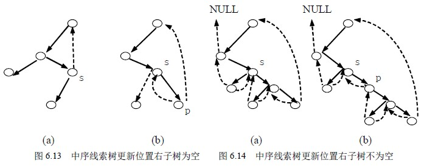

# 6.4 线索二叉树—线索二叉树的基本操作实现

在线索二叉树中，结点的结构可以定义为如下形式：

typedef char elemtype;

typedef struct BiThrNode {

elemtype data;

struct BiThrNode *lchild;

struct BiThrNode *rchild;

unsigned ltag:1;

unsigned rtag:1;

}BiThrNodeType,*BiThrTree;

下面以中序线索二叉树为例，讨论线索二叉树的建立、线索二叉树的遍历以及在线索二叉树上查找前驱结点、查找后继结点、插入结点和删除结点等操作的实现算法。

### 1．建立一棵中序线索二叉树

建立线索二叉树，或者说对二叉树线索化，实质上就是遍历一棵二叉树。在遍历过程中，访问结点的操作是检查当前结点的左、右指针域是否为空，如果为空，将它们改为指向前驱结点或后继结点的线索。为实现这一过程，设指针 pre 始终指向刚刚访问过的结点，即若指针 p 指向当前结点，则 pre 指向它的前驱，以便增设线索。

另外，在对一棵二叉树加线索时，必须首先申请一个头结点，建立头结点与二叉树的根结点的指向关系，对二叉树线索化后，还需建立最后一个结点与头结点之间的线索。

下面是建立中序线索二叉树的递归算法，其中 pre 为全局变量。

int InOrderThr(BiThrTree *head,BiThrTree T)

{/*中序遍历二叉树 T，并将其中序线索化，*head 指向头结点。*/

if (!(*head =(BiThrNodeType*)malloc(sizeof(BiThrNodeType)))) return 0;

(*head)->ltag=0; (*head)->rtag=1; /*建立头结点*/

(*head)->rchild=*head; /*右指针回指*/

if (!T) (*head)->lchild =*head; /*若二叉树为空，则左指针回指*/

else { (*head)->lchild=T; pre= head;

InThreading(T); /*中序遍历进行中序线索化*/

pre->rchild=*head; pre->rtag=1; /*最后一个结点线索化*/

(*head)->rchild=pre;

}

return 1;

}

算法 6.13

void InTreading(BiThrTree p)

{/*中序遍历进行中序线索化*/

if (p)

{ InThreading(p->lchild); /*左子树线索化*/

if (!p->lchild) /*前驱线索*/

{ p->ltag=1; p->lchild=pre;

}

if (!pre->rchild) /*后继线索*/

{ pre->rtag=1; pre->rchild=p;

}

pre=p;

InThreading(p->rchild); /*右子树线索化*/

}

}

算法 6.14

### 2．在中序线索二叉树上查找任意结点的中序前驱结点

对于中序线索二叉树上的任一结点，寻找其中序的前驱结点，有以下两种情况：

（1）如果该结点的左标志为 1，那么其左指针域所指向的结点便是它的前驱结点；

（2）如果该结点的左标志为 0，表明该结点有左孩子，根据中序遍历的定义，它的前驱结点是以该结点的左孩子为根结点的子树的最右结点，即沿着其左子树的右指针链向下查找，当某结点的右标志为 1 时，它就是所要找的前驱结点。

在中序线索二叉树上寻找结点 p 的中序前驱结点的算法如下：

BiThrTree InPreNode（BiThrTree p）{/*在中序线索二叉树上寻找结点 p 的中序前驱结点*/

BiThrTree pre;

pre=p->lchild;

if (p->ltag!=1)

while (pre->rtag==0) pre=pre->rchild;

return(pre);

}

算法 6.15

### 3．在中序线索二叉树上查找任意结点的中序后继结点

对于中序线索二叉树上的任一结点，寻找其中序的后继结点，有以下两种情况：

（1）如果该结点的右标志为 1，那么其右指针域所指向的结点便是它的后继结点；

（2）如果该结点的右标志为 0，表明该结点有右孩子，根据中序遍历的定义，它的前驱结点是以该结点的右孩子为根结点的子树的最左结点，即沿着其右子树的左指针链向下查找，当某结点的左标志为 1 时，它就是所要找的后继结点。

在中序线索二叉树上寻找结点 p 的中序后继结点的算法如下：

BiThrTree InPostNode（BiThrTree p）

{/*在中序线索二叉树上寻找结点 p 的中序后继结点*/

BiThrTree post;

post=p->rchild;

if (p->rtag!=1)

while (post->rtag==0) post=post->lchild;

return(post);

}

算法 6.16

以上给出的仅是在中序线索二叉树中寻找某结点的前驱结点和后继结点的算法。在前序线索二叉树中寻找结点的后继结点以及在后序线索二叉树中寻找结点的前驱结点可以采用同样的方法分析和实现。在此就不再讨论了。

### 4．在中序线索二叉树上查找任意结点在先序下的后继

这一操作的实现依据是：若一个结点是某子树在中序下的最后一个结点，则它必是该子树在先序下的最后一个结点。该结论可以用反证法证明。

下面就依据这一结论，讨论在中序线索二叉树上查找某结点在先序下后继结点的情况。设开始时，指向此某结点的指针为 p。

**（1）若待确定先序后继的结点为分支结点，则又有两种情况：**

① 当 p->ltag=0 时，p->lchild 为 p 在先序下的后继；

② 当 p->ltag=1 时，p->rchild 为 p 在先序下的后继。

**（2）若待确定先序后继的结点为叶子结点，则也有两种情况：**

① 若 p->rchild 是头结点，则遍历结束；

② 若 p->rchild 不是头结点，则 p 结点一定是以 p->rchild 结点为根的左子树中在中序遍历下的最后一个结点，因此 p 结点也是在该子树中按先序遍历的最后一个结点。此时， 若 p->rchild 结点有右子树， 则所找结点在先序下的后继结点的地址为 p->rchild->rchild；若 p->rchild 为线索，则让 p＝p->rchild，反复情况（2）的判定。

在中序线索二叉树上寻找结点 p 的先序后继结点的算法如下：

BiThrTree IPrePostNode（BiThrTree head,BiThrTree p）

{/*在中序线索二叉树上寻找结点 p 的先序的后继结点,head 为线索树的头结点*/

BiThrTree post;

if (p->ltag==0) post=p->lchild;

else { post=p;

while (post->rtag==1&&post->rchild!=head) post=post->rchild;

post=post->rchild;

}

return(post);

}

算法 6.17

### 5．在中序线索二叉树上查找任意结点在后序下的前驱

这一操作的实现依据是：若一个结点是某子树在中序下的第一个结点，则它必是该子树在后序下的第一个结点。该结论可以用反证法证明。

下面就依据这一结论，讨论在中序线索二叉树上查找某结点在后序下前驱结点的情况。设开始时，指向此某结点的指针为 p。

**（1）若待确定后序前驱的结点为分支结点，则又有两种情况：**

① 当 p->ltag=0 时，p->lchild 为 p 在后序下的前驱；

② 当 p->ltag=1 时，p->rchild 为 p 在后序下的前驱。

**（2）若待确定后序前驱的结点为叶子结点，则也有两种情况：**

① 若 p->lchild 是头结点，则遍历结束；

② 若 p->lchild 不是头结点，则 p 结点一定是以 p->lchild 结点为根的右子树中在中中序遍历下的第一个结点，因此 p 结点也是在该子树中按后序遍历的第一个结点。此时，若 p->lchild 结点有左子树， 则所找结点在后序下的前驱结点的地址为 p->lchild->lchild；若 p->lchild 为线索，则让 p＝p->lchild，反复情况（2）的判定。

在中序线索二叉树上寻找结点 p 的后序前驱结点的算法如下：

BiThrTree IPostPretNode（BiThrTree head,BiThrTree p）

{/*在中序线索二叉树上寻找结点 p 的先序的后继结点，head 为线索树的头结点*/

BiThrTree pre;

if (p->rtag==0) pre=p->rchild;

else { pre=p;

while (pre->ltag==1&& post->rchild!=head) pre=pre->lchild;

pre=pre->lchild;

}

return(pre);

}

算法 6.18

### 6．在中序线索二叉树上查找值为 x 的结点

利用在中序线索二叉树上寻找后继结点和前驱结点的算法，就可以遍历到二叉树的所有结点。比如，先找到按某序遍历的第一个结点，然后再依次查询其后继；或先找到按某序遍历的最后一个结点，然后再依次查询其前驱。这样，既不用栈也不用递归就可以访问到二叉树的所有结点。

在中序线索二叉树上查找值为 x 的结点，实质上就是在线索二叉树上进行遍历，将访问结点的操作具体写为那结点的值与 x 比较的语句。下面给出其算法：

BiThrTree Search (BiThrTree head,elemtype x){/*在以 head 为头结点的中序线索二叉树中查找值为 x 的结点*/

BiThrTree p;

p=head->lchild;

while (p->ltag==0&&p!=head) p=p->lchild;

while(p!=head && p->data!=x) p=InPostNode(p);

if (p==head)

{ printf(“Not Found the data!\n”);

return(0);

}

else return(p);

}

算法 6.19

### 7．在中序线索二叉树上的更新

线索二叉树的更新是指，在线索二叉树中插入一个结点或者删除一个结点。一般情况下，这些操作有可能破坏原来已有的线索，因此，在修改指针时，还需要对线索做相应的修改。一般来说，这个过程的代价几乎与重新进行线索化相同。这里仅讨论一种比较简单的情况，即在中序线索二叉树中插入一个结点 p，使它成为结点 s 的右孩子。

下面分两种情况来分析：

（1）若 s 的右子树为空，如图 6.13 (a)所示，则插入结点 p 之后成为图 6.13 (b)所示的情形。在这种情况中，s 的后继将成为 p 的中序后继，s 成为 p 的中序前驱，而 p 成为 s 的右孩子。二叉树中其它部分的指针和线索不发生变化。

（2）若 s 的右子树非空，如图 6.14 (a)所示，插入结点 p 之后如图 6.14 (b)所示。S 原来的右子树变成 p 的右子树，由于 p 没有左子树，故 s 成为 p 的中序前驱，p 成为 s 的右孩子；又由于 s 原来的后继成为 p 的后继，因此还要将 s 原来的本来指向 s 的后继的左线索，改为指向 p。

下面给出上述操作的算法。

void InsertThrRight(BiThrTree s,BiThrTree p)

{/*在中序线索二叉树中插入结点 p 使其成为结点 s 的右孩子*/

BiThrTree w;

p->rchild=s->rchild;

p->rtag=s->rtag;

p->lchild=s;

p->ltag=1; /*将 s 变为 p 的中序前驱*/

s->rchild=p;

s->rtag=0; /*p 成为 s 的右孩子*/

if(p->rtag==0) /*当 s 原来右子树不空时，找到 s 的后继 w，变 w 为 p 的后继，p 为 w 的前驱*/

{ w=InPostNode(p);

w->lchild=p;

}

}

算法 6.20