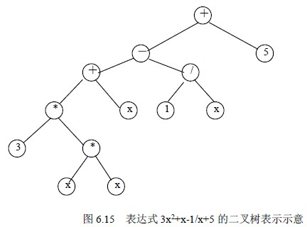

# 6.5 二叉树的应用—二叉树遍历的应用

在以上讨论的遍历算法中，访问结点的数据域信息，即操作 Visite（bt->data）具有更一般的意义，需根据具体问题，对 bt 数据进行不同的操作。下面介绍几个遍历操作的典型应用。

## 1．查找数据元素

Search（bt，x）在 bt 为二叉树的根结点指针的二叉树中查找数据元素 x。查找成功时返回该结点的指针；查找失败时返回空指针。

算法实现如下，注意遍历算法中的 Visite(bt->data)等同于其中的一组操作步骤。

BiTree Search（BiTree bt，elemtype x）

{/*在 bt 为根结点指针的二叉树中查找数据元素 x*/

BiTree p;

if (bt->data==x) return bt; /*查找成功返回*/

if (bt->lchild!=NULL) return(Search(bt->lchild,x));

/*在 bt->lchild 为根结点指针的二叉树中查找数据元素 x*/

if (bt->rchild!=NULL) return(Search(bt->rchild,x));

/*在 bt->rchild 为根结点指针的二叉树中查找数据元素 x*/

return NULL; /*查找失败返回*/

}

算法 6.21

## 2．统计出给定二叉树中叶子结点的数目

**（1）顺序存储结构的实现**

int CountLeaf1（SqBiTree bt，int k）

{/*一维数组 bt[2k-1]为二叉树存储结构，k 为二叉树深度，函数值为叶子数。*/

total=0;

for(i=1;i<=2k-1;i++)

{ if (bt[i]!=0)

{ if ((bt[2i]==0 && bt[2i+1]==0) || (i>(2k-1)/2))

total++;

}

}

return(total);

}

算法 6.22

**（2）二叉链表存储结构的实现**

int CountLeaf2（BiTree bt）

{/*开始时，bt 为根结点所在链结点的指针，返回值为 bt 的叶子数*/

if (bt==NULL) return(0);

if (bt->lchild==NULL && bt->rchild==NULL) return(1);

return(CountLeaf2(bt->lchild)+CountLeaf2(bt->rchild));

}

算法 6.23

## 3．创建二叉树二叉链表存储，并显示。

设创建时，按二叉树带空指针的先序次序输入结点值，结点值类型为字符型。输出按中序输出。

CreateBinTree（BinTree *bt）是以二叉链表为存储结构建立一棵二叉树 T 的存储，bt 为指向二叉树 T 根结点指针的指针。设建立时的输入序列为：AB0D00CE00F00。建立如图 6.3 (b)所示的二叉树存储。

InOrderOut（bt）为按中序输出二叉树 bt 的结点。算法实现如下，注意在创建算法中，遍历算法中的 Visite(bt->data)被读入结点、申请空间存储的操作所代替；在输出算法中，遍历算法中的 Visite(bt->data)被 c 语言中的格式输出语句所代替。

void CreateBinTree(BinTree *T)

{/*以加入结点的先序序列输入，构造二叉链表*/

char ch;

scanf("\n%c",&ch);

if (ch=='0') *T=NULL; /*读入 0 时，将相应结点置空*/

else {*T=(BinTNode*)malloc(sizeof(BinTNode)); /*生成结点空间*/

(*T)->data=ch;

CreateBinTree(&(*T)->lchild); /*构造二叉树的左子树*/

CreateBinTree(&(*T)->rchild); /*构造二叉树的右子树*/

}

}

void InOrderOut(BinTree T)

{/*中序遍历输出二叉树 T 的结点值*/

if (T)

{ InOrderOut(T->lchild); /*中序遍历二叉树的左子树*/

printf("%3c",T->data); /*访问结点的数据*/

InOrderOut(T->rchild); /*中序遍历二叉树的右子树*/

}

}

main()

{BiTree bt;

CreateBinTree(&bt);

InOrderOut(bt);

}

算法 6.24

## 4．表达式运算

我们可以把任意一个算数表达式用一棵二叉树表示，图 6.15 所示为表达式 3x2+x-1/x+5 的二叉树表示。在表达式二叉树中，每个叶结点都是操作数，每个非叶结点都是运算符。对于一个非叶子结点，它的左、右子树分别是它的两个操作数。

对该二叉树分别进行先序、中序和后序遍历，可以得到表达式的三种不同表示形式。

前缀表达式+-+*3*xxx/1x5

中缀表达式 3*x*x+x-1/x+5

后缀表达式 3xx**x+1x/-5+

中缀表达式是经常使用的算术表达式，前缀表达式和后缀表达式分别称为波兰式和逆波兰式，它们在编译程序中有着非常重要的作用。