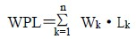
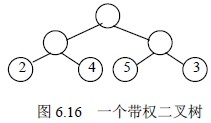
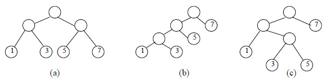
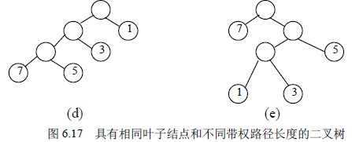
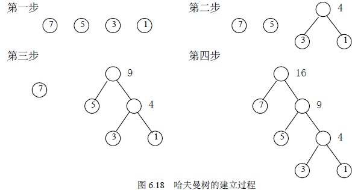
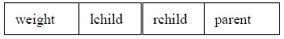
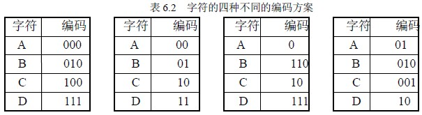
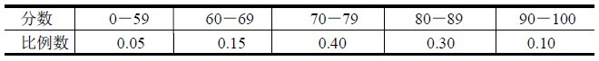

# 6.5 二叉树的应用—最优二叉树(哈夫曼树)

### 1．哈夫曼树的基本概念

最优二叉树，也称哈夫曼（Haffman）树，是指对于一组带有确定权值的叶结点，构造的具有最小带权路径长度的二叉树。

那么什么是二叉树的带权路径长度呢？

在前面我们介绍过路径和结点的路径长度的概念，而二叉树的路径长度则是指由根结点到所有叶结点的路径长度之和。如果二叉树中的叶结点都具有一定的权值，则可将这一概念加以推广。设二叉树具有 n 个带权值的叶结点，那么从根结点到各个叶结点的路径长度与相应结点权值的乘积之和叫做二叉树的带权路径长度，记为：

其中 Wk 为第 k 个叶结点的权值，Lk 为第 k 个叶结点的路径长度。如图 6.16 所示的二叉树，它的带权路径长度值 WPL＝2×2＋4×2＋5×2＋3×2＝28。

在给定一组具有确定权值的叶结点，可以构造出不同的带权二叉树。例如，给出 4 个叶结点，设其权值分别为 1，3，5，7，我们可以构造出形状不同的多个二叉树。这些形状不同的二叉树的带权路径长度将各不相同。

这五棵树的带权路径长度分别为：

（a）WPL＝1×2＋3×2＋5×2＋7×2＝32

（b）WPL＝1×3＋3×3＋5×2＋7×1＝29

（c）WPL＝1×2＋3×3＋5×3＋7×1＝33

（d）WPL＝7×3＋5×3＋3×2＋1×1＝43 

（e）WPL＝7×1＋5×2＋3×3＋1×3＝29

由此可见，由相同权值的一组叶子结点所构成的二叉树有不同的形态和不同的带权路径长度，那么如何找到带权路径长度最小的二叉树（即哈夫曼树）呢？根据哈夫曼树的定义，一棵二叉树要使其 WPL 值最小，必须使权值越大的叶结点越靠近根结点，而权值越小的叶结点越远离根结点。哈夫曼（Haffman）依据这一特点提出了一种方法，这种方法的基本思想是：

（1）由给定的 n 个权值{W1，W2，…，Wn}构造 n 棵只有一个叶结点的二叉树，从而得到一个二叉树的集合 F＝{T1，T2，…，Tn}；

（2）在 F 中选取根结点的权值最小和次小的两棵二叉树作为左、右子树构造一棵新的二叉树，这棵新的二叉树根结点的权值为其左、右子树根结点权值之和；

（3）在集合 F 中删除作为左、右子树的两棵二叉树，并将新建立的二叉树加入到集合 F 中；

（4）重复（2）（3）两步，当 F 中只剩下一棵二叉树时，这棵二叉树便是所要建立的哈夫曼树。

图 6.18 给出了前面提到的叶结点权值集合为 W＝{1，3，5，7}的哈夫曼树的构造过程。可以计算出其带权路径长度为 29，由此可见，对于同一组给定叶结点所构造的哈夫曼树，树的形状可能不同，但带权路径长度值是相同的，一定是最小的。

### 2．哈夫曼树的构造算法

在构造哈夫曼树时，可以设置一个结构数组 HuffNode 保存哈夫曼树中各结点的信息，根据二叉树的性质可知，具有 n 个叶子结点的哈夫曼树共有 2n－1 个结点，所以数组 HuffNode 的大小设置为 2n－1，数组元素的结构形式如下：

其中，weight 域保存结点的权值，lchild 和 rchild 域分别保存该结点的左、右孩子结点在数组 HuffNode 中的序号，从而建立起结点之间的关系。为了判定一个结点是否已加入到要建立的哈夫曼树中，可通过 parent 域的值来确定。初始时 parent 的值为－1，当结点加入到树中时，该结点 parent 的值为其双亲结点在数组 HuffNode 中的序号，就不会是－1 了。

构造哈夫曼树时，首先将由 n 个字符形成的 n 个叶结点存放到数组 HuffNode 的前 n 个分量中，然后根据前面介绍的哈夫曼方法的基本思想，不断将两个小子树合并为一个较大的子树，每次构成的新子树的根结点顺序放到 HuffNode 数组中的前 n 个分量的后面。

下面给出哈夫曼树的构造算法。

#define MAXVALUE 10000 /*定义最大权值*/

#define MAXLEAF 30 /*定义哈夫曼树中叶子结点个数*/

#define MAXNODE MAXLEAF*2-1

typedef struct {

int weight;

int parent;

int lchild;

int rchild;

}HNodeType;

void HaffmanTree(HNodeType HuffNode [ ])

{/*哈夫曼树的构造算法*/

int i,j,m1,m2,x1,x2,n;

scanf(“%d”,&n); /*输入叶子结点个数*/

for (i=0;i<2*n-1;i++) /*数组 HuffNode[ ]初始化*/

{ HuffNode[i].weight=0;

HuffNode[i].parent=-1;

HuffNode[i].lchild=-1;

HuffNode[i].rchild=-1;

}

for (i=0;i<n;i++) scanf(“%d”,&HuffNode[i].weight); /*输入 n 个叶子结点的权值*/

for (i=0;i<n-1;i++) /*构造哈夫曼树*/

{ m1=m2=MAXVALUE;

x1=x2=0;

for (j=0;j<n+i;j++)

{ if (HuffNode[j].weight<m1 && HuffNode[j].parent==-1)

{ m2=m1; x2=x1;

m1=HuffNode[j].weight; x1=j;

}

else if (HuffNode[j].weight<m2 && HuffNode[j].parent==-1)

{ m2=HuffNode[j].weight;

x2=j;

}

}

/*将找出的两棵子树合并为一棵子树*/

HuffNode[x1].parent=n+i; HuffNode[x2].parent=n+i;

HuffNode[n+i].weight= HuffNode[x1].weight+HuffNode[x2].weight;

HuffNode[n+i].lchild=x1; HuffNode[n+i].rchild=x2;

}

}

算法 6.25

### 3．哈夫曼树在编码问题中的应用

在数据通讯中，经常需要将传送的文字转换成由二进制字符 0，1 组成的二进制串，我们称之为编码。例如，假设要传送的电文为 ABACCDA，电文中只含有 A，B，C，D 四种字符，若这四种字符采用表 6.2 (a)所示的编码，则电文的代码为 000010000100100111 000，长度为 21。在传送电文时，我们总是希望传送时间尽可能短，这就要求电文代码尽可能短，显然，这种编码方案产生的电文代码不够短。表 6.2 (b)所示为另一种编码方案，用此编码对上述电文进行编码所建立的代码为 00010010101100，长度为 14。在这种编码方案中，四种字符的编码均为两位，是一种等长编码。如果在编码时考虑字符出现的频率，让出现频率高的字符采用尽可能短的编码，出现频率低的字符采用稍长的编码，构造一种不等长编码，则电文的代码就可能更短。如当字符 A，B，C，D 采用表 6.2 (c)所示的编码时，上述电文的代码为 0110010101110，长度仅为 13。

哈夫曼树可用于构造使电文的编码总长最短的编码方案。具体做法如下：设需要编码的字符集合为{d1，d2，…，dn}，它们在电文中出现的次数或频率集合为{w1，w2，…，wn}，以 d1，d2，…，dn 作为叶结点，w1，w2，…，wn 作为它们的权值，构造一棵哈夫曼树，规定哈夫曼树中的左分支代表 0，右分支代表 1，则从根结点到每个叶结点所经过的路径分支组成的 0 和 1 的序列便为该结点对应字符的编码，我们称之为哈夫曼编码。

在哈夫曼编码树中，树的带权路径长度的含义是各个字符的码长与其出现次数的乘积之和，也就是电文的代码总长，所以采用哈夫曼树构造的编码是一种能使电文代码总长最短的不等长编码。

在建立不等长编码时，必须使任何一个字符的编码都不是另一个字符编码的前缀，这样才能保证译码的唯一性。例如表 6.2 (d)的编码方案，字符 A 的编码 01 是字符 B 的编码 010 的前缀部分，这样对于代码串 0101001，既是 AAC 的代码，也是 ABD 和 BDA 的代码，因此，这样的编码不能保证译码的唯一性，我们称之为具有二义性的译码。

然而，采用哈夫曼树进行编码，则不会产生上述二义性问题。因为，在哈夫曼树中，每个字符结点都是叶结点，它们不可能在根结点到其它字符结点的路径上，所以一个字符的哈夫曼编码不可能是另一个字符的哈夫曼编码的前缀，从而保证了译码的非二义性。

下面讨论实现哈夫曼编码的算法。实现哈夫曼编码的算法可分为两大部分：

（1）构造哈夫曼树；

（2）在哈夫曼树上求叶结点的编码。

求哈夫曼编码，实质上就是在已建立的哈夫曼树中，从叶结点开始，沿结点的双亲链域回退到根结点，每回退一步，就走过了哈夫曼树的一个分支，从而得到一位哈夫曼码值，由于一个字符的哈夫曼编码是从根结点到相应叶结点所经过的路径上各分支所组成的 0，1 序列，因此先得到的分支代码为所求编码的低位码，后得到的分支代码为所求编码的高位码。我们可以设置一结构数组 HuffCode 用来存放各字符的哈夫曼编码信息，数组元素的结构如下：

其中，分量 bit 为一维数组，用来保存字符的哈夫曼编码，start 表示该编码在数组 bit 中的开始位置。所以，对于第 i 个字符，它的哈夫曼编码存放在 HuffCode[i].bit 中的从 HuffCode[i].start 到 n 的分量上。

哈夫曼编码算法描述如下。

#define MAXBIT 10 /*定义哈夫曼编码的最大长度*/

typedef struct {

int bit[MAXBIT];

int start;

}HCodeType;

void HaffmanCode ( )

{ /*生成哈夫曼编码*/

HNodeType HuffNode[MAXNODE];

HCodeType HuffCode[MAXLEAF],cd;

int i,j, c,p;

HuffmanTree (HuffNode ); /*建立哈夫曼树*/

for (i=0;i<n;i++) /*求每个叶子结点的哈夫曼编码*/

{ cd.start=n-1; c=i;

p=HuffNode[c].parent;

while(p!=0) /*由叶结点向上直到树根*/

{ if (HuffNode[p].lchild==c) cd.bit[cd.start]=0;

else cd.bit[cd.start]=1;

cd.start--; c=p;

p=HuffNode[c].parent;

}

for (j=cd.start+1;j<n;j++) /*保存求出的每个叶结点的哈夫曼编码和编码的起始位*/

HuffCode[i].bit[j]=cd.bit[j];

HuffCode[i].start=cd.start;

}

for (i=0;i<n;i++) /*输出每个叶子结点的哈夫曼编码*/

{ for (j=HuffCode[i].start+1;j<n;j++)

printf(“%ld”,HuffCode[i].bit[j]);

printf(“\n”);

}

}

算法 6.26

### 3．哈夫曼树在判定问题中的应用

例如，要编制一个将百分制转换为五级分制的程序。显然，此程序很简单，只要利用条件语句便可完成。如：

if (a<60) b=”bad”;

else if (a<70) b=”pass”

else if (a<80) b=”general”

else if (a<90) b=”good”

else b=”excellent”;

这个判定过程可以图 6.19 (a)所示的判定树来表示。如果上述程序需反复使用，而且每次的输入量很大，则应考虑上述程序的质量问题，即其操作所需要的时间。因为在实际中，学生的成绩在五个等级上的分布是不均匀的，假设其分布规律如下表所示：

则 80％以上的数据需进行三次或三次以上的比较才能得出结果。假定以 5，15，40，30 和 10 为权构造一棵有五个叶子结点的哈夫曼树，则可得到如图 6.19 (b)所示的判定过程，它可使大部分的数据经过较少的比较次数得出结果。但由于每个判定框都有两次比较，将这两次比较分开，得到如图 6.19 (c)所示的判定树，按此判定树可写出相应的程序。假设有 10000 个输入数据，若按图 6.19 (a)的判定过程进行操作，则总共需进行 31500 次比较；而若按图 6.19 (c)的判定过程进行操作，则总共仅需进行 22000 次比较。