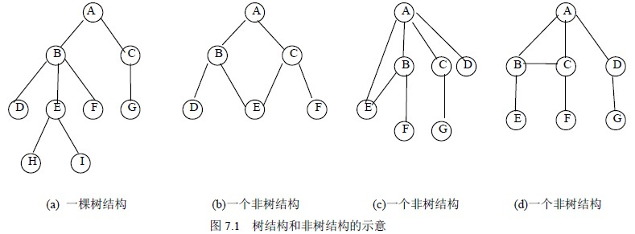
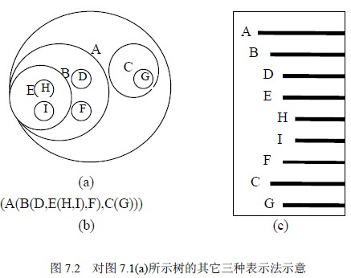

# 7．1 树的概念与表示

本章是对第六章内容的扩充，即对具有更一般意义的树结构进行讨论。本章所讨论的树结构，其结点可以有任意数目的子结点，这使其在存储以及操作实现上要比二叉树更复杂。

## 7．1．1 树的定义及相关术语

**1．树的定义**

树（Tree）是 n（n≥0）个有限数据元素的集合。当 n＝0 时，称这棵树为空树。在一棵非树 T 中：

（1）有一个特殊的数据元素称为树的根结点，根结点没有前驱结点。

（2）若 n>1，除根结点之外的其余数据元素被分成 m（m>0）个互不相交的集合 T1，T2，…，Tm，其中每一个集合 Ti（1≤i≤m）本身又是一棵树。树 T1，T2，…，Tm 称为这个根结点的子树。

可以看出，在树的定义中用了递归概念，即用树来定义树。因此，树结构的算法类同于二叉树结构的算法，也可以使用递归方法。

树的定义还可形式化的描述为二元组的形式：

T＝（D，R）其中 D 为树 T 中结点的集合，R 为树中结点之间关系的集合。

当树为空树时，D＝Φ；当树 T 不为空树时有：

D＝{Root}∪DF 其中，Root 为树 T 的根结点，DF 为树 T 的根 Root 的子树集合。DF 可由下式表示：DF＝D1∪D2∪…∪Dm 且 Di∩Dj＝Φ（i≠j，1≤i≤m，1≤j≤m）当树 T 中结点个数 n≤1 时，R＝Φ；当树 T 中结点个数 n>1 时有：R＝{<Root，ri>，i＝1，2，…，m}其中，Root 为树 T 的根结点，ri 是树 T 的根结点 Root 的子树 Ti 的根结点。

树定义的形式化，主要用于树的理论描述。图 7.1(a)是一棵具有 9 个结点的树，即 T＝{A，B，C，…，H，I}，结点 A 为树 T 的根结点，除根结点 A 之外的其余结点分为两个不相交的集合： T1＝{B,D,E,F,H,I}和 T2={C,G}，T1 和 T2 构成了结点 A 的两棵子树，T1 和 T2 本身也分别是一棵树。例如，子树 T1 的根结点为 B，其余结点又分为两个不相交的集合：T11＝{D}，T12＝{E,H,I}和 T13＝{F}。

T11、T12 和 T13 构成了子树 T1 的根结点 B 的三棵子树。如此可继续向下分为更小的子树，直到每棵子树只有一个根结点为止。

从树的定义和图 7.1(a)的示例可以看出，树具有下面两个特点：

（1）树的根结点没有前驱结点，除根结点之外的所有结点有且只有一个前驱结点。

（2）树中所有结点可以有零个或多个后继结点。

由此特点可知，图 7.1(b)、(c)、(d)所示的都不是树结构。

**2．相关术语**

在二叉树中介绍的有关概念在树中仍然适用。除此之外，再介绍两个关于树的术语。

（1）有序树和无序树。如果一棵树中结点的各子树丛左到右是有次序的，即若交换了某结点各子树的相对位置，则构成不同的树，称这棵树为有序树；反之，则称为无序树。

（2）森林。零棵或有限棵不相交的树的集合称为森林。自然界中树和森林是不同的概念，但在数据结构中，树和森林只有很小的差别。任何一棵树，删去根结点就变成了森林。

## 7．1．2 树的表示

树的表示方法有以下四种，各用于不同的目的。

**1．直观表示法**

树的直观表示法就是以倒着的分支树的形式表示，图 7.1(a)就是一棵树的直观表示。其特点就是对树的逻辑结构的描述非常直观。是数据结构中最常用的树的描述方法。

**2．嵌套集合表示法**

所谓嵌套集合是指一些集合的集体，对于其中任何两个集合，或者不相交，或者一个包含另一个。用嵌套集合的形式表示树，就是将根结点视为一个大的集合，其若干棵子树构成这个大集合中若干个互不相交的子集，如此嵌套下去，即构成一棵树的嵌套集合表示。图 7.2 (a)就是一棵树的嵌套集合表示。

**3．凹入表示法**

树的凹入表示法如图 7.2 (c)所示。树的凹入表示法主要用于树的屏幕和打印输出。

**4．广义表表示法**

树用广义表表示，就是将根作为由子树森林组成的表的名字写在表的左边，这样依次将书表示出来。图 7.2 (b)就是一棵树的广义表表示。

