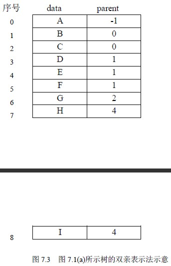
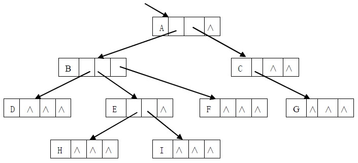
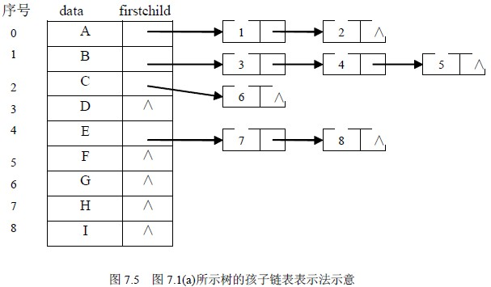
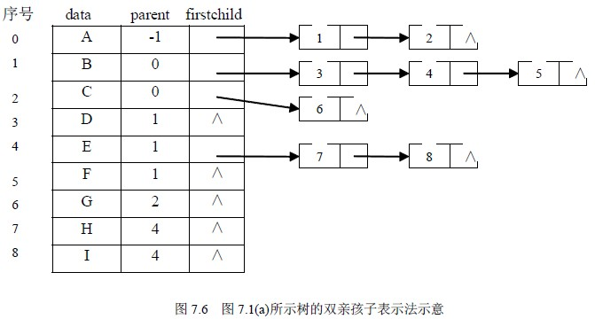
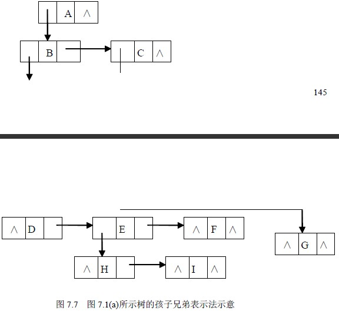

# 7．2 树的基本操作与存储

## 7．2．1 树的基本操作

树的基本操作通常有以下几种：

（1）Initiate（t）初始化一棵空树 t。

（2）Root（x）求结点 x 所在树的根结点。

（3）Parent（t，x）求树 t 中结点 x 的双亲结点。

（4）Child（t，x，i）求树 t 中结点 x 的第 i 个孩子结点。

（5）RightSibling（t，x）求树 t 中结点 x 的第一个右边兄弟结点。

（6）Insert（t，x，i，s）把以 s 为根结点的树插入到树 t 中作为结点 x 的第 i 棵子树。

（7）Delete（t，x，i）在树 t 中删除结点 x 的第 i 棵子树。

（8）Tranverse（t）是树的遍历操作，即按某种方式访问树 t 中的每个结点，且使每个结点只被访问一次。

## 7．2．2 树的存储结构

在计算机中，树的存储有多种方式，既可以采用顺序存储结构，也可以采用链式存储结构，但无论采用何种存储方式，都要求存储结构不但能存储各结点本身的数据信息，还要能唯一地反映树中各结点之间的逻辑关系。下面介绍几种基本的树的存储方式。

**1．双亲表示法**

由树的定义可以知道，树中的每个结点都有唯一的一个双亲结点，根据这一特性，可用一组连续的存储空间（一维数组）存储树中的各个结点，数组中的一个元素表示树中的一个结点，数组元素为结构体类型，其中包括结点本身的信息以及结点的双亲结点在数组中的序号，树的这种存储方法称为双亲表示法。其存储表示可描述为：

#define MAXNODE <树中结点的最大个数>

typedef struct {

elemtype data;

int parent;

}NodeType;

NodeType t[MAXNODE];

图 7.1(a)所示的树的双亲表示如图 7.3 所示。图中用 parent 域的值为-1 表示该结点无双亲结点，即该结点是一个根结点。

树的双亲表示法对于实现 Parent（t，x）操作和 Root（x）操作很方便，但若求某结点的孩子结点，即实现 Child（t，x，i）操作时，则需要查询整个数组。此外，这种存储方式不能反映各兄弟结点之间的关系，所以实现 RightSibling（t，x）操作也比较困难。在实际中，如果需要实现这些操作，可在结点结构中增设存放第一个孩子的域和存放第一个右兄弟的域，就能较方便地实现上述操作了。

**2．孩子表示法**

（1）多重链表法

由于树中每个结点都有零个或多个孩子结点，因此，可以令每个结点包括一个结点信息域和多个指针域，每个指针域指向该结点的一个孩子结点，通过各个指针域值反映出树中各结点之间的逻辑关系。在这种表示法中，树中每个结点有多个指针域，形成了多条链表，所以这种方法又常称为多重链表法。在一棵树中，各结点的度数各异，因此结点的指针域个数的设置有两种方法：

① 每个结点指针域的个数等于该结点的度数；

② 每个结点指针域的个数等于树的度数。

对于方法①，它虽然在一定程度上节约了存储空间，但由于树中各结点是不同构的，各种操作不容易实现，所以这种方法很少采用；方法②中各结点是同构的，各种操作相对容易实现，但为此付出的代价是存储空间的浪费。图 7.4 是图 7.1(a)所示的树采用这种方法的存储结构示意图。显然，方法②适用于各结点的度数相差不大的情况。树中结点的存储表示可描述为：

#define MAXSON <树的度数>

typedef struct TreeNode {

elemtype data;

struct TreeNode *son[MAXSON];

}NodeType;

对于任意一棵树 t，可以定义：NodeType *t;使变量 t 为指向树的根结点的指针。

图 7.4 图 7.1(a)所示树的孩子表示法示意

（2）孩子链表表示法

孩子链表法是将树按如图 7.5 所示的形式存储。其主体是一个与结点个数一样大小的一维数组，数组的每一个元素有两个域组成，一个域用来存放结点信息，另一个用来存放指针，该指针指向由该结点孩子组成的单链表的首位置。单链表的结构也由两个域组成，一个存放孩子结点在一维数组中的序号，另一个是指针域，指向下一个孩子。

在孩子表示法中查找双亲比较困难，查找孩子却十分方便，故适用于对孩子操作多的应用。

这种存储表示可描述为：

#define MAXNODE <树中结点的最大个数>

typedef struct ChildNode{

int childcode;

struct ChildNode *nextchild;

}

typedef struct {

elemtype data;

struct ChildNode *firstchild;

}NodeType;

NodeType t[MAXNODE];

**3．双亲孩子表示法**

双亲表示法是将双亲表示法和孩子表示法相结合的结果。其仍将各结点的孩子结点分别组成单链表，同时用一维数组顺序存储树中的各结点，数组元素除了包括结点本身的信息和该结点的孩子结点链表的头指针之外，还增设一个域，存储该结点双亲结点在数组中的序号。图 7.6 所示图 7.1(a)的树采用这种方法的存储示意图。

**4．孩子兄弟表示法**

这是一种常用的存储结构。其方法是这样的：在树中，每个结点除其信息域外，再增加两个分别指向该结点的第一个孩子结点和下一个兄弟结点的指针。在这种存储结构下，树中结点的存储表示可描述为：

typedef struct TreeNode {

elemtype data;

struct TreeNode *son;

struct TreeNode *next;

}NodeType;

图 7.7 给出了图 7.7(a)所示的树采用孩子兄弟表示法时的存储示意图。

