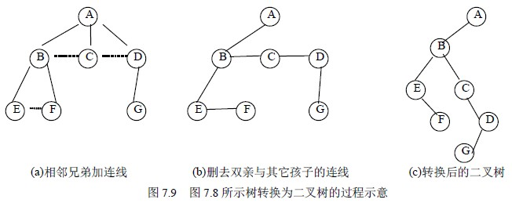
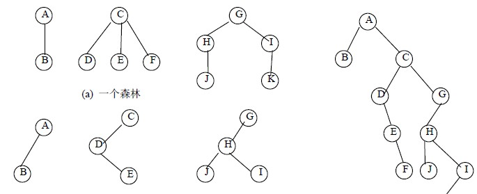
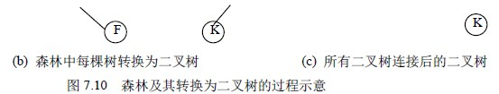
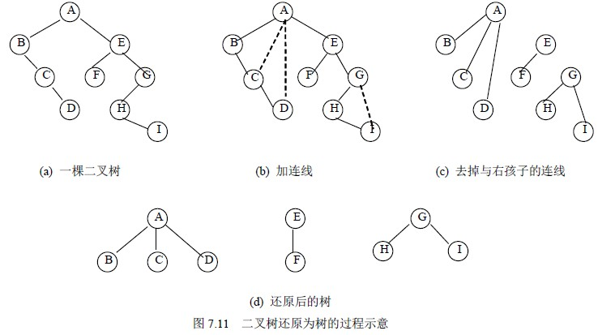

# 7．3 树、森林与二叉树的转换

从树的孩子兄弟表示法可以看到，如果设定一定规则，就可用二叉树结构表示树和森林，这样，对树的操作实现就可以借助二叉树存储，利用二叉树上的操作来实现。本节将讨论树和森林与二叉树之间的转换方法。

## 7．3．1 树转换为二叉树

对于一棵无序树，树中结点的各孩子的次序是无关紧要的，而二叉树中结点的左、右孩子结点是有区别的。为避免发生混淆，我们约定树中每一个结点的孩子结点按从左到右的次序顺序编号。如图 7.8 所示的一棵树，根结点 A 有 B、C、D 三个孩子，可以认为结点 B 为 A 的第一个孩子结点，结点 C 为 A 的第二个孩子结点, 结点 D 为 A 的第三个孩子结点。

将一棵树转换为二叉树的方法是：

（1）树中所有相邻兄弟之间加一条连线。

（2）对树中的每个结点，只保留它与第一个孩子结点之间的连线，删去它与其它孩子结点之间的连线。

（3）以树的根结点为轴心，将整棵树顺时针转动一定的角度，使之结构层次分明。

可以证明，树作这样的转换所构成的二叉树是唯一的。图 7.9(a)、(b)、(c)给出了图 7.8 所示的树转换为二叉树的转换过程示意图。

由上面的转换可以看出，在二叉树中，左分支上的各结点在原来的树中是父子关系，而右分支上的各结点在原来的树中是兄弟关系。由于树的根结点没有兄弟，所以变换后的二叉树的根结点的右孩子必为空。

事实上，一棵树采用孩子兄弟表示法所建立的存储结构与它所对应的二叉树的二叉链表存储结构是完全相同的。

C

∧

∧ D

∧ H

E ∧ F ∧

∧ G

∧ I ∧

B

E

D

F G

## 7．3．2 森林转换为二叉树

由森林的概念可知，森林是若干棵树的集合，只要将森林中各棵树的根视为兄弟，每棵树又可以用二叉树表示，这样，森林也同样可以用二叉树表示。森林转换为二叉树的方法如下：

（1）将森林中的每棵树转换成相应的二叉树。

（2）第一棵二叉树不动，从第二棵二叉树开始，依次把后一棵二叉树的根结点作为前一棵二叉树根结点的右孩子，当所有二叉树连起来后，此时所得到的二叉树就是由森林转换得到的二叉树。

这一方法可形式化描述为：

如果 F＝{ T1，T2，…，Tm }是森林，则可按如下规则转换成一棵二叉树 B＝（root，LB，RB）。

（1）若 F 为空，即 m＝0，则 B 为空树；

（2）若 F 非空，即 m≠0，则 B 的根 root 即为森林中第一棵树的根 Root(T1)；B 的左子树 LB 是从 T1 中根结点的子树森林 F1＝{ T11，T12，…，T1m1 }转换而成的二叉树；其右子树 RB 是从森林 F’＝{ T2，T3，…，Tm }转换而成的二叉树。

图 7.10 给出了森林及其转换为二叉树的过程。

## 7．3．3 二叉树转换为树和森林

树和森林都可以转换为二叉树，二者不同的是树转换成的二叉树，其根结点无右分支，而森林转换后的二叉树，其根结点有右分支。显然这一转换过程是可逆的，即可以依据二叉树的根结点有无右分支，将一棵二叉树还原为树或森林，具体方法如下：

（1）若某结点是其双亲的左孩子，则把该结点的右孩子、右孩子的右孩子……都与该结点的双亲结点用线连起来；

（2）删去原二叉树中所有的双亲结点与右孩子结点的连线；

（3）整理由（1）、（2）两步所得到的树或森林，使之结构层次分明。

这一方法可形式化描述为：

如果 B＝（root，LB，RB）是一棵二叉树，则可按如下规则转换成森林 F＝{ T1，T2，…，Tm }。

（1）若 B 为空，则 F 为空；

（2）若 B 非空，则森林中第一棵树 T1 的根 ROOT（T1）即为 B 的根 root；T1 中根结点的子树森林 F1 是由 B 的左子树 LB 转换而成的森林；F 中除 T1 之外其余树组成的森林 F’＝{ T2，T3，…，Tm }是由 B 的右子树 RB 转换而成的森林。

图 7.11 给出了一棵二叉树还原为森林的过程示意。

