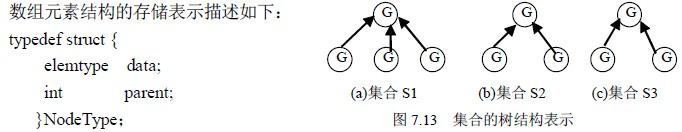
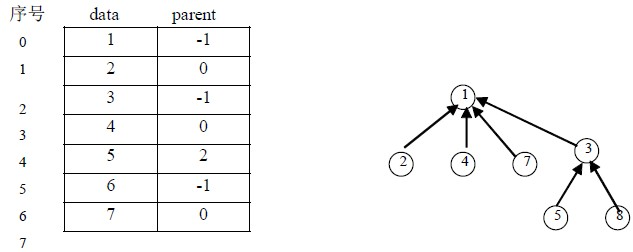
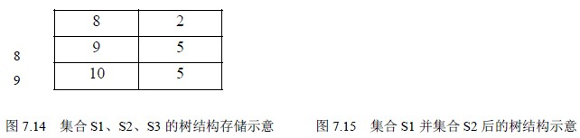

# 7．5 树的应用

树的应用十分广泛，在后面介绍的排序和查找常用的两项技术中，就有以树结构组织数据进行操作的。本节仅讨论树在判定树和集合表示与运算方面的应用。

### 7．5．1 判定树

在前面介绍了最优二叉树，即哈夫曼树在判定问题中的应用，在实际应用中，树也可用于判定问题的描述和解决，著名的八枚硬币问题就是其中一例。

设有八枚硬币，分别表示为 a，b，c，d，e，f，g，h，其中有一枚且仅有一枚硬币是伪造的，假硬币的重量与真硬币的重量不同，可能轻，也可能重。现要求以天平为工具，用最少的比较次数挑选出假硬币，并同时确定这枚硬币的重量比其它真硬币是轻还是重。

问题的解决过程如图 7.12 所示，解决过程中的一系列判断构成了树结构，我们称这样的树为判定树。

图中大写字母 H 和 L 分别表示假硬币较其它真硬币重或轻。下面对这一判定方法加以说明，并分析它的正确性。

从八枚硬币中任取六枚，假设是 a，b，c，d，e 和 f，在天平两端各放三枚进行比较。

假设 a，b，c 三枚放在天平的一端，d，e，f 三枚放在天平的另一端，可能出现三种比较结果：

（1）a＋b＋c>d＋e＋f

（2）a＋b＋c＝d＋e＋f

（3）a＋b＋c<d＋e＋f

这里，只以第一种情况为例进行讨论。若 a＋b＋c>d＋e＋f，根据题目的假设，可以肯定这六枚硬币中必有一枚为假币，同时也说明 g，h 为真币。这时可将天平两端个去掉一枚硬币，假设它们是 c 和 f，同时将天平两端的硬币各换一枚，假设硬币 b，d 作了互换，然后进行第二次比较，那么比较的结果同样可能有三种：

①a＋d>b＋e 这种情况表明天平两端去掉硬币 c，f 且硬币 b，d 互换后，天平两端的轻重关系保持不变，从而说明了假币必然是 a，e 中的一个，这时我们只要用一枚真币（b，c，d，f，g，h）和 a 或 e 进行比较，就能找出假币。例如，用 b 和 a 进行比较，若 a>b，则 a 是较重的假币；若 a＝b，则 e 为较轻的假币；不可能出现 a<b 的情况。

②a＋d＝b＋e 此时天平两端由不平衡变为平衡，表明假币一定在去掉的两枚硬币 c，f 中，a，b，d，e，g，h 必定为真硬币，同样的方法，用一枚真币和 c 或 f 进行比较，例如，用 a 和 c 进行比较，若 c>a，则 c 是较重的假币；若 a＝c，则 f 为较轻的假币；不可能出现 c<a 的情况.

③a＋d<b＋e 此时表明由于天平两端两枚硬币 b，d 的对换，引起了两端轻重关系的改变，那么可以肯定 b 或 d 中有一枚是假硬币，再只要用一枚真币和 b 或 d 进行比较，就能找出假币。例如，用 a 和 b 进行比较，若 a<b，则 b 是较重的假币；若 a＝b，则 d 为较轻的假币；不可能出现 a>b 的情况。

对于结果（2）和（3）的各种情况，可按照上述方法作类似的分析。图 7.12 所示的判定树包括了所有可能发生的情况，八枚硬币中，每一枚硬币都可能是或轻或重的假币，因此共有 16 种结果，反映在树中，则有 16 个叶结点，从图中可看出，每种结果都需要经过三次比较才能得到。

### 7．5．2 集合的表示

集合是一种常用的数据表示方法，对集合可以作多种操作，假设集合 S 由若干个元素组成，可以按照某一规则把集合 S 划分成若干个互不相交的子集合，例如，集合 S＝{1，2，3，4，5，6，7，8，9，10}，可以被分成如下三个互不相交的子集合：

S1＝{1，2，4，7}

S2＝{3，5，8}

S3＝{6，9，10}

集合{S1，S2，S3}就被称为集合 S 的一个划分。

此外，在集合上还有最常用的一些运算，比如集合的交、并、补、差以及判定一个元素是否是集合中的元素，等等。

为了有效地对集合执行各种操作，可以用树结构表示集合。用树中的一个结点表示集合中的一个元素，树结构采用双亲表示法存储。例如，集合 S1、S2 和 S3 可分别表示为图 7.13(a)、(b)、(c)所示的结构。将它们作为集合 S 的一个划分，存储在一维数组中，如图 7.14

所示。

其中 data 域存储结点本身的数据，parent 域为指向双亲结点的指针，即存储双亲结点在数组中的序号。

当集合采用这种存储表示方法时，很容易实现集合的一些基本操作。例如，求两个集合的并集，就可以简单地把一个集合的树根结点作为另一个集合的树根结点的孩子结点。如求上述集合 S1 和 S2 的并集，可以表示为：

S1∪S2＝{1，2，3，4，5，7，8}该结果用树结构表示如图 7.15 所示。集合并运算的算法实现如下：void Union（NodeType a[ ]，int i，int j）/*合并以数组 a 的第 i 个元素和第 j 个元素为树根结点的集合*/

{ if (a[i].parent!=-1||a[j].parent!=-1)

{printf(“\n 调用参数不正确”)；

return；

}

a[j].parent=i; /*将 i 置为两个集合共同的根结点*/

}

算法 7.1

如果要查找某个元素所在的集合，可以沿着该元素的双亲域向上查，当查到某个元素的双亲域值为－1 时，该元素就是所查元素所属集合的树根结点，算法如下：

int Find（NodeType a[ ]，elemtype x）{/*在数组 a 中查找值为 x 的元素所属的集合，*/

/*若找到，返回树根结点在数组 a 中的序号；否则，返回－1*/

/*常量 MAXNODE 为数组 a 的最大容量*/

int i,j;

i=0;

while (i<MAXNODE && a[i].data!=x) i++;

if (i>=MAXNODE) return –1; /*值为 x 的元素不属于该组集合，返回－1*/

j=i;

while (a[j].parent!=-1) j=a[j].parent;

return j; /*j 为该集合的树根结点在数组 a 中的序号*/

}

算法 7.2

### 7．5．3 关系等价求等价类问题

1．问题：已知集合 S 及其上的等价关系 R，求 R 在 S 上的一个划分{S1,S2,…,Sn}，其中，S1,S2,…,Sn 分别为 R 的等价类，它们满足：

∪Si＝S 且 Si∩Sj＝ф(i≠j)设集合 S 中有 n 个元素，关系 R 中有 m 个序偶对。

2．算法思想：

（1）令 S 中每个元素各自形成一个单元素的子集，记作 S1，S2，…，Sn；

（2）重复读入 m 个序偶对，对每个读入的序偶对<x,y>，判定 x 和 y 所属子集。不失一般性，假设 x∈Si，y∈Sj，若 Si≠Sj，则将 Si 并入 Sj，并置 Si 为空（或将 Sj 并入 Si，并置 Sj 为空）；若 Si＝Sj，则不做什么操作，接着读入下一对序偶。直到 m 个序偶对都被处理过后，S1，S2，…，Sn 中所有非空子集即为 S 的 R 等价类，这些等价类的集合即为集合 S 的一个划分。

3．数据的存储结构：对集合的存储采用第 7.5.2 小节中介绍的集合的存储方式，即采用双亲表示法来存储本算法中的集合。

4． 算法实现

通过前面的分析可知，本算法在实现过程中所用到的基本操作有以下两个：

（1）Find（S，x）查找函数。确定集合 S 中的单元素 x 所属子集 Si，函数的返回值为该子集树根结点在双亲表示法数组中的序号；

（2）Union（S，i，j）集合合并函数。将集合 S 的两个互不相交的子集合并，i 和 j 分别为两个子集用树表示的根结点在双亲表示法数组中的序号。合并时，将一个子集的根结点的双亲域的值由没有双亲改为指向另一个子集的根结点。

这两个操作的实现在 7.5.2 小节中已经介绍过，下面就本问题的解决算法步骤给出描述：

①k=1

②若 k>m 则转⑦，否则转③

③读入一序偶对<x，y>

④i= Find（S，x）;j= Find（S，y）

⑤若 i≠j，则 Union（S，i，j）；

⑥k++

⑦输出结果，结束。

5． 算法的时间复杂性：

查找算法和合并算法的时间复杂度分别为 O(d)和 O(1)，其中 d 是树的深度。这种表示集合的树的深度和树的形成过程有关。在极端的情况下，每读入一个序偶对，就需要合并一次，即最多进行(m－n)/2 次合并，若假设每次合并都是将含成员多的根结点指向含成员少的根结点，则最后得到的集合树的深度为 n，而树的深度与查找有关。这样全部操作的时间复杂性可估计为 O(n2)。

若将合并算法进行改进，即合并时将含成员少的根结点指向含成员多的根结点，这样会减少树的深度，从而减少了查找时的比较次数。促使整个算法效率的提高。