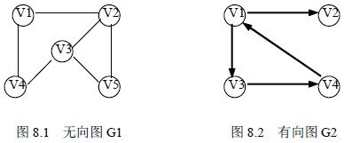
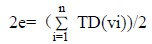
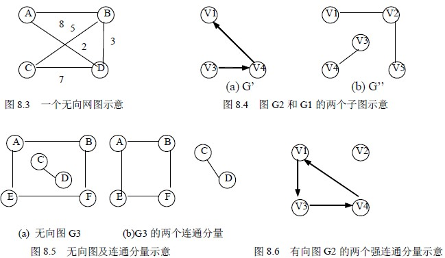

# 8.1 图的基本概念

图状结构是一种比树形结构更复杂的非线性结构。在树状结构中，结点间具有分支层次关系，每一层上的结点只能和上一层中的至多一个结点相关，但可能和下一层的多个结点相关。而在图状结构中，任意两个结点之间都可能相关，即结点之间的邻接关系可以是任意的。因此，图状结构被用于描述各种复杂的数据对象，在自然科学、社会科学和人文科学等许多领域有着非常广泛的应用。

## 8.1.1 图的定义和术语

**1．图的定义**

图(Graph)是由非空的顶点集合和一个描述顶点之间关系――边（或者弧）的集合组成，其形式化定义为：

G＝（V，E）

V＝{vi| vi∈dataobject}

E＝{( vi,vj)| vi, vj ∈V ∧P(vi, vj)}

其中，G 表示一个图，V 是图 G 中顶点的集合，E 是图 G 中边的集合，集合 E 中 P(vi,vj)表示顶点 vi 和顶点 vj 之间有一条直接连线，即偶对(vi,vj)表示一条边。图 8.1 给出了一个图的示例，在该图中：

集合 V＝{v1,v2,v3,v4,v5}；

集合 E＝{(v1,v2),(v1,v4),(v2,v3),(v3,v4),(v3,v5),(v2,v5)}。

**2．图的相关术语**

（1）无向图。在一个图中，如果任意两个顶点构成的偶对（vi, vj）∈E 是无序的，即顶点之间的连线是没有方向的，则称该图为无向图。如图 8.1 所示是一个无向图 G1。

（2）有向图。在一个图中，如果任意两个顶点构成的偶对（vi, vj）∈E 是有序的，即顶点之间的连线是有方向的，则称该图为有向图。如图 8.2 所示是一个有向图 G2：

G2=(V2,E2)

V2={v1,v2,v3,v4}

E2={<v1,v2>,<v1,v3>,<v3,v4>,<v4,v1>}

（3）顶点、边、弧、弧头、弧尾。图中，数据元素 vi 称为顶点(vertex )；P(vi, vj)表示在顶点 vi 和顶点 vj 之间有一条直接连线。如果是在无向图中，则称这条连线为边；如果是在有向图中，一般称这条连线为弧。边用顶点的无序偶对（vi, vj）来表示，称顶点 vi 和顶点 vj 互为邻接点，边（vi, vj）依附于顶点 vi 与顶点 vj；弧用顶点的有序偶对<vi, vj>来表示，有序偶对的第一个结点 vi 被称为始点（或弧尾），在图中就是不带箭头的一端；有序偶对的第二个结点 vj 被称为终点（或弧头），在图中就是带箭头的一端。

（4）无向完全图。在一个无向图中，如果任意两顶点都有一条直接边相连接，则称该图为无向完全图。可以证明，在一个含有 n 个顶点的无向完全图中，有 n(n-1)/2 条边。

（5）有向完全图。在一个有向图中，如果任意两顶点之间都有方向互为相反的两条弧相连接，则称该图为有向完全图。在一个含有 n 个顶点的有向完全图中，有 n(n-1)条边。

（6）稠密图、稀疏图。若一个图接近完全图，称为稠密图；称边数很少的图为稀疏图。

（7）顶点的度、入度、出度。顶点的度（degree）是指依附于某顶点 v 的边数，通常记为 TD (v)。在有向图中，要区别顶点的入度与出度的概念。顶点 v 的入度是指以顶点为终点的弧的数目。记为 ID (v)；顶点 v 出度是指以顶点 v 为始点的弧的数目，记为 OD (v)。

有 TD (v)=ID (v)＋OD (v)。

例如，在 G1 中有：

TD(v1)=2 TD(v2)=3 TD(v3)=3 TD(v4)=2 TD(v5)=2

在 G2 中有：

ID(v1)=1 OD(v1)=2 TD(v1)=3

ID(v2)=1 OD(v2)=0 TD(v2)=1

ID(v3)=1 OD(v3)=1 TD(v3)=2

ID(v4)=1 OD(v4)=1 TD(v4)=2

可以证明，对于具有 n 个顶点、e 条边的图，顶点 vi 的度 TD (vi)与顶点的个数以及边的数目满足关系：

（8）边的权、网图。与边有关的数据信息称为权（weight）。在实际应用中，权值可以有某种含义。比如，在一个反映城市交通线路的图中，边上的权值可以表示该条线路的长度或者等级；对于一个电子线路图，边上的权值可以表示两个端点之间的电阻、电流或电压值；对于反映工程进度的图而言，边上的权值可以表示从前一个工程到后一个工程所需要的时间等等。边上带权的图称为网图或网络（network）。如图 8.3 所示，就是一个无向网图。如果边是有方向的带权图，则就是一个有向网图。

（9）路径、路径长度。顶点 vp 到顶点 vq 之间的路径（path）是指顶点序列 vp,vi1,vi2, …,vim,vq.。其中，（vp,vi1），(vi1,vi2)，…,(vim,.vq)分别为图中的边。路径上边的数目称为路径长度。图 8.1 所示的无向图 G1 中，v1→v4→v3→v5 与 v1→v2→v5 是从顶点 v1 到顶点 v5 的两条路径，路径长度分别为 3 和 2。

（10）回路、简单路径、简单回路。称 vi 的路径为回路或者环（cycle）。序列中顶点不重复出现的路径称为简单路径。在图 8.1 中，前面提到的 v1 到 v5 的两条路径都为简单路径。除第一个顶点与最后一个顶点之外，其他顶点不重复出现的回路称为简单回路，或者简单环。如图 8.2 中的 v1→v3→v4→v1。

（11）子图。对于图 G=（V，E），G’=（V’，E’），若存在 V’是 V 的子集，E’是 E 的子集，则称图 G’是 G 的一个子图。图 8.4 示出了 G2 和 G1 的两个子图 G’和 G’’。

（12）连通的、连通图、连通分量。在无向图中，如果从一个顶点 vi 到另一个顶点 vj(i≠j)有路径，则称顶点 vi 和 vj 是连通的。如果图中任意两顶点都是连通的，则称该图是连通图。无向图的极大连通子图称为连通分量。图 8.5 (a)中有两个连通分量，如图 8.5 (b)所示。

（13）强连通图、强连通分量。对于有向图来说，若图中任意一对顶点 vi 和 vj(i≠j)均有从一个顶点 vi 到另一个顶点 vj 有路径，也有从 vj 到 vi 的路径，则称该有向图是强连通图。有向图的极大强连通子图称为强连通分量。图 8.2 中有两个强连通分量，分别是{v1,v2,v3}和{v4}，如图 8.6 所示。

（14）生成树。所谓连通图 G 的生成树，是 G 的包含其全部 n 个顶点的一个极小连通子图。它必定包含且仅包含 G 的 n-1 条边。图 8.4(b)G”示出了图 8.1(a)中 G1 的一棵生成树。在生成树中添加任意一条属于原图中的边必定会产生回路，因为新添加的边使其所依附的两个顶点之间有了第二条路径。若生成树中减少任意一条边，则必然成为非连通的。

（15）生成森林。在非连通图中，由每个连通分量都可得到一个极小连通子图，即一棵生成树。这些连通分量的生成树就组成了一个非连通图的生成森林。

## 8.1.2 图的基本操作

（1） CreatGraph（G）输入图 G 的顶点和边，建立图 G 的存储。

（2）DestroyGraph（G）释放图 G 占用的存储空间。

（3）GetVex（G，v）在图 G 中找到顶点 v，并返回顶点 v 的相关信息。

（4）PutVex（G，v，value）在图 G 中找到顶点 v，并将 value 值赋给顶点 v。

（5）InsertVex（G，v）在图 G 中增添新顶点 v。

（6）DeleteVex（G，v）在图 G 中，删除顶点 v 以及所有和顶点 v 相关联的边或弧。

（7）InsertArc（G，v，w）在图 G 中增添一条从顶点 v 到顶点 w 的边或弧。

（8）DeleteArc（G，v，w）在图 G 中删除一条从顶点 v 到顶点 w 的边或弧。

（9）DFSTraverse（G，v）在图 G 中，从顶点 v 出发深度优先遍历图 G。

（10）BFSTtaverse（G，v）在图 G 中，从顶点 v 出发广度优先遍历图 G。

在一个图中，顶点是没有先后次序的，但当采用某一种确定的存储方式存储后，存储结构中顶点的存储次序构成了顶点之间的相对次序，这里用顶点在图中的位置表示该顶点的存储顺序；同样的道理，对一个顶点的所有邻接点，采用该顶点的第 i 个邻接点表示与该顶点相邻接的某个顶点的存储顺序，在这种意义下，图的基本操作还有：

（11）LocateVex（G，u）在图 G 中找到顶点 u，返回该顶点在图中位置。

（12）FirstAdjVex（G，v）在图 G 中，返回 v 的第一个邻接点。若顶点在 G 中没有邻接顶点，则返回“空”。

（13）NextAdjVex（G，v，w）在图 G 中，返回 v 的（相对于 w 的）下一个邻接顶点。若 w 是 v 的最后一个邻接点，则返回“空”。