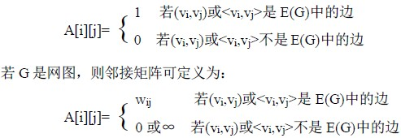

# 8.2 图的存储表示—邻接矩阵

图是一种结构复杂的数据结构，表现在不仅各个顶点的度可以千差万别，而且顶点之间的逻辑关系也错综复杂。从图的定义可知，一个图的信息包括两部分，即图中顶点的信息以及描述顶点之间的关系――边或者弧的信息。因此无论采用什么方法建立图的存储结构，都要完整、准确地反映这两方面的信息。

下面介绍几种常用的图的存储结构。

所谓邻接矩阵（Adjacency Matrix）的存储结构，就是用一维数组存储图中顶点的信息，用矩阵表示图中各顶点之间的邻接关系。假设图 G＝（V，E）有 n 个确定的顶点，即 V＝{v0,v1,…,vn-1},则表示 G 中各顶点相邻关系为一个 n×n 的矩阵，矩阵的元素为：

其中，wij 表示边(vi,vj)或<vi,vj>上的权值；∞表示一个计算机允许的、大于所有边上权值的数。

用邻接矩阵表示法表示图如图 8.7 所示。

用邻接矩阵表示法表示网图如图 8.8 所示。

从图的邻接矩阵存储方法容易看出这种表示具有以下特点：

① 无向图的邻接矩阵一定是一个对称矩阵。因此，在具体存放邻接矩阵时只需存放上（或下）三角矩阵的元素即可。

② 对于无向图，邻接矩阵的第 i 行（或第 i 列）非零元素（或非∞元素）的个数正好是第 i 个顶点的度 TD(vi)。

③ 对于有向图，邻接矩阵的第 i 行（或第 i 列）非零元素（或非∞元素）的个数正好是第 i 个顶点的出度 OD(vi)（或入度 ID(vi)）。

④用邻接矩阵方法存储图，很容易确定图中任意两个顶点之间是否有边相连；但是，要确定图中有多少条边，则必须按行、按列对每个元素进行检测，所花费的时间代价很大。

这是用邻接矩阵存储图的局限性。

下面介绍图的邻接矩阵存储表示。

在用邻接矩阵存储图时，除了用一个二维数组存储用于表示顶点间相邻关系的邻接矩阵外，还需用一个一维数组来存储顶点信息，另外还有图的顶点数和边数。故可将其形式描述如下：

#define MaxVertexNum 100 /*最大顶点数设为 100*/

typedef char VertexType; /*顶点类型设为字符型*/

typedef int EdgeType; /*边的权值设为整型*/

typedef struct {

VertexType vexs[MaxVertexNum]; /*顶点表*/

EdeType edges[MaxVertexNum][MaxVertexNum]; /*邻接矩阵，即边表*/

int n,e; /*顶点数和边数*/

}Mgragh; /*Maragh 是以邻接矩阵存储的图类型*/

建立一个图的邻接矩阵存储的算法如下：

void CreateMGraph(MGraph *G)

{/*建立有向图 G 的邻接矩阵存储*/

int i,j,k,w;

char ch;

printf("请输入顶点数和边数(输入格式为:顶点数,边数):\n");

scanf("%d,%d",&(G->n),&(G->e));/*输入顶点数和边数*/

printf("请输入顶点信息(输入格式为:顶点号<CR>):\n");

for (i=0;i<G->n;i++) scanf("\n%c",&(G->vexs[i])); /*输入顶点信息，建立顶点表*/

for (i=0;i<G->n;i++)

for (j=0;j<G->n;j++) G->edges[i][j]=0; /*初始化邻接矩阵*/

printf("请输入每条边对应的两个顶点的序号(输入格式为:i,j):\n");

for (k=0;k<G->e;k++)

{scanf("\n%d,%d",&i,&j); /*输入 e 条边，建立邻接矩阵*/

G->edges[i][j]=1; /*若加入 G->edges[j][i]=1;，*/

/*则为无向图的邻接矩阵存储建立*/

}

}/*CreateMGraph*/

算法 8.1