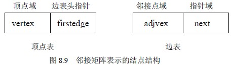
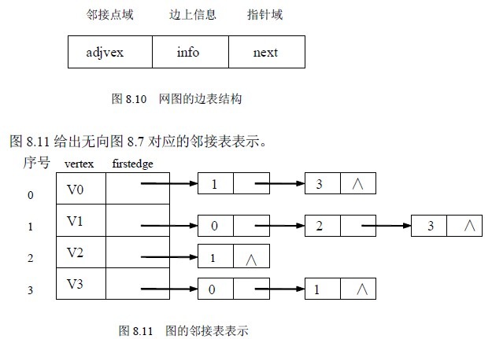
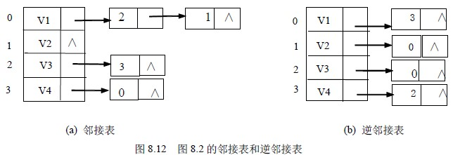

# 8.2 图的存储表示—邻接表

邻接表(Adjacency List)是图的一种顺序存储与链式存储结合的存储方法。邻接表表示法类似于树的孩子链表表示法。就是对于图 G 中的每个顶点 vi，将所有邻接于 vi 的顶点 vj 链成一个单链表，这个单链表就称为顶点 vi 的邻接表，再将所有点的邻接表表头放到数组中，就构成了图的邻接表。在邻接表表示中有两种结点结构，如图 8.9 所示。一种是顶点表的结点结构，它由顶点域（vertex）和指向第一条邻接边的指针域（firstedge）构成，另一种是边表（即邻接表）结点，它由邻接点域(adjvex)和指向下一条邻接边的指针域(next)构成。对于网图的边表需再增设一个存储边上信息（如权值等）的域（info），网图的边表结构如图 8.10 所示。

邻接表表示的形式描述如下：

＃define MaxVerNum 100 /*最大顶点数为 100*/

typedef struct node{ /*边表结点*/

int adjvex; /*邻接点域*/

struct node * next; /*指向下一个邻接点的指针域*/

/*若要表示边上信息，则应增加一个数据域 info*/

}EdgeNode;

typedef struct vnode{ /*顶点表结点*/

VertexType vertex; /*顶点域*/

EdgeNode * firstedge; /*边表头指针*/

}VertexNode;

typedef VertexNode AdjList[MaxVertexNum]; /*AdjList 是邻接表类型*/

typedef struct{

AdjList adjlist; /*邻接表*/

int n,e; /*顶点数和边数*/

}ALGraph; /*ALGraph 是以邻接表方式存储的图类型*/

建立一个有向图的邻接表存储的算法如下：

void CreateALGraph(ALGraph *G)

{/*建立有向图的邻接表存储*/

int i,j,k;

EdgeNode * s;

printf("请输入顶点数和边数(输入格式为:顶点数,边数)：\n");

scanf("%d,%d",&(G->n),&(G->e)); /*读入顶点数和边数*/

printf("请输入顶点信息(输入格式为:顶点号<CR>)：\n");

for (i=0;i<G->n;i++) /*建立有 n 个顶点的顶点表*/

{scanf("\n%c",&(G->adjlist[i].vertex)); /*读入顶点信息*/

G->adjlist[i].firstedge=NULL; /*顶点的边表头指针设为空*/

}

printf("请输入边的信息(输入格式为:i,j)：\n");

for (k=0;k<G->e;k++) /*建立边表*/

{scanf("\n%d,%d",&i,&j); /*读入边<Vi,Vj>的顶点对应序号*/

s=(EdgeNode*)malloc(sizeof(EdgeNode)); /*生成新边表结点 s*/

s->adjvex=j; /*邻接点序号为 j*/

s->next=G->adjlist[i].firstedge; /*将新边表结点 s 插入到顶点 Vi 的边表头部*/

G->adjlist[i].firstedge=s;

}

}/*CreateALGraph*/

算法 8.2

若无向图中有 n 个顶点、e 条边，则它的邻接表需 n 个头结点和 2e 个表结点。显然，在边稀疏(e<<n(n-1)/2)的情况下，用邻接表表示图比邻接矩阵节省存储空间，当和边相关的信息较多时更是如此。

在无向图的邻接表中，顶点 vi 的度恰为第 i 个链表中的结点数；而在有向图中，第 i 个链表中的结点个数只是顶点 vi 的出度，为求入度，必须遍历整个邻接表。在所有链表中其邻接点域的值为 i 的结点的个数是顶点 vi 的入度。有时，为了便于确定顶点的入度或以顶点 vi 为头的弧，可以建立一个有向图的逆邻接表，即对每个顶点 vi 建立一个链接以 vi 为头的弧的链表。例如图 8.12 所示为有向图 G2（图 8.2）的邻接表和逆邻接表。

在建立邻接表或逆邻接表时，若输入的顶点信息即为顶点的编号，则建立邻接表的复杂度为 O（n+e），否则，需要通过查找才能得到顶点在图中位置，则时间复杂度为 O（n·e）。

在邻接表上容易找到任一顶点的第一个邻接点和下一个邻接点，但要判定任意两个顶点（vi 和 vj）之间是否有边或弧相连，则需搜索第 i 个或第 j 个链表，因此，不及邻接矩阵方便。