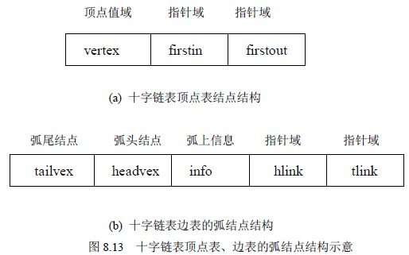
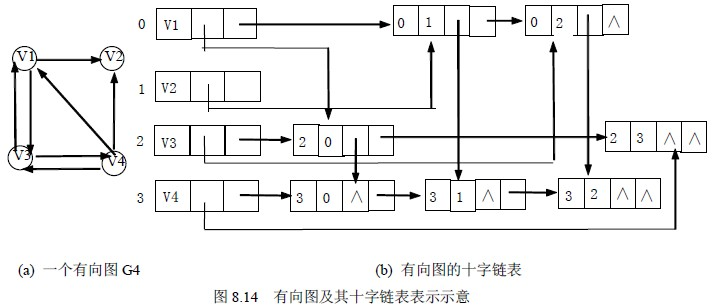

# 8.2 图的存储表示—十字链表

十字链表（Orthogonal List）是有向图的一种存储方法，它实际上是邻接表与逆邻接表的结合，即把每一条边的边结点分别组织到以弧尾顶点为头结点的链表和以弧头顶点为头顶点的链表中。在十字链表表示中，顶点表和边表的结点结构分别如图 8.13 的(a)和(b)所示。

在弧结点中有五个域：其中尾域(tailvex)和头(headvex)分别指示弧尾和弧头这两个顶点在图中的位置，链域 hlink 指向弧头相同的下一条弧，链域 tlink 指向弧尾相同的下一条弧，info 域指向该弧的相关信息。弧头相同的弧在同一链表上，弧尾相同的弧也在同一链表上。它们的头结点即为顶点结点，它由三个域组成：其中 vertex 域存储和顶点相关的信息，如顶点的名称等；firstin 和 firstout 为两个链域，分别指向以该顶点为弧头或弧尾的第一个弧结点。例如，图 8.14(a)中所示图的十字链表如图 8.14（b）所示。若将有向图的邻接矩阵看成是稀疏矩阵的话，则十字链表也可以看成是邻接矩阵的链表存储结构，在图的十字链表中，弧结点所在的链表非循环链表，结点之间相对位置自然形成，不一定按顶点序号有序，表头结点即顶点结点，它们之间而是顺序存储。有向图的十字链表存储表示的形式描述如下：

#define MAX_VERTEX_NUM 20

typedef struct ArcBox {

int tailvex,headvex; /*该弧的尾和头顶点的位置*/

struct ArcBox * hlink, tlink; /分别为弧头相同和弧尾相财的弧的链域*/

InfoType info; /*该弧相关信息的指针*/

}ArcBox;

typedef struct VexNode {

VertexType vertex:

ArcBox fisrin, firstout; /*分别指向该顶点第一条入弧和出弧*/

}VexNode;

typedef struct {

VexNode xlist[MAX_VERTEX_NUM]; /*表头向量*/

int vexnum,arcnum; /*有向图的顶点数和弧数*/

}OLGraph;

下面给出建立一个有向图的十字链表存储的算法。通过该算法，只要输入 n 个顶点的信息和 e 条弧的信息，便可建立该有向图的十字链表，其算法内容如下。

void CreateDG(LOGraph **G)

/*采用十字链表表示，构造有向图 G(G.kind=DG)*/

{ scanf (&(*G->brcnum),&(*G->arcnum),&IncInfo); /*IncInfo 为 0 则各弧不含其实信息*/

for (i=0;i<*G->vexnum;++i) /*构造表头向量*/

{ scanf(&(G->xlist[i].vertex)); /*输入顶点值*/

*G->xlist[i].firstin=NulL;*G->xlist[i].firstout =NULL; /*初始化指针*/

}

for(k=0;k<G.arcnum;++k) /*输入各弧并构造十字链表*/

{ scanf(&v1,&v2); /*输入一条弧的始点和终点*/

i=LocateVex(*G,v1); j=LocateVex(*G,v2); /*确定 v1 和 v2 在 G 中位置*/

p=(ArcBox*) malloc (sizeof(ArcBox)); /*假定有足够空间*/

*p={ i,j,*G->xlist[j].fistin,*G->xlist[i].firstout,NULL} /*对弧结点赋值*/

/*{tailvex,headvex,hlink,tlink,info}*/

*G->xlist[j].fisrtin=*G->xlist[i].firstout=p; /*完成在入弧和出弧链头的插入*/

if (IncInfo) Input( p->info); /*若弧含有相关信息，则输入*/

}

}/*CreateDG*/

算法 8.3

在十字链表中既容易找到以为尾的弧，也容易找到以 vi 为头的弧，因而容易求得顶点的出度和入度（或需要，可在建立十字链表的同时求出）。同时，由算法 8.3 可知，建立十字链表的时间复杂度和建立邻接表是相同的。在某些有向图的应用中，十字链表是很有用的工具。