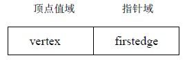
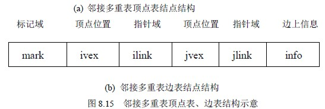
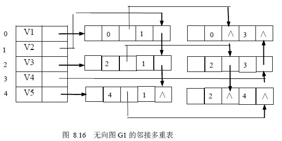

# 8.2 图的存储表示—邻接多重表

邻接多重表(Adjacency Multilist)主要用于存储无向图。因为，如果用邻接表存储无向图，每条边的两个边结点分别在以该边所依附的两个顶点为头结点的链表中，这给图的某些操作带来不便。例如，对已访问过的边做标记，或者要删除图中某一条边等，都需要找到表示同一条边的两个结点。因此，在进行这一类操作的无向图的问题中采用邻接多重表作存储结构更为适宜。

邻接多重表的存储结构和十字链表类似，也是由顶点表和边表组成，每一条边用一个结点表示，其顶点表结点结构和边表结点结构如图 8.15 所示。

其中，顶点表由两个域组成，vertex 域存储和该顶点相关的信息 firstedge 域指示第一条依附于该顶点的边；边表结点由六个域组成，mark 为标记域，可用以标记该条边是否被搜索过；ivex 和 jvex 为该边依附的两个顶点在图中的位置；ilink 指向下一条依附于顶点 ivex 的边;jlink 指向下一条依附于顶点 jvex 的边，info 为指向和边相关的各种信息的指针域。

例如，图 8.16 所示为无向图 8.1 的邻接多重表。在邻接多重表中，所有依附于同一顶点的边串联在同一链表中，由于每条边依附于两个顶点，则每个边结点同时链接在两个链表中。可见，对无向图而言，其邻接多重表和邻接表的差别，仅仅在于同一条边在邻接表中用两个结点表示，而在邻接多重表中只有一个结点。因此，除了在边结点中增加一个标志域外，邻接多重表所需的存储量和邻接表相同。在邻接多重表上，各种基本操作的实现亦和邻接表相似。邻接多重表存储表示的形式描述如下：

#define MAX_VERTEX_NUM 20

typedef emnu{ unvisited,visited} VisitIf;

typedef struct EBox{

VisitIf mark: /*访问标记*/

int ivex,jvex; /*该边依附的两个顶点的位置*/

struct EBox ilink, jlink; /*分别指向依附这两个顶点的下一条边*/

InfoType info; /*该边信息指针*/

}EBox;

typedef struct VexBox{

VertexType data;

EBox fistedge; /*指向第一条依附该顶点的边*/

}VexBox;

typedef struct{

VexBox adjmulist[MAX_VERTEX_NUM];

int vexnum,edgenum; /*无向图的当前顶点数和边数*/

}AMLGraph;