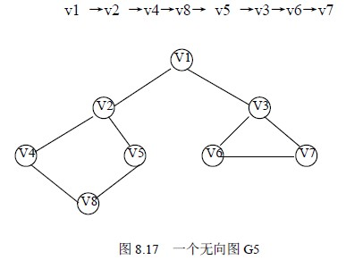

# 8．3 图的遍历

图的遍历是指从图中的任一顶点出发，对图中的所有顶点访问一次且只访问一次。图的遍历操作和树的遍历操作功能相似。图的遍历是图的一种基本操作，图的许多其它操作都是建立在遍历操作的基础之上。

由于图结构本身的复杂性，所以图的遍历操作也较复杂，主要表现在以下四个方面：

① 在图结构中，没有一个“自然”的首结点，图中任意一个顶点都可作为第一个被访问的结点。

② 在非连通图中，从一个顶点出发，只能够访问它所在的连通分量上的所有顶点，因此，还需考虑如何选取下一个出发点以访问图中其余的连通分量。

③ 在图结构中，如果有回路存在，那么一个顶点被访问之后，有可能沿回路又回到该顶点。

④ 在图结构中，一个顶点可以和其它多个顶点相连，当这样的顶点访问过后，存在如何选取下一个要访问的顶点的问题。

图的遍历通常有深度优先搜索和广度优先搜索两种方式，下面分别介绍。

### 8.3.1 深度优先搜索

深度优先搜索（Depth_Fisrst Search）遍历类似于树的先根遍历，是树的先根遍历的推广。

假设初始状态是图中所有顶点未曾被访问，则深度优先搜索可从图中某个顶点发 v 出发，访问此顶点，然后依次从 v 的未被访问的邻接点出发深度优先遍历图，直至图中所有和 v 有路径相通的顶点都被访问到；若此时图中尚有顶点未被访问，则另选图中一个未曾被访问的顶点作起始点，重复上述过程，直至图中所有顶点都被访问到为止。

以图 8.17 的无向图 G5 为例，进行图的深度优先搜索。假设从顶点 v1 出发进行搜索，在访问了顶点 v1 之后，选择邻接点 v2。因为 v2 未曾访问，则从 v2 出发进行搜索。依次类推，接着从 v4 、v8 、v5 出发进行搜索。在访问了 v5 之后，由于 v5 的邻接点都已被访问，则搜索回到 v8。由于同样的理由，搜索继续回到 v4，v2 直至 v1，此时由于 v1 的另一个邻接点未被访问，则搜索又从 v1 到 v3，再继续进行下去由此，得到的顶点访问序列为：

显然，这是一个递归的过程。为了在遍历过程中便于区分顶点是否已被访问，需附设访问标志数组 visited[0:n-1], ，其初值为 FALSE ，一旦某个顶点被访问，则其相应的分量置为 TRUE。

从图的某一点 v 出发，递归地进行深度优先遍历的过程如算法 8.4 所示。

void DFS(Graph G,int v )

{ /*从第 v 个顶点出发递归地深度优先遍历图 G*/

visited[v]=TRUE;VisitFunc(v); /*访问第 v 个顶点*/

for(w=FisrAdjVex(G,v);w; w=NextAdjVex(G,v,w))

if (!visited[w]) DFS(G,w); /*对 v 的尚未访问的邻接顶点 w 递归调用 DFS*/

}

算法 8.4

算法 8.5 和算法 8.6 给出了对以邻接表为存储结构的整个图 G 进行深度优先遍历实现的 C 语言描述。

void DFSTraverseAL(ALGraph *G)

{/*深度优先遍历以邻接表存储的图 G*/

int i;

for (i=0;i<G->n;i++)

visited[i]=FALSE; /*标志向量初始化*/

for (i=0;i<G->n;i++)

if (!visited[i]) DFSAL(G,i); /*vi 未访问过，从 vi 开始 DFS 搜索*/

}/*DFSTraveseAL*/

算法 8.5

void DFSAL(ALGraph *G,int i)

{/*以 Vi 为出发点对邻接表存储的图 G 进行 DFS 搜索*/

EdgeNode *p;

printf("visit vertex:V%c\n",G->adjlist[i].vertex);/*访问顶点 Vi*/

visited[i]=TRUE; /*标记 Vi 已访问*/

p=G->adjlist[i].firstedge; /*取 Vi 边表的头指针*/

while(p) /*依次搜索 Vi 的邻接点 Vj，j=p->adjva*/

{if (!visited[p->adjvex]) /*若 Vj 尚未访问，则以 Vj 为出发点向纵深搜索*/

DFSAL(G,p->adjvex);

p=p->next; /*找 Vi 的下一个邻接点*/

}

}/*DFSAL*/

算法 8.6

分析上述算法，在遍历时，对图中每个顶点至多调用一次 DFS 函数，因为一旦某个顶点被标志成已被访问，就不再从它出发进行搜索。因此，遍历图的过程实质上是对每个顶点查找其邻接点的过程。其耗费的时间则取决于所采用的存储结构。当用二维数组表示邻接矩阵图的存储结构时，查找每个顶点的邻接点所需时间为 O(n2) ，其中 n 为图中顶点数。而当以邻接表作图的存储结构时，找邻接点所需时间为 O(e)，其中 e 为无向图中边的数或有向图中弧的数。由此，当以邻接表作存储结构时，深度优先搜索遍历图的时间复杂度为 O(n+e) 。

### 8.3.2 广度优先搜索

广度优先搜索（Breadth_First Search） 遍历类似于树的按层次遍历的过程。假设从图中某顶点 v 出发，在访问了 v 之后依次访问 v 的各个未曾访问过和邻接点，然后分别从这些邻接点出发依次访问它们的邻接点，并使“先被访问的顶点的邻接点”先于“后被访问的顶点的邻接点”被访问，直至图中所有已被访问的顶点的邻接点都被访问到。若此时图中尚有顶点未被访问，则另选图中一个未曾被访问的顶点作起始点，重复上述过程，直至图中所有顶点都被访问到为止。换句话说，广度优先搜索遍历图的过程中以 v 为起始点，由近至远，依次访问和 v 有路径相通且路径长度为 1,2,…的顶点。

例如，对图 8.17 所示无向图 G5 进行广度优先搜索遍历，首先访问 v1 和 v1 的邻接点 v2 和 v3，然后依次访问 v2 的邻接点 v4 和 v5 及 v3 的邻接点 v6 和 v7，最后访问 v4 的邻接点 v8。由于这些顶点的邻接点均已被访问，并且图中所有顶点都被访问，由些完成了图的遍历。得到的顶点访问序列为：

v1→v2 →v3 →v4→ v5→ v6→ v7 →v8

和深度优先搜索类似，在遍历的过程中也需要一个访问标志数组。并且，为了顺次访问路径长度为 2、3、…的顶点，需附设队列以存储已被访问的路径长度为 1、2、… 的顶点。

从图的某一点 v 出发，递归地进行广度优先遍历的过程如算法 8.7 所示。

void BFSTraverse(Graph G, Status(*Visit)(int v))

{/*按广度优先非递归遍历图 G。使用辅助队列 Q 和访问标志数组 visited*/

for (v=0;v<G,vexnum;++v)

visited[v]=FALSE

InitQueue(Q); /*置空的国债队列 Q*/

if (!visited[v]) /*v 尚未访问*/

{EnQucue(Q,v); /*v 入队列*/

while (!QueueEmpty(Q))

{ DeQueue(Q,u); /*队头元素出队并置为 u*/

visited[u]=TRUE; visit(u); /*访问 u*/

for(w=FistAdjVex(G,u); w; w=NextAdjVex(G,u,w))

if (!visited[w]) EnQueue(Q,w); /*u 的尚未访问的邻接顶点 w 入队列 Q*/

}

}

}/*BFSTraverse*/

算法 8.7

算法 8.8 和算法 8.9 给出了对以邻接矩阵为存储结构的整个图 G 进行深度优先遍历实现的 C 语言描述。

void BFSTraverseAL(MGraph *G)

{/*广度优先遍历以邻接矩阵存储的图 G*/

int i;

for (i=0;i<G->n;i++)

visited[i]=FALSE; /*标志向量初始化*/

for (i=0;i<G->n;i++)

if (!visited[i]) BFSM(G,i); /* vi 未访问过，从 vi 开始 BFS 搜索*/

}/*BFSTraverseAL*/

算法 8.8

void BFSM(MGraph *G,int k)

{/*以 Vi 为出发点，对邻接矩阵存储的图 G 进行 BFS 搜索*/

int i,j;

CirQueue Q;

InitQueue(&Q);

printf("visit vertex:V%c\n",G->vexs[k]); /*访问原点 Vk*/

visited[k]=TRUE;

EnQueue(&Q,k); /*原点 Vk 入队列*/

while (!QueueEmpty(&Q))

{i=DeQueue(&Q); /*Vi 出队列*/

for (j=0;j<G->n;j++) /*依次搜索 Vi 的邻接点 Vj*/

if (G->edges[i][j]==1 && !visited[j]) /*若 Vj 未访问*/

{printf("visit vertex:V%c\n",G->vexs[j]); /*访问 Vj */

visited[j]=TRUE;

EnQueue(&Q,j); /*访问过的 Vj 入队列*/

}

}

}/*BFSM*/

算法 8.9

分析上述算法，每个顶点至多进一次队列。遍历图的过程实质是通过边或弧找邻接点的过程，因此广度优先搜索遍历图的时间复杂度和深度优先搜索遍历相同，两者不同之处仅仅在于对顶点访问的顺序不同。