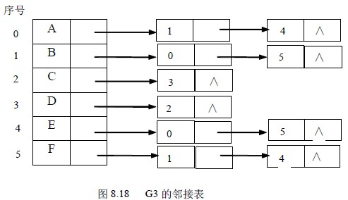

# 8.4 图的连通性—无向图的连通性

判定一个图的连通性是图的一个应用问题，我们可以利用图的遍历算法来求解这一问题。本节将重点讨论无向图的连通性、有向图的连通性、由图得到其生成树或生成森林以及连通图中是否有关节点等几个有关图的连通性的问题。

在对无向图进行遍历时，对于连通图，仅需从图中任一顶点出发，进行深度优先搜索或广度优先搜索，便可访问到图中所有顶点。对非连通图，则需从多个顶点出发进行搜索，而每一次从一个新的起始点出发进行搜索过程中得到的顶点访问序列恰为其各个连通分量中的顶点集。例如，图 8.5 (a)是一个非连通图 G3，按照图 8.18 所示 G3 的邻接表进行深度优先搜索遍历，需由算法 8.5 调用两次 DFS（即分别从顶点 A 和 D 出发），得到的顶点访问序列分别为：

A B F E C E 这两个顶点集分别加上所有依附于这些顶点的边，便构成了非连通图 G3 的两个连通分量，如图 8.5(b) 所示。

因此，要想判定一个无向图是否为连通图，或有几个连通分量，就可设一个计数变量 count，初始时取值为 0，在算法 8.5 的第二个 for 循环中，每调用一次 DFS，就给 count 增 1。这样，当整个算法结束时，依据 count 的值，就可确定图的连通性了。

