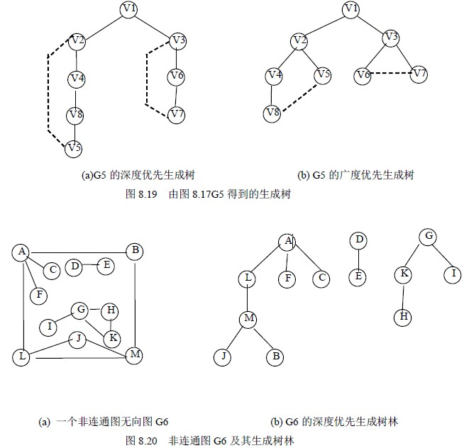

# 8.4 图的连通性—生成树和生成森林

在这一小节里，我们将给出通过对图的遍历，得到图的生成树或生成森林的算法。

设 E(G)为连通图 G 中所有边的集合，则从图中任一顶点出发遍历图时，必定将 E(G)分成两个集合 T(G)和 B(G)，其中 T(G)是遍历图过程中历经的边的集合；B(G)是剩余的边的集合。显然，T(G)和图 G 中所有顶点一起构成连通图 G 的极小连通子图。按照 8.1.2 节的定义，它是连通图的一棵生成树，并且由深度优先搜索得到的为深度优先生成树；由广度优先搜索得到的为广度优先生成树。例如，图 8.17(a)和(b)所示分别为连通图 G5 的深度优先生成树和广度优先生成树。图中虚线为集合 B(G) 中的边，实线为集合 T(G)中的边。

对于非连通图，通过这样的遍历，将得到的是生成森林。例如，图 8.20 (b) 所示为图 8.20 (a)的深度优先生成森林，它由三棵深度优先生成树组成。

假设以孩子兄弟链表作生成森林的存储结构，则算法 8.10 生成非连通图的深度优先生成森林，其中 DFSTree 函数如算法 8.11 所示。显然，算法 8.10 的时间复杂度和遍历相同。

void DESForest(Graph G, CSTree *T)

{ /*建立无向图 G 的深度优先生成森林的孩子兄弟链表 T*/

T=NULL;

for (v=0;v<G.vexnum;++v)

if (!visited[v]=FALSE;

for(v=0;v<G.vexnum;++v)

if (!visited[v]) /*顶点 v 为新的生成树的根结点*/

{ p=(CSTree)malloc(sixeof(CSNode)); /*分配根结点*/

p={GetVex(G,v).NULL,NULL}; /*给根结点赋值*/

if (!T)

(*T)=p; /*T 是第一棵生成树的根*/

else q->nextsibling=p; /*前一棵的根的兄弟是其它生成树的根*/

q=p; /*q 指示当前生成树的根*/

DFSTree(G,v,&p); /*建立以 p 为根的生成树*/

}

}

算法 8.10

void DFSTree(Graph G,int v ,CSTree *T)

{/*从第 v 个顶点出发深度优先遍历图 G，建立以*T 为根的生成树*/

visited[v]=TRUE;

first=TRUE;

for(w=FirstAdjVex(G,v); w; w=NextAdjVex(G,v,w))

if(!visited[w])

{ p=(CSTree)malloc(sizeof)CSNode)); /*分配孩子结点*/

*p={GetVex(G,w),NULL,NULL};

if (first) /*w 是 v 的第一个未被访问的邻接顶点，作为根的左孩子结点*/

{ T->lchild=p;

first=FALSE;

}

else { /*w 是 v 的其它未被访问的邻接顶点，作为上一邻接顶点的右兄弟*/

q->nextsibling=p;

}

q=p;

DFSTree(G,w,&q); /*从第 w 个顶点出发深度优先遍历图 G，建立生成子树*q*/

}

}

算法 8.11