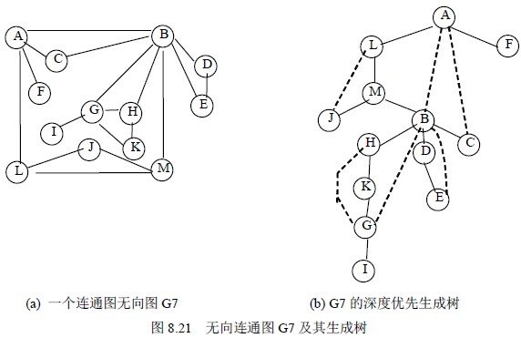

# 8.4 图的连通性—关节点和重连通分量

假若在删去顶点 v 以及和 v 相关联的各边之后，将图的一个连通分量分割成两个或两个以上的连通分量，则称顶点 v 为该图的一个关节点(articulation point) 。一个没有关节点的连通图称为重连通图(biconnected graph) 。在重连通图上，任意一对顶点之间至少存在两条路径，则在删去某个顶点以及依附于该顶点的各边时也不破坏图的连通性。若在连通图上至少删去 k 个顶点才能破坏图的连通性，则称此图的连通度为 k。关节点和重连通图在实际中较多应用。显然，一个表示通信网络的图的连通度越高，其系统越可靠，无论是哪一个站点出现故障或遭到外界破坏，都不影响系统的正常工作；又如，一个航空网若是重连通的，则当某条航线因天气等某种原因关闭时，旅客仍可从别的航线绕道而行；再如，若将大规模的集成电路的关键线路设计成重连通的话，则在某些元件失效的情况下，整个片子的功能不受影响，反之，在战争中，若要摧毁敌方的运输线，仅需破坏其运输网中的关节点即可。

例如，图 8.21 (a)中图 G7 是连通图，但不是重连通图。图中有四个关节点 A、B 和 G 。若删去顶点 B 以及所有依附顶点 B 的边，G7 就被分割成三个连通分量{A、C、F、L、M、J}、{G、H、I、K}和{D、E}。类似地，若删去顶点 A 或 D 或 G 以及所依附于它们的边，则 G7 被分割成两个连通分量，由此，关节点亦称为割点。

利用深度优先搜索便可求得图的关节点，并由此可判别图是否是重连通的。

图 8.21 (b)所示为从顶点 A 出发深优先生成树，图中实线表示树边，虚线表示回边（即不在生成树上的边）。对树中任一顶点 v 而言，其孩子结点为在它之后搜索到的邻接点，而其双亲结点和由回边连接的祖先结点是在它之前搜索到的邻接点。由深度优先生成树可得出两类关节点的特性：

（1）若生成树的根有两棵或两棵以上的子树，则此根顶点必为关节点。因为图中不存在联结不同子树中顶点的边，因此，若删去根顶点，生成树便变成生成森林。如图 8.21(b)中的顶点 A。

（2）若生成树中某个非叶子顶点 v，其某棵子树的根和子树中的其它结点均没有指向 v 的祖先的回边，则 v 为关节点。因为，若删去 v，则其子树和图的其它部分被分割开来。如图 8.21(b)中的顶点 B 和 G 。

若对图 Graph＝(V，{Edge}) 重新定义遍历时的访问函数 visited，并引入一个新的函数 low，则由一次深度优先遍历便可求得连通图中存在的所有关节点。

定义 visited[v]为深度优先搜索遍历连通图时访问顶点 v 的次序号；定义：

若对于某个顶点 v，存在孩子结点 w 且 low[w]≧visited[v]，则该顶点 v 必为关节点。因为当 w 是 v 的孩子结点时，low[w]≧visited[v]，表明 w 及其子孙均无指向 v 的祖先的回边。由定义可知，visited[v]值即为 v 在深度优先生成树的前序序列的序号，只需将 DFS 函数中头两个语句改为 visited[v0]=++count（在 DFSTraverse 中设初值 count=1）即可；low[v]可由后序遍历深度优先生成树求得，而 v 在后序序列中的次序和遍历时退出 DFS 函数的次序相同，由此修改深度优先搜索遍历的算法便可得到求关节点的算法（见算法 8.12 和算法 8.13）。

void FindArticul(ALGraph G)

{ /*连通图 G 以邻接表作存储结构，查找并输出 G 上全部关节点*/

count=1; /*全局变量 count 用于对访问计数*/

visited[0]=1; /*设定邻接表上 0 号顶点为生成树的根*/

for(i=1;i<G.vexnum;++i) /*其余顶点尚未访问*/

visited[i]=0;

p=G.adjlist[0].first;

v=p->adjvex;

DFSArticul(g,v); /*从顶点 v 出发深度优先查找关节点*/

if(count<G.vexnum) /*生成树的根至少有两棵子树*/

{printf(0,G.adjlist[0].vertex); /*根是关节点，输出*/

while(p->next)

{ p=p->next;

v=p->adjvex;

if(visited[v]==0) DFSArticul(g,v);

}

}

} /*FindArticul*/

算法 8.12

void DFSArticul(ALGraph G,int v0)

/*从顶点 v0 出发深度优先遍历图 G，查找并输出关节点*/

{ visited[v0]=min=++count; /*v0 是第 count 个访问的顶点*/

for(p=G.adjlist[v0].firstedge; p; p=p->next;) /*对 v0 的每个邻接点检查*/

{ w=p->adjvex; /*w 为 v0 的邻接点*/

if(visited[w]==0) /*若 w 未曾访问，则 w 为 v0 的孩子*/

{ DFSArticul(G,w); /*返回前求得 low[w]*/

if(low[w]<min)min=low[w];

if(low[w]>=visited[v0]) printf(v0,G.adjlist[v0].vertex); /*输出关节点*/

}

else if(visited[w]<min) min=visited[w]; /*w 已访问，w 是 v0 在生成树上的祖先*/

}

low[v0]=min;

}

算法 8.13

例如，图 G7 中各顶点计算所得 visited 和 low 的函数值如下所列：

其中 J 是第一个求得 low 值的顶点，由于存在回边（J,L），则 low[J]=Min{visited[J]、visited[L]}=2。顺便提一句，上述算法中将指向双亲的树边也看成是回边，由于不影响关节点的判别，因此，为使算法简明起见，在算法中没有区别之。

由于上述算法的过程就是一个遍历的过程，因此，求关节点的时间复杂度仍为 O（n+e）。