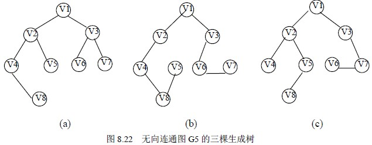

# 8.5 最小生成树—最小生成树的基本概念

由生成树的定义可知，无向连通图的生成树不是唯一的。连通图的一次遍历所经过的边的集合及图中所有顶点的集合就构成了该图的一棵生成树，对连通图的不同遍历，就可能得到不同的生成树。图 8.22 (a)、(b)和(c)所示的均为图 8.17 的无向连通图的生成树。

可以证明，对于有 n 个顶点的无向连通图，无论其生成树的形态如何，所有生成树中都有且仅有 n－1 条边。

如果无向连通图是一个网，那么，它的所有生成树中必有一棵边的权值总和最小的生成树，我们称这棵生成树为最小生成树，简称为最小生成树。

最小生成树的概念可以应用到许多实际问题中。例如有这样一个问题：以尽可能抵的总造价建造城市间的通讯网络，把十个城市联系在一起。在这十个城市中，任意两个城市之间都可以建造通讯线路，通讯线路的造价依据城市间的距离不同而有不同的造价，可以构造一个通讯线路造价网络，在网络中，每个顶点表示城市，顶点之间的边表示城市之间可构造通讯线路，每条边的权值表示该条讯线路的造价，要想使总的造价最低，实际上就是寻找该网络的最小生成树。

下面介绍两种常用的构造最小生成树的方法。