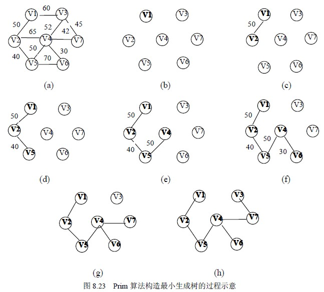
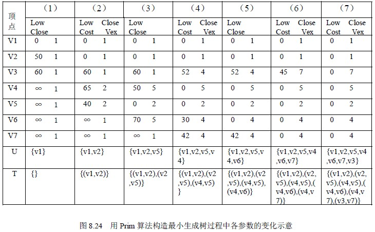

# 8.5 最小生成树—构造最小生成树的 Prim 算法

假设 G＝（V，E）为一网图，其中 V 为网图中所有顶点的集合，E 为网图中所有带权边的集合。设置两个新的集合 U 和 T，其中集合 U 用于存放 G 的最小生成树中的顶点，集合 T 存放 G 的最小生成树中的边。令集合 U 的初值为 U＝{u1}（假设构造最小生成树时，从顶点 u1 出发），集合 T 的初值为 T＝{}。Prim 算法的思想是，从所有 u∈U，v∈V－U 的边中，选取具有最小权值的边（u，v），将顶点 v 加入集合 U 中，将边（u，v）加入集合 T 中，如此不断重复，直到 U＝V 时，最小生成树构造完毕，这时集合 T 中包含了最小生成树的所有边。

Prim 算法可用下述过程描述，其中用 wuv 表示顶点 u 与顶点 v 边上的权值。

（1）U＝{u1},T={};

（2）while (U≠V)do

(u，v)＝min{wuv；u∈U，v∈V－U }

T＝T＋{(u，v)}

U＝U＋{v}

（3）结束。

图 8.23 (a)所示的一个网图，按照 Prim 方法，从顶点 1 出发，该网的最小生成树的产生过程如图 8.23 (b)、(c)、(d)、(e)、(f)和(g)所示。

为实现 Prim 算法，需设置两个辅助一维数组 lowcost 和 closevert，其中 lowcost 用来保存集合 V－U 中各顶点与集合 U 中各顶点构成的边中具有最小权值的边的权值；数组 closevertex 用来保存依附于该边的在集合 U 中的顶点。假设初始状态时，U＝{u1}(u1 为出发的顶点)，这时有 lowcost[0]=0，它表示顶点 u1 已加入集合 U 中，数组 lowcost 的其它各分量的值是顶点 u1 到其余各顶点所构成的直接边的权值。然后不断选取权值最小的边（ui，uk）（ui∈U，uk∈V－U），每选取一条边，就将 lowcost（k）置为 0，表示顶点 uk 已加入集合 U 中。由于顶点 uk 从集合 V－U 进入集合 U 后，这两个集合的内容发生了变化，就需依据具体情况更新数组 lowcost 和 closevertex 中部分分量的内容。最后 closevertex 中即为所建立的最小生成树。

当无向网采用二维数组存储的邻接矩阵存储时，Prim 算法的 C 语言实现为：

void Prim（int gm[ ][MAXNODE]，int n，int closevertex[ ]）

{/*用 Prim 方法建立有 n 个顶点的邻接矩阵存储结构的网图 gm 的最小生成树*/

/*从序号为 0 的顶点出发；建立的最小生成树存于数组 closevertex 中*/

int lowcost[100],mincost;

int i,j,k;

for (i=1;i<n;i++) /*初始化*/

{ lowcost[i]=gm[0][i];

closevertex[i]=0;

}

lowcost[0]=0; /*从序号为 0 的顶点出发生成最小生成树*/

closevertex[0]=0;

for (i=1;i<n;i++) /*寻找当前最小权值的边的顶点*/

{mincost=MAXCOST; /*MAXCOST 为一个极大的常量值*/

j=1;k=1;

while (j<n)

{ if (lowcost[j]<mincost && lowcost[j]!=0)

{ mincost=lowcost[j];

k=j;

}

j++;

}

printf(“顶点的序号＝%d 边的权值＝%d\n”,k,mincost);

lowcost[k]=0;

for (j=1;j<n;j++) /*修改其它顶点的边的权值和最小生成树顶点序号*/

if (gm[k][j]<lowcost[j])

{ lowcost[j]=gm[k][j];

closevertex[j]=k;

}

}

}

算法 8.14

图 8.24 给出了在用上述算法构造网图 8.23 (a)的最小生成树的过程中，数组 closevertex、lowcost 及集合 U，V－U 的变化情况，读者可进一步加深对 Prim 算法的了解。

在 Prim 算法中，第一个 for 循环的执行次数为 n－1，第二个 for 循环中又包括了一个 while 循环和一个 for 循环，执行次数为 2(n-1)2，所以 Prim 算法的时间复杂度为 O(n2)。

