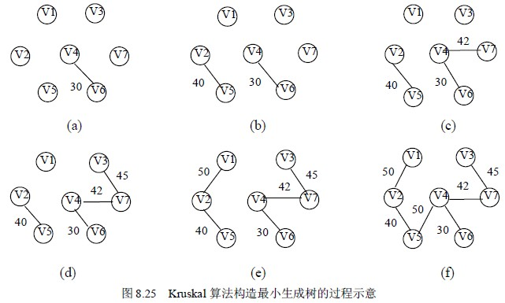

# 8.5 最小生成树—构造最小生成树的 Kruskal 算法

Kruskal 算法是一种按照网中边的权值递增的顺序构造最小生成树的方法。其基本思想是：设无向连通网为 G＝（V，E），令 G 的最小生成树为 T，其初态为 T＝（V，{}），即开始时，最小生成树 T 由图 G 中的 n 个顶点构成，顶点之间没有一条边，这样 T 中各顶点各自构成一个连通分量。然后，按照边的权值由小到大的顺序，考察 G 的边集 E 中的各条边。若被考察的边的两个顶点属于 T 的两个不同的连通分量，则将此边作为最小生成树的边加入到 T 中，同时把两个连通分量连接为一个连通分量；若被考察边的两个顶点属于同一个连通分量，则舍去此边，以免造成回路，如此下去，当 T 中的连通分量个数为 1 时，此连通分量便为 G 的一棵最小生成树。

对于图 8.23(a)所示的网，按照 Kruskal 方法构造最小生成树的过程如图 8.25 所示。在构造过程中，按照网中边的权值由小到大的顺序，不断选取当前未被选取的边集中权值最小的边。依据生成树的概念，n 个结点的生成树，有 n－1 条边，故反复上述过程，直到选取了 n－1 条边为止，就构成了一棵最小生成树。

下面介绍 Kruskal 算法的实现。

设置一个结构数组 Edges 存储网中所有的边，边的结构类型包括构成的顶点信息和边权值，定义如下：

#define MAXEDGE <图中的最大边数>

typedef struct {

elemtype v1;

elemtype v2;

int cost;

} EdgeType;

EdgeType edges[MAXEDGE];

在结构数组 edges 中，每个分量 edges[i]代表网中的一条边，其中 edges[i].v1 和 edges[i].v2 表示该边的两个顶点，edges[i].cost 表示这条边的权值。为了方便选取当前权值最小的边，事先把数组 edges 中的各元素按照其 cost 域值由小到大的顺序排列。在对连通分量合并时，采用 7.5.2 节所介绍的集合的合并方法。对于有 n 个顶点的网，设置一个数组 father[n]，其初值为 father[i]=-1（i＝0，1，…，n－1），表示各个顶点在不同的连通分量上，然后，依次取出 edges 数组中的每条边的两个顶点，查找它们所属的连通分量，假设 vf1 和 vf2 为两顶点所在的树的根结点在 father 数组中的序号，若 vf1 不等于 vf2，表明这条边的两个顶点不属于同一分量，则将这条边作为最小生成树的边输出，并合并它们所属的两个连通分量。

下面用 C 语言实现 Kruskal 算法，其中函数 Find 的作用是寻找图中顶点所在树的根结点在数组 father 中的序号。需说明的是，在程序中将顶点的数据类型定义成整型，而在实际应用中，可依据实际需要来设定。

typedef int elemtype;

typedef struct {

elemtype v1;

elemtype v2;

int cost;

}EdgeType;

void Kruskal（EdgeType edges[ ]，int n）

/*用 Kruskal 方法构造有 n 个顶点的图 edges 的最小生成树*/

{ int father[MAXEDGE];

int i,j,vf1,vf2;

for (i=0;i<n;i++) father[i]=-1;

i=0;j=0;

while(i<MAXEDGE && j<n-1)

{ vf1=Find(father,edges[i].v1);

vf2=Find(father,edges[i].v2);

if (vf1!=vf2)

{ father[vf2]=vf1;

j++;

printf(“%3d%3d\n”,edges[i].v1,edges[i].v2);

}

i++;

}

}

算法 8.15

int Find（int father[ ]，int v）

/*寻找顶点 v 所在树的根结点*/

{ int t;

t=v;

while(father[t]>=0)

t=father[t];

return(t);

}

算法 8.16

在 Kruskal 算法中，第二个 while 循环是影响时间效率的主要操作，其循环次数最多为 MAXEDGE 次数，其内部调用的 Find 函数的内部循环次数最多为 n，所以 Kruskal 算法的时间复杂度为 O（n·MAXEDGE）。