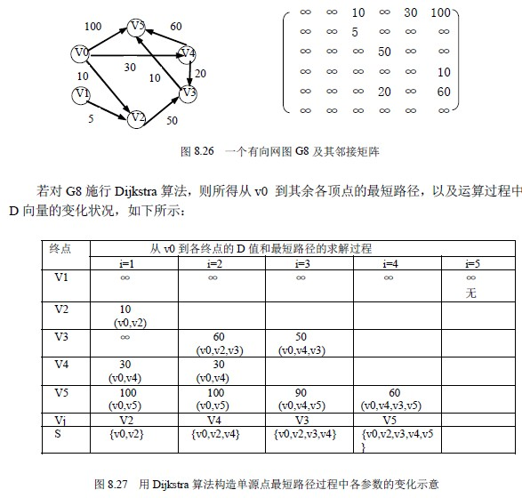

# 8.6 最短路径—从一个源点到其它各点的最短路径

最短路径问题是图的又一个比较典型的应用问题。例如，某一地区的一个公路网，给定了该网内的 n 个城市以及这些城市之间的相通公路的距离，能否找到城市 A 到城市 B 之间一条举例最近的通路呢？如果将城市用点表示，城市间的公路用边表示，公路的长度作为边的权值，那么，这个问题就可归结为在网图中，求点 A 到点 B 的所有路径中，边的权值之和最短的那一条路径。这条路径就是两点之间的最短路径，并称路径上的第一个顶点为源点（Sourse），最后一个顶点为终点（Destination）。在非网图中，最短路径是指两点之间经历的边数最少的路径。下面讨论两种最常见的最短路径问题。

本节先来讨论单源点的最短路径问题：给定带权有向图 G＝（V，E）和源点 v∈V，求从 v 到 G 中其余各顶点的最短路径。在下面的讨论中假设源点为 v0。

下面就介绍解决这一问题的算法。即由迪杰斯特拉（Dijkstra）提出的一个按路径长度递增的次序产生最短路径的算法。该算法的基本思想是：设置两个顶点的集合 S 和 T＝V－S，集合 S 中存放已找到最短路径的顶点，集合 T 存放当前还未找到最短路径的顶点。

初始状态时，集合 S 中只包含源点 v0，然后不断从集合 T 中选取到顶点 v0 路径长度最短的顶点 u 加入到集合 S 中，集合 S 每加入一个新的顶点 u，都要修改顶点 v0 到集合 T 中剩余顶点的最短路径长度值，集合 T 中各顶点新的最短路径长度值为原来的最短路径长度值与顶点 u 的最短路径长度值加上 u 到该顶点的路径长度值中的较小值。此过程不断重复，直到集合 T 的顶点全部加入到 S 中为止。

Dijkstra 算法的正确性可以用反证法加以证明。假设下一条最短路径的终点为 x，那么，该路径必然或者是弧（v0，x），或者是中间只经过集合 S 中的顶点而到达顶点 x 的路径。

因为假若此路径上除 x 之外有一个或一个以上的顶点不在集合 S 中，那么必然存在另外的终点不在 S 中而路径长度比此路径还短的路径，这与我们按路径长度递增的顺序产生最短路径的前提相矛盾，所以此假设不成立。

下面介绍 Dijkstra 算法的实现。

首先，引进一个辅助向量 D，它的每个分量 D[i] 表示当前所找到的从始点 v 到每个终点 vi 的最短路径的长度。它的初态为：若从 v 到 vi 有弧，则 D[i]为弧上的权值；否则置 D[i]为∞。显然，长度为：

D[j]=Min{D[i]| vi∈V}的路径就是从 v 出发的长度最短的一条最短路径。此路径为（v ,vj）。

那么，下一条长度次短的最短是哪一条呢？假设该次短路径的终点是 vk ，则可想而知，这条路径或者是（v, vk），或者是（v, vj, vk）。它的长度或者是从 v 到 vk 的弧上的权值，或者是 D[j]和从 vj 到 vk 的弧上的权值之和。

依据前面介绍的算法思想，在一般情况下，下一条长度次短的最短路径的长度必是：

D[j]=Min{D[i]| vi∈V-S}其中，D[i] 或者弧（v, vi）上的权值，或者是 Dk][i] vi∈V（2）选择 vj，使得 D[j]=Min{D[i]| vi∈V-S}vj 就是当前求得的一条从 v 出发的最短路径的终点。令 S＝S∪{j}（3）修改从 v 出发到集合 V-S 上任一顶点 vk 可达的最短路径长度。如果 D[j]+ edges[j][k]<D[k]则修改 D[k]为 D[k]=D[j]+ edges[j][k]重复操作（2）、（3）共 n-1 次。由此求得从 v 到图上其余各顶点的最短路径是依路径长度递增的序列。

算法 8.17 为用 C 语言描述的 Dijkstra 算法。

void ShortestPath_1(Mgraph G,int v0,PathMatrix *p, ShortPathTable *D)

{ /*用 Dijkstra 算法求有向网 G 的 v0 顶点到其余顶点 v 的最短路径 P[v]及其路径长度 D[v]*/

/*若 P[v][w]为 TRUE，则 w 是从 v0 到 v 当前求得最短路径上的顶点*/

/*final[v] 为 TRUE 当且仅当 v∈S, ，即已经求得从 v0 到 v 的最短路径*/

/*常量 INFINITY 为边上权值可能的最大值*/

for (v=0;v<G.vexnum;++v)

{fianl[v]=FALSE; D[v]=G.edges[v0][v];

for (w=0; w<G.vexnum; ++w) P[v][w]=FALSE; /*设空路径*/

if (D[v]<INFINITY) {P[v][v0]=TRUE; P[v][w]=TRUE;}

}

D[v0]=0; final[v0]=TRUE； /*初始化，v0 顶点属于 S 集*/

/*开始主循环，每次求得 v0 到某个 v 顶点的最短路径，并加 v 到集*/

for(i=1; i<G.vexnum; ++i) /*其余 G.vexnum-1 个顶点*/

{min=INFINITY; /*min 为当前所知离 v0 顶点的最近距离*/

for (w=0;w<G.vexnum;++w)

if (!final[w]) /*w 顶点在 V－S 中*/

if (D[w]<min) {v=w; min=D[w];}

final[v]=TRUE /*离 v0 顶点最近的 v 加入 S 集合*/

for(w=0;w>G.vexnum;++w) /*更新当前最短路径*/

if (!final[w]&&(min+G.edges[v][w]<D[w])) /*修改 D[w]和 P[w],w∈V-S*/

{ D[w]=min+G.edges[v][w];

P[w]=P[v]; P[w][v]=TRUE; /*P[w]=P[v]+P[w]*/

}

}

}/*ShortestPath._1*/

算法 8.17

例如，图 8.26 所示一个有向网图 G8 的带权邻接矩阵为：

下面分析一下这个算法的运行时间。第一个 for 循环的时间复杂度是 O(n)，第二个 for 循环共进行 n-1 次，每次执行的时间是 O(n)。所以总是的时间复杂度是 O(n2)。如果用带权的邻接表作为有向图的存储结构，则虽然修改 D 的时间可以减少，但由于在 D 向量中选择最小的分量的时间不变，所以总的时间仍为 O(n2)。

如果只希望找到从源点到某一个特定的终点的最短路径，但是，从上面我们求最短路径的原理来看，这个问题和求源点到其它所有顶点的最短路径一样复杂，其时间复杂度也是 O(n2)。